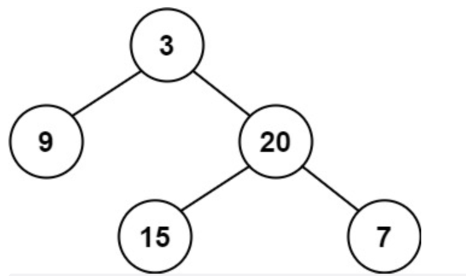
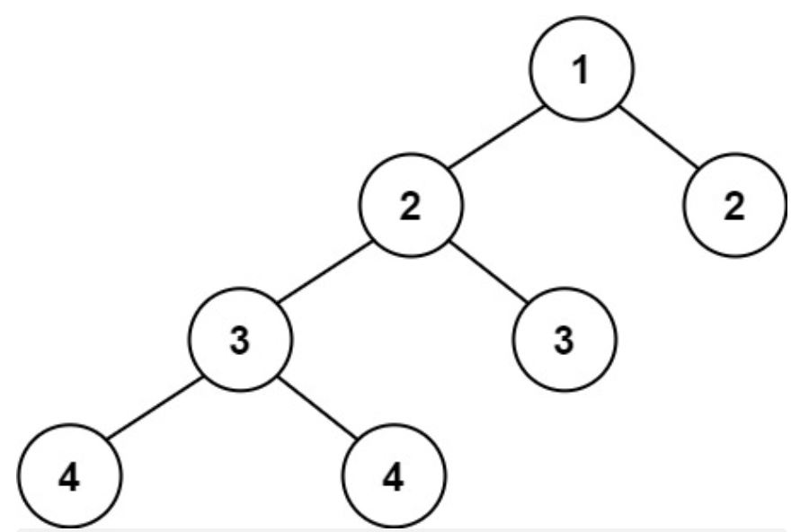

---
title: leetcode——平衡二叉树（110-简单）
date: 2022-05-26
categories:
 - 算法
tags:
 - 算法
 - leetcode-easy
sidebar: auto
--- 

## 1. 题目描述
给定一个二叉树，判断它是否是高度平衡的二叉树。  
一棵高度平衡二叉树的定义：一个二叉树每个节点的左右两个子树的高度差的绝对值不超过1。   

**示例1**：  
    
```bash
输入: root = [3,9,20,null,null,15,7]
输出: true
```  

**示例2**：  
  
```bash
输入：root = [1,2,2,3,3,null,null,4,4] 
输出：false
```

**示例3**：  
```bash
输入：root = []
输出：true
``` 

**提示：**   
- 树中的节点树在范围[0, 5000]内  
- -10^4 <= Node.val <= 10^4   

## 2. 思路分析  
递归求解每个节点的左右节点高度，一旦某个节点不满足平衡二叉树，即对其进行阻断，不再继续递归。 

## 3. 题解  
```js
/**
 * 二叉树节点定义：
 * function TreeNode(val, left, right) {
 *   this.val = (val === undefined ? 0 : val);
 *   this.left = (left === undefined ? null : left);
 *   this.right = (right === undefined ? null : right);
 * }
**/
/**
 * @param {TreeNode} root
 * @return {boolean}
**/ 
var isBalanced = function(root) {
  if(!root) return true;
  const leftHeight = getHeight(root.left);
  const rightHeight = getHeight(root.right);
  return Math.abs(leftHeight - rightHeight) <= 1 && isBalanced(root.left) && isBalanced(root.right);
}
var getHeight = function(root) {
  if(!root) return 0;
  return Math.max(getHeight(root.left), getHeight(root.right)) + 1;
}
```