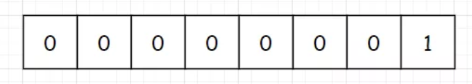
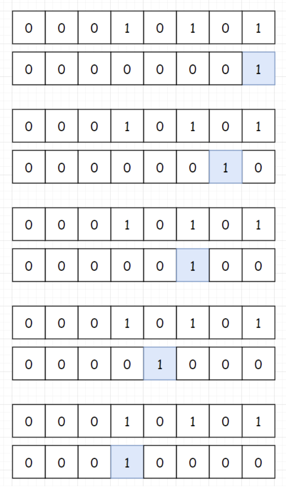

---
title: leetcode——位1的个数（191-简单）
date: 2022-05-31
categories:
 - 算法
tags:
 - 算法
 - 位运算
 - leetcode-easy
sidebar: auto
--- 

## 1. 题目描述
编写一个函数，输入是一个无符号整数（以二进制串的形式），返回其二进制表达式中数字为1的个数（也称为**汉明重量**）。  

**提示**  
- 请注意，在某些语言（如Java）中，没有无符号整数类型。在这种情况下，输入和输出都将被指定为有符号整数类型，并且不应影响您的实现，因为无论整数是有符号的还是无符号的，其内部的二进制表示形式都是相同的。  
- 在 Java 中，编译器使用二进制补码记法来表示有符号整数。因此，在上面的 示例 3 中，输入表示有符号整数 -3。

**示例1**：  
```bash
输入: 00000000000000000000000000001011
输出: 3
解释：输入的二进制串 00000000000000000000000000001011 中，共有三位为 '1'。
```   

**示例2**：  
```bash
输入: 00000000000000000000000010000000
输出: 1
解释：输入的二进制串 00000000000000000000000010000000 中，共有一位为 '1'。
```  

**示例3**：  
```bash
输入: 11111111111111111111111111111101
输出: 31
解释：输入的二进制串 11111111111111111111111111111101 中，共有 31 位为 '1'。
```  

**提示：**   
- 输入必须是长度为32的二进制串

## 2. 思路分析
通过位运算来进行求解。  

1. 构造一个掩码（初始值为1）  
  
2. 掩码每次向左移动一位，然后与目标值求与，即可判断目标值当前位是否为1。下图以目标值 = 21为例：   
  


## 3. 题解  
```js
/**
* @param {number} n 一个正整数
* @return {number}
*/
var hammingWeight = function(n) {
  let result = 0;
  let mask = 1;
  for(let i = 0; i < 32; i++) { // n为32位数，因此需要遍历32次
    if((n & mask) !== 0) result++;
    mask = mask << 1; // 掩码mask每次遍历后向左移动一位
  }
  return result;
};
```