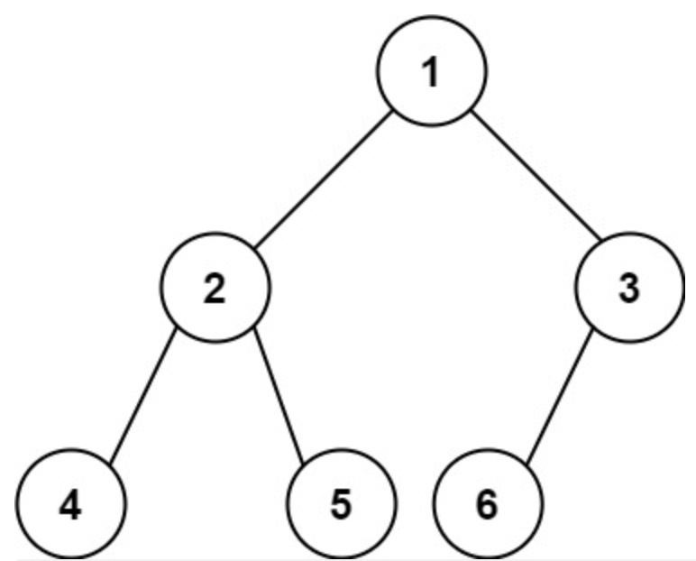

---
title: leetcode——完全二叉树的节点个数（222-中等）
date: 2022-05-26
categories:
 - 算法
tags:
 - 算法
 - leetcode-medium
sidebar: auto
--- 

## 1. 题目描述
给你一棵完全二叉树的根节点`root`，求出该树的节点个数。  
**完全二叉树**的定义：  
在完全二叉树中，除了最底层节点可能没填满外，其余每层节点数都达到最大值，并且最下面一层的节点都集中在该层最左边的若干位置。若底层为第`h`层，则该层包含`1~2^h`个节点.  

**满二叉树**的定义：  
如果二叉树中除了叶子节点，每个节点的度都为2，则此二叉树称为满二叉树。（二叉树的度代表某个节点的孩子或者说直接后继的个数）。  

综上，二叉树中除去最后一层节点为满二叉树，且最后一层节点依次从左到右分布，则此二叉树被称为完全二叉树。  

**示例1**：  
    
```bash
输入: root = [1,2,3,4,5,6]
输出: 6
```  

**示例2**：   
```bash
输入：root = [] 
输出：0
```

**示例3**：  
```bash
输入：root = [1]
输出：1
``` 

**提示：**   
- 树中的节点树在范围[0, 50000]内  
- 0 <= Node.val <= 5*10^4   
- 题目数据保证输入的树是完全二叉树

## 2. 思路分析  
**思路1：** 递归求解  
**思路2：**  
将完全二叉树分成若干个满二叉树和完全二叉树。因为满二叉树的节点数可以根据层高计算`2^h - 1`。然后计算子树中的完全二叉树节点。  
对任意一个子树，遍历其左子树层高leftHeight，右子树层高rightHeight，若leftHeight === rightHeight，则左子树是满二叉树；否则右子树是满二叉树。  

## 3. 题解  
**法一：递归** 
```js
/**
 * 二叉树节点定义：
 * function TreeNode(val, left, right) {
 *   this.val = (val === undefined ? 0 : val);
 *   this.left = (left === undefined ? null : left);
 *   this.right = (right === undefined ? null : right);
 * }
**/
/**
 * @param {TreeNode} root
 * @return {number}
**/ 
var countNodes = function(root) {
  if(!root) return 0;
  return 1 + countNodes(root.left) + countNodes(root.right);
}
```

**法二：拆分满二叉树与完全二叉树**   
```js
/**
 * 二叉树节点定义：
 * function TreeNode(val, left, right) {
 *   this.val = (val === undefined ? 0 : val);
 *   this.left = (left === undefined ? null : left);
 *   this.right = (right === undefined ? null : right);
 * }
**/
/**
 * @param {TreeNode} root
 * @return {number}
**/ 
var countNodes = function(root) {
  if(!root) return 0;
  const leftHeight = getHeight(root.left);
  const rightHeight = getHeight(root.right);
  if(leftHeight === rightHeight) {
    return 1 + countNodes(root.right) + (1 << leftHeight) - 1;  // x << y等同于x * 2^y
  } else {
    return 1 + countNodes(root.left) + (1 << rightHeight) - 1;
  }
}

var getHeight = function(root) {
  let height = 0;
  while(root) {
    height++;
    root = root.left;
  }
  return height;
}
```
