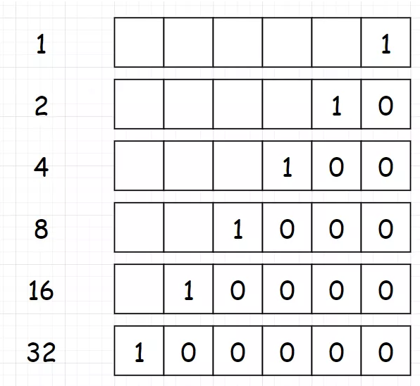
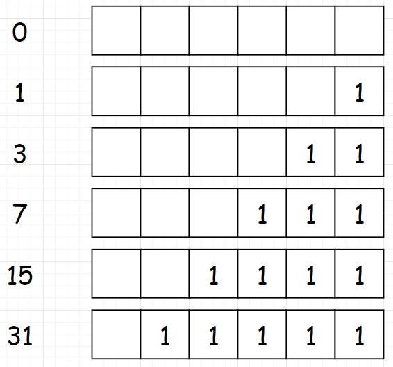
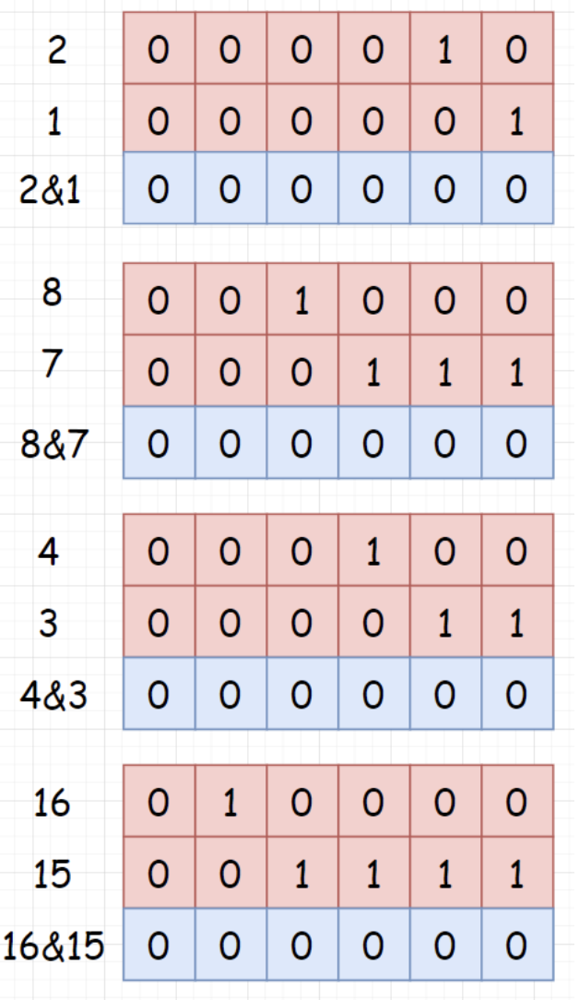

---
title: leetcode——2的幂（231-简单）
date: 2022-05-31
categories:
 - 算法
tags:
 - 算法
 - 位运算
 - leetcode-easy
sidebar: auto
--- 

## 1. 题目描述
给你一个整数n，请你判断该整数是否是2的幂次方。如果是，返回true；否则返回false。  
如果存在一个整数x使得`n == 2^x`，则认为n是2的幂次方。

**示例1**：  
```bash
输入: n = 1
输出: true
解释：2^0 = 1
```   

**示例2**：  
```bash
输入: n = 16
输出: true
解释：2^4 = 16
```  

**示例3**：  
```bash
输入: n = 3
输出: false
```  

**示例4**：  
```bash
输入: n = 4
输出: true
```  

**示例5**：  
```bash
输入: n = 5
输出: false
```  

**提示：**   
- -2^31 <= n <= 2^31 - 1

## 2. 思路分析
通过位运算来进行求解。  
2的幂的二进制数如下：  
  
可以发现这些数的**最高位为1，其它位为0**.因此可以将本题转化为“判断一个数的二进制，仅最高位为1，其余为0”  

接着，2的幂 - 1的二进制数如下：  
    
可以发现，对于2的幂 - 1的数，**所有位都是1**。  

最后，对**2的幂**与**2的幂 - 1**进行与运算（&）：   
   
可以发现，对于`n = 2^x`这样的数，都有`n&(n - 1) = 0`.


## 3. 题解  
```js
/**
* @param {number} n
* @return {boolean}
*/
var isPowerOfTwo = function(n) {
  // 易忽略：因为题目说明了n是整数，因此n一定要大于0
  return n > 0 && (n & (n - 1) === 0);
};
```