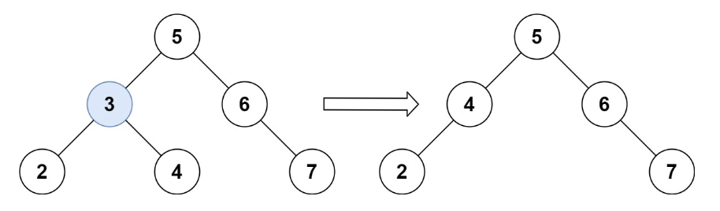
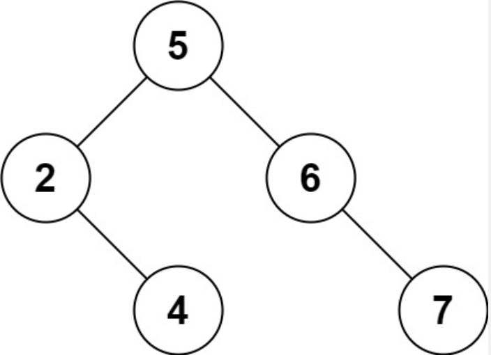

---
title: leetcode——删除二叉搜索树中的节点（450-中等）
date: 2022-05-19
categories:
 - 算法
tags:
 - 算法
 - leetcode-medium
sidebar: auto
--- 

## 1. 题目描述
给定一个二叉搜索树的根节点root和一个值key，删除二叉搜索树总的key对应的节点，并保证二叉搜索树的性质不变。返回二叉搜索树（有可能被更新）的根节点的引用。  
一般来说，删除节点可分为两个步骤：  
1. 首先找到需要删除的节点  
2. 如果找到了，删除它。  

**示例1**：  
  

```bash
输入: root = [5,3,6,2,4,null,7], key = 3
输出: [5,4,6,2,null,null,7]
解释：给定需要删除的节点值是3，所以我们首先找到3这个节点，然后删除它。还有另一个正确答案是[5,2,6,null,4,null,7]
```  


**示例2**：  
```bash
输入：root = [5,3,6,2,4,null,7], key = 0
输出：[5,3,6,2,4,null,7] 
解释：二叉树不包含值为0的节点
```  
**示例3**：  
```bash
输入：root = [], key = 0;
输出：[]
```

**提示：**   
- 树中节点数在[0,10^4]范围内  
- -10^5 <= Node.val <= 10^5  
- 节点值唯一
- root是合法的二叉搜索树  
- -10^5 <= key <= 10^5  

**说明**  
要求算法时间复杂度为 O(h)，h 为树的高度。

## 2. 思路分析
**二叉搜索树（BST）：**  
- 若它的左子树不为空，则所有左子树上的值均小于其根节点的值  
- 若它的右子树不为空，则所有右子树上的值均大于其根节点的值  
- 它的左右子树也分别为二叉搜索树

**思路：**  
1. 找到待删除节点
2. 若待删除节点的左子树为空，则让右子树替代自己  
3. 若待删除节点的右子树为空，则让待删除节点的左子树代替自己
4. 若待删除节点的左右子树都不为空，则需要找到比当前节点小的最大节点（前驱）代替自己 or 比当前节点大的最小节点（后继）代替自己   


## 3. 题解
**法一**  
```js
/**
 * 一个二叉树节点的定义
 * function TreeNode(val, left, right) {
 *  this.val = (val === undefined ? 0 : val)
 *  this.left = (left === undefined ? null : left)
 *  this.right = (right === undefined ? null : right)
 * }
 **/
/**
 * @param {TreeNode} root
 * @param {number} key
 * @return {TreeNode}
 **/
var deleteNode = function(root, key) {
  if(root === null) return null;
  if(root.val === key) {
    if(root.left === null) return root.right;
    if(root.right === null) return root.left;
    const minNode = getMin(root.right);
    root.val = minNode.val;
    root.right = deleteNode(root.right, minNode.val);
  } else if(root.val > key) {
    root.left = deleteNode(root.left, key);
  } else {
    root.right = deleteNode(root.right, key);
  }
  return root;
}

var getMin = function(node) {
  while(node.left !== null) node = node.left;
  return node;
}
```

**法二**
```js
/**
 * 一个二叉树节点的定义
 * function TreeNode(val, left, right) {
 *  this.val = (val === undefined ? 0 : val)
 *  this.left = (left === undefined ? null : left)
 *  this.right = (right === undefined ? null : right)
 * }
 **/
/**
 * @param {TreeNode} root
 * @param {number} key
 * @return {TreeNode}
 **/
var deleteNode = function(root, key) {
  if(root === null) return null;
  if(root.val === key) {
    if(root.left === null) return root.right;
    if(root.right === null) return root.left;
    const maxNode = getMax(root.left);
    root.val = maxNode.val;
    root.left = deleteNode(root.left, maxNode.val);
  } else if(root.val > key) {
    root.left = deleteNode(root.left, key);
  } else {
    root.right = deleteNode(root.right, key)
  }
  return root;
}

var getMax = function(node) {
  while(node.right !== null) node = node.right;
  return node;
}
```