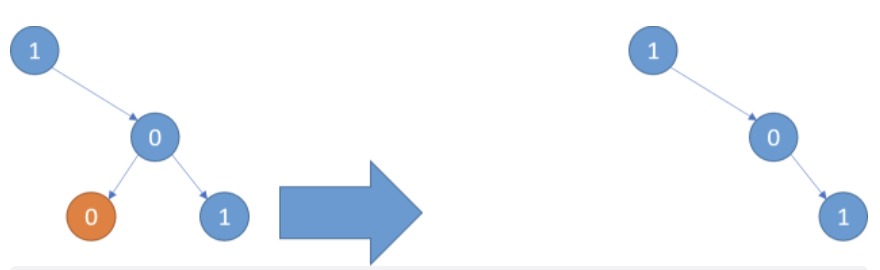
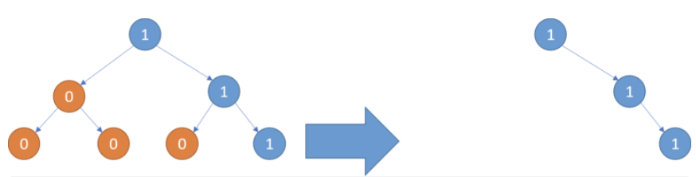
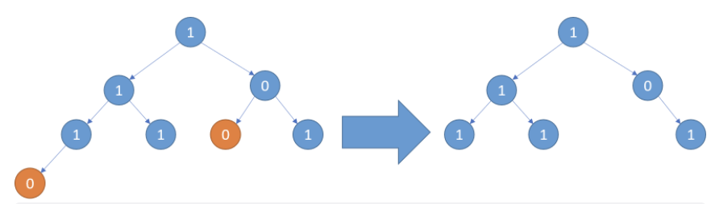

---
title: leetcode——二叉树剪枝（814-中等）
date: 2022-05-28
categories:
 - 算法
tags:
 - 算法
 - leetcode-medium
sidebar: auto
--- 

## 1. 题目描述
给你二叉树的根节点`root`，此外树的每个节点要么是0，要么是1.  
返回移除了所有不包含1的子树的原二叉树。  
节点`node`的子树为`node`本身加上所有`node`的后代。

**示例1**：  
    
```bash
输入: root = [1,null,0.0,1]
输出: [1,null,0,null,1]
解释：只有红色节点满足条件“所有不包含1的子树”。右图为返回的答案。
```  

**示例2**： 
    
```bash
输入：root = [1,0,1,0,0,0,1]
输出：[1,null,1,null,1]
```

**示例3**：  
    
```bash  
输入：root = [1,1,0,1,1,0,1,0]  
输出：[1,1,0,1,1,null,1]
```

**提示：**   
- 树中节点数在[1,200]内
- Node.val为0或1

## 2. 思路分析
使用递归的方法：在递归的过程中，如果当前节点的左右节点皆为空，且当前节点为0，我们就将当前节点剪掉即可。

## 3. 题解
```js
/**
 * 一个二叉树节点的定义
 * function TreeNode(val, left, right) {
 *  this.val = (val === undefined ? 0 : val)
 *  this.left = (left === undefined ? null : left)
 *  this.right = (right === undefined ? null : right)
 * }
 **/
/**
 * @param {TreeNode} root
 * @return {TreeNode}
 **/
var pruneTree = function(root) {
  if(!root) return null;
  root.left = pruneTree(root.left);
  root.right = pruneTree(root.right);
  if(root.val === 0 && !root.left && !root.right) {
    return null;
  } else {
    return root;
  }
}
```