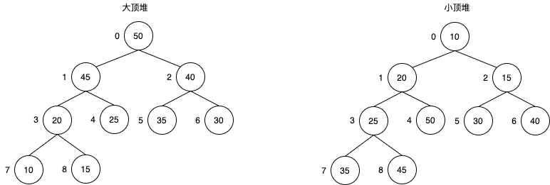

## 一个小试练【难度：🌟】
在一个字符串数组中有红、黄、蓝三种颜色的球，且个数不相等、顺序不一致，请为该数组排序，使得排序后数组中球的顺序为：黄、红、蓝。  
> 如：红黄黄蓝蓝红蓝蓝红红红黄黄黄，排序后为：黄黄黄黄黄红红红红红蓝蓝蓝蓝。

```js
var str = '红黄黄蓝蓝红蓝蓝红红红黄黄黄';
var obj = {
  '黄': 0,
  '红':1,
  '蓝': 2
}
const str2 = str.split('').sort((a, b) => obj[a] - obj[b]);
console.log(str2); // ["黄", "黄", "黄", "黄", "黄", "红", "红", "红", "红", "红", "蓝", "蓝", "蓝", "蓝"]
```

## 1. 选择排序（SelectSort）
**【思路说明】**    
1. 从数组的开头起，以第一个元素作为初始比较对象，遍历整个数组，选择出最小的元素放在数组的第一个位置；
2. 然后再从第二个元素开始，以第二个元素作为初始比较对象，遍历未知顺序的数组部分，选择出最小的元素放在数组的第二个位置；
3. 对后面的元素分别重复上述步骤，直到所有的数据完成排序。  
**【复杂度说明】**  
- 时间复杂度为O(n^2)
- 空间复杂度为O(1)  
**【代码实现】**  
```js
function selectSort(array) {
  var minIndex = 0; // 最小值索引
  var tempValue; // 数据交换时暂存变量
  for(var i = 0; i < array.length; i++) {
    minIndex = i;
    for(var j = i + 1; j < array.length; j++) {
      if(array[minIndex] > array[j]) {
        minIndex = j;
      }
    }
    // 判断minIndex是否发生变更，若发生变更，则该索引对应的元素是最小值，交换两个元素位置即可
    if(minIndex !== i) {
      tempValue = array[minIndex];
        array[minIndex] = array[i];
        array[i] = tempValue;  // 这里的交换可以用ES6一行代码实现：[array[minIndex], array[i]] = [array[i], array[minIndex]]
    }
  }
  return array;
}
```

## 2. 快速排序（QuickSort）
**【思路说明】**  
1. 在数组中，选择一个元素作为‘基准（pivot）’；（基准值可以任意选择，但是选择中间的值比较容易理解）
2. 所有小于‘基准’的元素，都移到‘基准’的左边，所有大于‘基准’的元素，都移到‘基准’的右边；
3. 对‘基准’左边和右边的两个子集，不断重复第一步和第二步，直到所有子集只剩下一个元素为止。  
**【复杂度说明】**  
- 时间复杂度为O(nlogn)
- 空间复杂度为O(n)  
**【代码实现】**  
```js
function quickSort(array) {
  if(array.length < 2) return array;
  var pivotIndex = Math.floor(array.length / 2);
  var pivot = array.splice(pivotIndex, 1)[0]; // 这一步很关键哦
  var leftArray = [];
  var rightArray = [];
  for(var i = 0; i < array.length; i++) {
    if(array[i] < pivot) {
      leftArray.push(array[i])
    } else {
      rightArray.push(array[i])
    }
  }
  return quickSort(leftArray).concat([pivot], quickSort(rightArray))
}
```

## 3. 插入排序（InsertSort）
**【思路说明】**
将一个元素插入到已经排好序的数组中，从而得到一个新的、长度加1的数组。  
1. 将原数组的第一个数看成一个有序数组；
2. 取下一个元素，在已经排序的数组中从后往前扫描；
3. 如果有序数组中某元素大于新元素，则将该元素后移一位；
4. 重复步骤3，直到某元素小于或等于新元素，然后将新元素插入到该元素的下一个位置；
5. 重复步骤2～4，直到得到一个长度等于原数组长度的有序数组。  
**【复杂度说明】**  
- 空间复杂度O(1)
- 时间复杂度O(n^2)  
**【代码实现】**  
```js
function insertSort(array) {
  var temp;
  for(var i = 1; i < array.length; i++) {
    temp = array[i];
    for(var j = i; array[j - 1] > temp && j > 0; j--) {
      array[j] = array[j - 1];
    }
    array[j] = temp;
  }
  return array;
}
```

## 4. 冒泡排序（BubbleSort）
**【思路说明】**  
主要是两两比较相邻元素，如果反序则交换，直到没有反序的记录为止。  
1. 依次两两比较相邻的元素，如果第一个元素比第二个大，则进行交换；
2. 经过第一轮比较后，最大的数已经出现在数组的最后一个位置；
3. 对除了数组最后一个元素外的所有元素重复步骤1，倒数第二大的元素出现在数组倒数第二的位置；
4. 重复步骤1~3，直到排序完毕。  
**【复杂度说明】**  
- 空间复杂度O(1)  
- 时间复杂度O(n^2)。最优O(n)，最差O(n^2)  
**【代码实现】**  
```js
function bubbleSort(array) {
  var tmp;
  for(var i = 0; i < array.length; i++) {
    for(var j = 0; j < array.length - i - 1; j++) {
      if(array[j] > array[j + 1]) {
        tmp = array[j];
        array[j] = array[j + 1];
        array[j + 1] = tmp;
      }
    }
  }
  return array;
}
```  

## 5. 归并排序（MergeSort）
**【思路说明】**  
归并排序是利用分治的策略去解决排序问题的，先分后合。   
1. 假设待排序数组的长度为n，首先将数组分成两个长度为n/2的数组；
2. 重读步骤1，直到拆分后的数组长度为1，可以认为原数组最终拆分成了n个有序的长度为1的数组。可以理解为从上往下生成一个二叉树的过程；
3. 从下往上，分别将二叉树节点的两个子元素数组进行两两合并，最终得到一个有序的长度为n的数组。    
**【复杂度说明】**  
- 时间复杂度O(nlogn)  
**【代码实现】**  
```js
// 分
function mergeSort(array) {
  if(array.length === 1) return array;
  var mid = Math.floor(array.length / 2);
  var leftArray = array.slice(0, mid);
  var rightArray = array.slice(mid, array.length);
  if(array.length > 1) {
    return merge(mergeSort(leftArray), mergeSort(rightArray));
  }
}
// 合
function merge(leftArray, rightArray) {
  var leftIndex = 0;
  var rightIndex = 0;
  var newArray = [];
  while(leftIndex < leftArray.length && rightIndex < rightArray.length) {
    if(leftArray[leftIndex] <= rightArray[rightIndex]) {
      newArray.push(leftArray[leftIndex]);
      leftIndex++;
    } else {
      newArray.push(rightArray[rightIndex]);
      rightIndex++;
    }
  }
  while(leftIndex < leftArray.length) {
    newArray.push(leftArray[leftIndex]);
    leftIndex++;
  }
  while(rightIndex < rightArray.length) {
    newArray.push(rightArray[rightIndex]);
    rightIndex++;
  }
  return newArray;
}
```

## 6. 希尔排序（ShellSort）
希尔排序又称缩小增量排序，属于一种插入排序，不同之处在于它会优先比较距离较远的元素。  
**【思路说明】**  
将整个待排序记录序列分割成若干个子序列，然后对每一个子序列进行直接插入排序：  
1. 先取一个正整数d1（通常取数组长度一半）,所有距离为d1倍数的元素放到一个组，然后在各自组内进行插入排序；
2. 取d2(通常取d1的一半)；
3. 重复上述分组和排序操作，直到di = 1，即所有元素个自成一组，最后对这个组进行插入排序。  
**【复杂度说明】**  
- 空间复杂度为O(1)
- 时间复杂度不稳定，取决于增量序列函数  
**【代码实现】**  
```js
function shellSort(array) {
  if(array.length < 2) { return array; }
  var gap = Math.floor(array.length / 2);
  var tmp;
  while(gap) {
    for(var i = gap; i < array.length; i++) {
      tmp = array[i];
      for(var j = i - gap; j >= 0; j -= gap) {
        if(array[j] > tmp) {
          array[j + gap] = array[j];
        } else {
          break;
        }
      }
      array[j + gap] = tmp;
    }
    gap = Math.floor(gap / 2);
  }
  return array;
}
```  

## 7. 堆排序（HeapSort）  
**【数据结构知识点】**
堆是具有以下性质的完全二叉树：
- 每个节点的值都大于或等于其左右孩子节点的值，称为大顶堆；
- 每个节点的值都小于或等于其左右孩子节点的值，称为小顶堆。  
那么，什么事完全二叉树呢：  
若二叉树的深度h，除第h层外，其它层(1 ~ h-1)的节点都达到最大个数，第h层所有的节点都连续集中的最左边，这就是完全二叉树。  
堆的示意图如下：  
  
以大顶堆为例，上图我们对堆中的节点按层进行编号，将这种逻辑结构映射到数组中就是下面这样子：
| 0  | 1 | 2 | 3 | 4 | 5 | 6 | 7| 8 |
| ---- | ---- | ---- | ---- | ---- | ---- | ---- | ---- | ---- | 
| 50 | 45 | 40 | 20 | 25 | 35 | 30 | 10 | 15 |   

该数组从逻辑上来讲就是一个堆结构，可以用以下公式来描述其定义：  
- 大顶堆(父节点大于等于其左右子节点)： array[i] >= array[2 * i + 1] && array[i] >= array[2 * i + 2]  
- 小顶堆（父节点小于等于其左右子节点）： array[i] <= array[2 * i + 1] && array[i] <= array[2 * i + 2]  
**【思路说明】**  
堆排序是利用堆这种数据结构而涉及的一种排序算法，属于选择排序。  
1. 构造初始堆。将给定的无序数组构造称一个大顶堆（一般升序采用大顶堆，降序采用小顶堆），假设将给定序列按照上图进行按层绘制成一个完全二叉树，则最后一个非叶子节点（对应序列为array.length / 2 - 1）节点开始，从左至右，从上至下；
2. 将堆顶元素与末尾元素进行交换，使末尾元素最大。然后继续调整剩下的数组元素，使其成为一个大顶堆，的搭配第二大元素；
3. 重复上述步骤，直到形成一个有序数组。  
**【复杂度说明】**  
- 时间复杂度O(nlogn)  
**【代码实现】**  
```js
// 处理一个无序数组，将其构造成一个大顶堆
function buildHeap(array) {
  var count = Math.floor(array.length / 2); // 非叶子节点个数
  for(var i = count - 1; i >= 0; i--) {
    adjustHeap(array, i, array.length); // 调整以使索引为i的非叶子节点及其所有子节点构成一个大顶堆
  }
}

function adjustHeap(array, parentInd, length) {
  // 假设数组第一个索引值为0，则父节点索引为i时，其做孩子为2 * i + 1，右孩子为 2 * i + 2
  var tmp = array[parentInd];
  var leftInd = parentInd * 2 + 1;
  var ind = leftInd;
  while(ind < length) {
    if((ind + 1) < length && array[ind] < array[ind + 1]) { //如果右孩子存在且大于左孩子，则将索引定位到右孩子
      ind++;
    }
    // ind表示孩子节点中数值较大的那一个孩子对应的索引值
    if(array[parentInd] < array[ind]) {
      array[parentInd] = array[ind];
      array[ind] = tmp;
      parentInd = ind; // 将父节点定位到子节点中较大的那一个（针对子节点同时也是非叶子节点的情况）
      ind = parentInd * 2 + 1; // 将ind定位到父节点的左孩子
    } else {
      break;
    }
  }
}

function heapSort(array) {
  buildHeap(array);
  var tmp;
  for(var i = array.length - 1; i > 0; i--) {
    tmp = array[0];
    array[0] = array[i];
    array[i] = tmp; // 使最小的数放到第一位
    adjustHeap(array, 0, i); // 调整剩余数组，使其中最大的数调整到堆顶；
  }
  return array;
}
```

