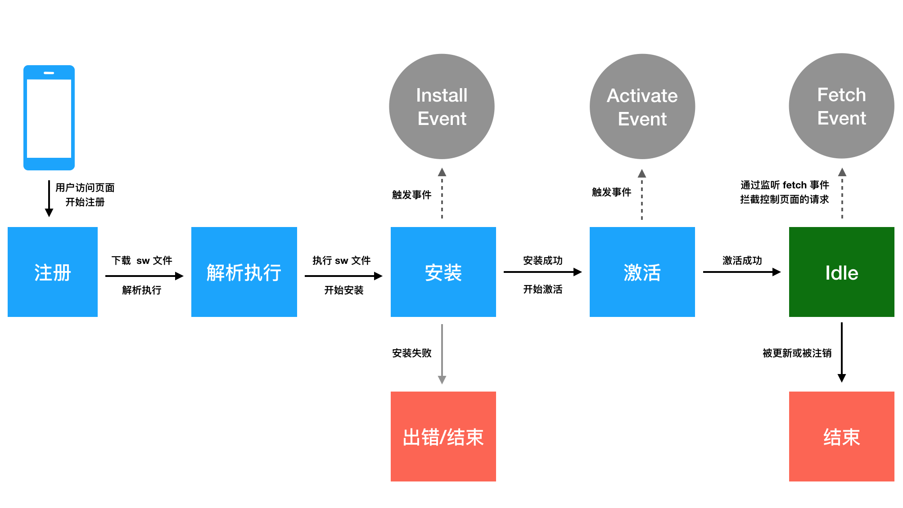

## 1. CSS3有哪些新增特性？
### 1.1 边框
- border-radius 圆角  
- box-shadow 盒阴影  
- border-image 边框图像  
### 1.2 背景
- background-size 背景图片的尺寸    
- background_origin 背景图片的定位区域   
- background-clip 背景图片的绘制区域  
### 1.3 渐变 
- linear-gradient 线性渐变  
- radial-gradient 径向渐变
### 1.4 文本效果
- word-break  
- word-wrap  
- text-overflow  
- text-shadow  
- text-wrap  
- text-outline   
- text-justify  
### 1.5 转换
**2D转换属性**:    
- transform  
- transform-origin  
**2D转换方法**:  
- translate(x,y)  
- translateX(n)  
- translateY(n)  
- rotate(angle)  
- scale(n)  
- scaleX(n)  
- scaleY(n)  
- rotate(angle)  
- matrix(n,n,n,n,n,n)  
### 1.6 3D转换
**3D转换属性**：  
- transform  
- transform-origin  
- transform-style  
**3D转换方法**:  
- translate3d(x,y,z)  
- translateX(x)  
- translateY(y)  
- translateZ(z)   
- scale3d(x,y,z)  
- scaleX(x)  
- scaleY(y)  
- scaleZ(z)  
- rotate3d(x,y,z,angle)  
- rotateX(x)  
- rotateY(y)  
- rotateZ(z)  
- perspective(n)  
### 1.7 过渡
- transition
### 1.8 动画
- @Keyframes规则  
- animation  
### 1.9 弹性盒子:flexbox
### 1.10 多媒体查询：@media

## 2. 写一个方法去掉字符串中的空格
**正则匹配**：   
```js
/**
 * @param {string} str
 * @return {string}
**/ 
var trim = function(str) {
  const reg = /\s+/g;
  return str.replace(reg, '');
}
```  
**split -> join**:  
```js
/**
 * @param {string} str
 * @return {string}
**/ 
var trim = function(str) {
  return str.split(' ').join('');
}
```

## 3. HTML全局属性（global attribute）有哪些？  
突然发现这里有几个有趣的属性哦～  
| 属性 | 描述 | 说明 | 
| ----- | ------ | ---- |    
| class | 规定元素的类名 | - |   
| id | 规定元素的唯一id | - |  
| style | 规定元素的行内样式 | - |   
| title | 规定元素的额外信息（可在工具提示中显示） | - |    
| lang | 设置元素中内容的语言代码 | - |   
| accesskey | 为访问当前元素设置快捷键 | <font color="orange">浏览器兼容性不好，不推荐使用</font> |   
| contenteditable | 是否可编辑元素的内容 | 该属性值必须是以下值之一： `true`或`''`，表示可编辑；`false`，表示不可编辑 |  
| contextmenu | 指定一个元素的上下文菜单。当用户右击该元素，出现上下文菜单 | <font color="red">已废弃</font> |   
| draggable | 指定元素是否可以拖动 | 该属性值： `true`,表示可被拖动；`false`， 表示不可被拖动 |   
| data-* | 用于存储页面的自定义数据 | 通过js和html之间进行数据交换，可以通过所属元素的`HTMLElement.dataset`接口访问 |  
| dir | 指定元素中文本方向 | 该属性值：`ltr`，从左到右；`rtl`，从右到左；`auto`，由用户代理决定方向 |  
| autocapitalize | 控制用户的文本输入是否/如何自动大写 | 该属性值：`off`或`none`，所有字母默认小写；`on`或`sentences`，每个句子的第一个字母默认大写，其它字母默认小写；`words`，每个单词的第一个字母默认大写；`characters`,所有字母默认大写 |  

## 4. 在页面上隐藏元素的方法？
| 方法 | 描述 | 说明 |  
| ---- | ---- | ---- |  
| `display: none;` | - | 不占位，该元素及其子元素都不可见。 |  
| `opacity: 0;` | 设置元素不透明度为0，即完全透明 | 占位 |  
| `visibility: hidden;` | 隐藏元素，但其它元素布局不变，相当于此元素变成透明 | 若将其子元素设置`visibility: visible`，则其子元素依然可见 |  
| `z-index: -999999999` | 将元素放到最底层, 可以让其它元素将其遮住 | - |  
| `position: absolute;transform: scale(0)` | 让元素脱标，设置元素缩放值为0，即元素大小为0 | - |  
| `margin-left: -100%;` | 让元素的位置在当前视口之外 | - |  
| `position: relative; left: -100%;` | 让元素的位置在当前视口之外 | - |  
| `width: 0; height: 0; overflow: hidden;` | - | 不占位 |   
| `text-indent: -9999px;` | 设置块元素首行文本内容之前的缩进量为负数，使其超出当前视口 | 仅针对块内文本元素 |   
| `font-size: 0;` | - | 仅针对块内文本元素 |  

## 5. 去除字符串中最后一个指定的字符
### 5.1 正则  
```js
/**
 * @param {string} str
 * @param {string} char
 * @return {string}
**/ 
var deleteSpecificLastCharacter = function(str, char) {
  const reg = new RegExp(`${char}(?=([^${char}]*)$)`);
  return str.replace(reg, '');
}
```  
**说明**：  
- (?=p): 匹配`p`前面的位置。其中`p`是一个子模式  
- ^：匹配开头  
- $：匹配结尾  
- *：匹配表达0次或多次  
### 5.2 lastIndexOf
```js
/**
 * @param {string} str
 * @param {string} char
 * @return {string}
**/ 
var deleteSpecificLastCharacter = function(str, char) {
  const index = str.lastIndexOf(char);
  return str.substring(0, index) + str.substring(index + 1, str.length);
}
```  
### 5.3 旋转字符串  
```js
/**
 * @param {string} str
 * @param {string} char
 * @return {string}
**/ 
var deleteSpecificLastCharacter = function(str, char) {
  return str.split('').reverse().join('').replace(char, '').split('').reverse().join('')
}
```  
## 6. 变量命名：下划线转大驼峰
```js
/**
 * @param {string} str
 * @return {string}
**/ 
var toCamel = function(str) {
  return str.replace(/_(\w)/g, (match, $1) => {
    return $1 ? $1.toUpperCase() : match;
  })
}
```

## 7. 超链接`target`属性的取值
| 值 | 描述 |  
| ---- | ---- |  
| `_blank` | 在新窗口中打开被链接文档 |  
| `_self` | 默认值。在当前窗口或者框架中加载目标文档 |  
| `_parent` | 在父框架集中打开被链接文档。当 a 标签本身在顶层时，则与 _self 相同 |  
| `_top` | 在整个窗口中打开被链接文档 |  
| framename | 在指定的框架中打开被链接文档 |  
| 任意字符 | 如果当前浏览器还没有打开这个链接，则会弹出新窗口打开此链接；如果已经打开了这个链接，则不会再重复弹出第二个窗口，而是刷新已打开的窗口链接 | 

## 8. 切换字符串大小写  
```js
/**
 * @param {string} str
 * @return {string}
**/  
var caseConvert = function(str) {
  return str.replace(/([a-z]*)([A-Z]*)/g, (match, $1, $2) => {
    return `${$1.toUpperCase()}${$2.toLowerCase()}`
  });
}
```

## 9. `<label>`标签有哪些作用?  
`<label>`标签用于表示用户界面中某个元素的说明。  
### 9.1 for  
使用for属性，与表单元素结合，关联表单控件，使表单元素获得焦点。更利于使用辅助技术的用户理解需要输入哪些数据。    
```html
<label for="username">username</label>
<input id="username" type="text">
```  
for属性值须与表单元素的id属性值一致。
### 9.2 accesskey 
访问label标签所绑定的热键，当你按下热键时，所绑定的元素将获得焦点。  
```html
<label for="inputBox" accesskey="N">name</label>
<input id="inputBox" type="text">
```  
accessKey属性所设置的快捷键不能与浏览器的快捷键冲突，否则将优先激活浏览器的快捷键。

## 10. 用css绘制一个三角形
**原理**：创建一个div，宽高都为0，并设置4个边框的`border-width`, `border-style`, `border-color`即可。如果要某个三角形变为透明，可设置`border-color: transparent`。  
**效果图**：  


**代码**：  
```html
<!DOCTYPE html>
<html>
<head>
<meta charset="utf-8">
<title>demo</title>
<style>
  .rect {
    width: 0;
    height: 0;
    border-top: 100px solid red;
    border-right: 100px solid yellow;
    border-bottom: 100px solid blue;
    border-left: 100px solid black;
  }
</style>
</head>
<body>
	<div class="rect">
  </div>
</body>
</html>
```

## 11. 去除字符串中的制表符和换行符  
**示例**：  
  

**正则**：  
`\n`: 匹配换行符（new line）    
`\r`: 匹配回车符（return）    
`\t`: 匹配制表符（tab）    
`\b`: 匹配退格符（backspace）    
`\f`: 匹配换页符  
`\v`: 匹配垂直制表符  
`\s`: 匹配空白符（space），包括<font color="#008dff">空格、水平制表符、垂直制表符、换行符、回车符、换页符</font>  

```js
/**
 * @param {string} str
 * @return {string} 
 */
var removeTN = function(str) {
  return str.replace(/\t|\n/g, '');
}
```

## 12. `iframe`有哪些优缺点？  
**是什么？**
`<iframe>`标签:内联框架元素，表示嵌套的[浏览器上下文](https://developer.mozilla.org/zh-CN/docs/Glossary/Browsing_context)。它能够将另一个HTML页面嵌入到当前页面中。  
**优点**  
- iframe能够原封不动地将嵌入的网页展示出来  
- 增加代码的复用性：如果有多个网页饮用了相同的iframe，那么只需要修改iframe的内容，即可实现所有页面的同步更新  
- 异步刷新：单个iframe刷新不会影响整体窗口的刷新。可以将加载缓慢的图片或其他资源放到iframe中加载    
- 可以跨域：每个iframe的源都可以不相同，以方便引入第三方内容  

**缺点**  
- 不利于SEO：浏览器搜索引擎不能很好地处理iframe中的内容，因此不利于引擎优化  
- 增加服务器的请求开销：iframe某种意义上是独立的页面，会有自己的css/js资源请求，当iframe多的时候，会伴随更多的服务器请求资源消耗  
- 降低用户体验：iframe框架容易出现横/纵向滚动条，分散用户的注意力；并且有滚动条时若需要打印页面，无法打印出完整内容  
- iframe会阻塞主页面的onload事件：window.onload事件会在所有iframe加载完成后才会出发，造成页面阻塞

## 13. CSS之BFC
BFC全称**块级格式化上下文（Blok Formatting Context）**。BFC类似一个“结界”，如果一个DOM元素具有BFC，那么它内部的子元素不会影响外面的元素；外面的元素也不会影响到其内部元素。  
### 13.1 特性  
- 计算BFC的高度时，其浮动子元素也参与计算  
- BFC时页面上的一个隔离的独立容器，容器里面的子元素不会影响到外面的元素；反之亦然  
- BFC的区域不会与float元素重叠

### 13.2 形成条件
- html根元素  
- 浮动元素：float的值不是none  
- 绝对定位元素：position为absolute或fixed  
- 内联块：display为inline-block  
- overflow不为visible  
- 弹性元素：display为flex或inline-flex元素的直接子元素    
- 网格元素：display为grid或inline-grid元素的直接子元素  
- 表格单元格元素：display为table、table-row、table-row-group、table-header-group、table-footer-group（分别对应table、tr、tbody、thead、tfoot标签的默认样式）、inline-table  

### 13.4 BFC的应用场景
- 解决外边距重叠问题：同属一个BFC的块级盒子在垂直方向会发生margin重叠，可以将其中一个盒子放入另一个BFC中以解决重叠问题。  
- 解决高度塌陷问题：由于浮动子元素导致父元素高度坍塌，可以将父元素变成一个BFC元素  

### 13.5 [扩展]清除浮动（解决高度塌陷问题）  
**方案一：给父元素也添加浮动**   
将父元素也从标准文档流中抽离。    
缺点：可读性差，不易于维护，可能导致整个页面布局的变化。  
**方案二：在父元素内最下方添加clear属性的空盒子**     
缺点：引入了冗余元素。  
**方案三：给父元素设置overflow: hidden**     
缺点：可能造成内容溢出元素不可见。  
**方案四：给父元素的after伪元素设置clear属性**   
最佳方案，也是bootstrap框架采用的清除浮动的方法。  
```css
.parent::after {
  content: '';
  display: block;
  clear: both;
}

.parent {
  zoom: 1; // 兼容IE6和IE7，触发hasLayout
}
```  

## 14. 计算某一个字符或字符串在另一个字符串中出现的次数
示意：  
  

**正则**：  
```js
/**
 * @param {string} str
 * @param {string} target 
 * @return {number}
 */ 
var substrCount = function(str, target) {
  const reg = new RegExp(target, 'g');
  return (str.match(reg)).length;
}
```

**数组拆分**：  
```js
/**
 * @param {string} str
 * @param {string} target 
 * @return {number}
 */ 
var substrCount = function(str, target) {
  return str.split(target).length - 1;
}
```

## 15. HTML5离线缓存  
通过离线存储，我们可以在离线的情况下，也能让用户正常访问Web App。  

### 15.1 Application Cache（应用程序缓存）——【<font color="red">不推荐，似乎已废弃</font>】  
可以在离线情况下，通过cache manifest文件，创建离线应用。    
**使用**：  
1. 在html文件的html标签上添加manifest属性。属性值为一个.appcache文件   
2. 在.appcache文件中声明清单文件。包含三个部分：CACHE（表示需要离线缓存的资源列表）、NETWORK（表示在线才能访问的资源列表）、FALLBACK（缓存失败后使用的文件）  
3. 在服务器添加MIME-type配置为"text/cache-manifest"  
**缺点**：  
- 需要遵循诸多规范，不易控制

### 15.2 Service Workers  
我们通常所说的Service Worker指的是Service Worker线程。  
浏览器中执行的JavaScript文件时运行在一个单一线程上，称之为**主线程**。而Service Worker是一种独立于浏览器主线程的**工作线程**，与主线程师完全隔离的，并且有自己独立的执行上下文（context）。  

**原理**：  
Service Worder从被注册开始，就会经历自身的一些生命周期，在这写生命周期中可以去做一些特定的事情，比如复杂的计算、缓存的写入、缓存的读取等。   
Service Worker生命周期（参考：[pwa-book](https://lavas-project.github.io/pwa-book/chapter04/3-service-worker-dive.html)）：  
   
1. 在主线程成功注册 Service Worker 之后，开始下载并解析执行 Service Worker 文件，执行过程中开始安装 Service Worker，在此过程中会触发 worker 线程的 install 事件。    
2. 如果 install 事件回调成功执行（在 install 回调中通常会做一些缓存读写的工作，可能会存在失败的情况），则开始激活 Service Worker，在此过程中会触发 worker 线程的 activate 事件，如果 install 事件回调执行失败，则生命周期进入 Error 终结状态，终止生命周期。  
3. 完成激活之后，Service Worker 就能够控制作用域下的页面的资源请求，可以监听 fetch 事件。  
4. 如果在激活后 Service Worker 被 unregister 或者有新的 Service Worker 版本更新，则当前 Service Worker 生命周期完结，进入 Terminated 终结状态。  

**使用**：  
假设当先项目存在如下目录：  
```txt
.
└── serviceWorkerDemo
    ├── index.html
    └── sw.js
```  
其中，index.html文件内容：  
```html
<!DOCTYPE html>
  <head>
    <title>Service Worker Demo</title>
  </head>
  <body>
    <script>
      if ('serviceWorker' in navigator) {
        navigator.serviceWorker.register('./sw.js')； // 注册Service Worker
      }
    </script>
  </body>
</html>
```  

**[Service Worker Demo](https://github.com/mdn/sw-test)**

## 16. 优雅降级 vs 渐进增强  
优雅降级和渐进增强的目的，都是关注不同浏览器下的不同体验，由于侧重点不同，就导致了工作流程上的区别。  
**优雅降级（Graceful Degradation）**  
一开始就构建站点的完整功能，然后针对低版本浏览器进行兼容。  
特点：从复杂的现状开始，并试图减少用户体验的供给。
**渐进增强（Progressive Enhancement）**  
一开始就针对低版本浏览器进行构建，保证最基本的功能，然后针对高版本浏览器增加用户体验。  
特点：从基础的现状开始，并不断扩充以适应未来环境的需要。  
**如何选择？**  
优先考虑业务，其次才是用户体验。  
当业务均能支持时：  
若低版本用户居多，则优先采用渐进增强的开发流程；若高版本用户居多，为了提高大多数用户的使用体验，则优先采用优雅降级的开发流程。


