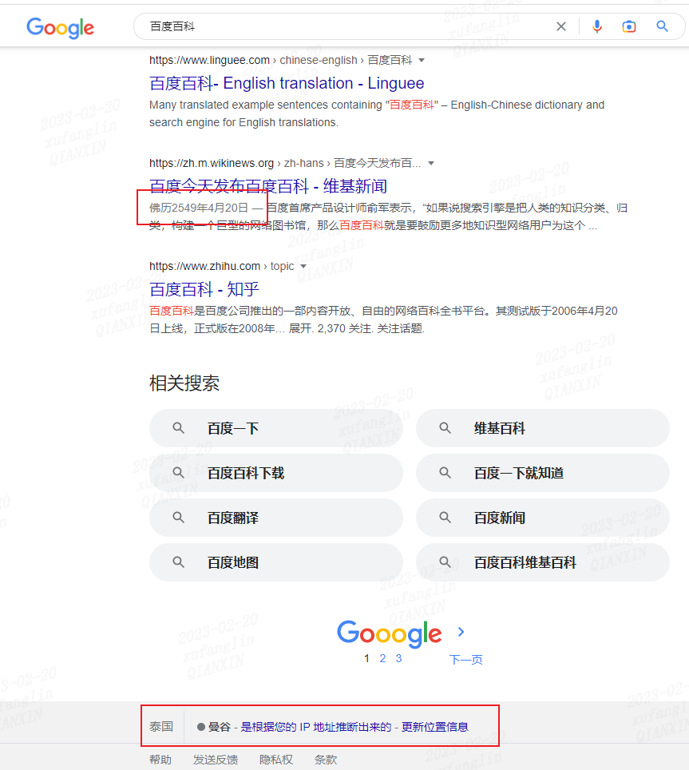
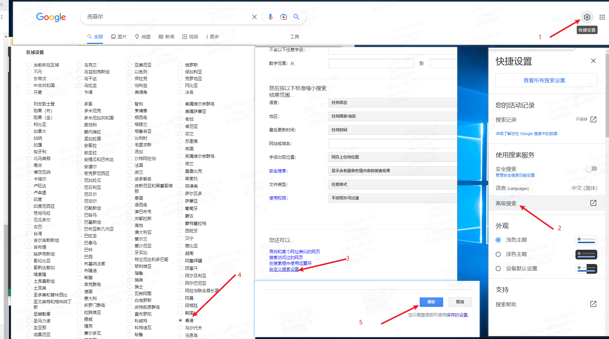
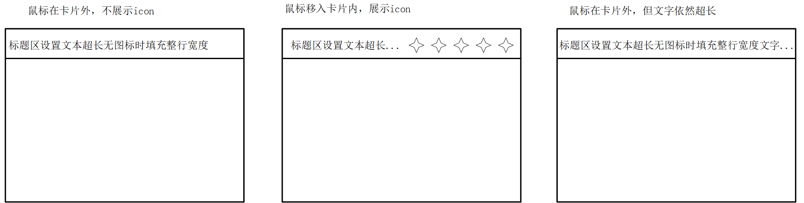

## 1. Number.prototype.toLocaleString()
功能：返回这个数字在**特定语言环境**下的表示字符串。    
背景：在开发过程中使用`Number.prototype.toLocaleString()`对数字转成字符串进行展示，通过浏览器访问站点进行访问预览。     
问题：当对数字`123456`进行字符串转换后，期望展示成`123456`, 发现页面展示`123,456`.    
原因：浏览器安装了代理插件解决google访问的问题，在搜索时发现搜索时间显示的是**佛历**，定位显示在曼谷。。。在使用`Number.prototype.toLocaleString()`对数字进行转换时，识别到当前的时区是曼谷，并基于此进行字符串的转换。

**扩展**：如何设置搜索时间为中国时间？  
chrome浏览器中是无法设置时区为中国的，但是你可以选择设置为【香港】，这样就能看到检索时间为20xx年-xx月-xx日这样的日期格式。  
  

  

## 2. table布局列宽计算
开发管理系统时，最常见的页面布局就是筛选器+表格布局，其中表格展示的字段数量可能通过配置进行增减。  
在UI走查阶段，UED和产品建议当页面宽度足够的时候，表格中的标题列不要做超出换行的样式，要确保标题在一行中展示完整。当列数较多时表格有横向滚动条即可。  
已知：标题列中除了展示标题以外，还可能包含排序、筛选、tooltip等icon。  
需求：写一个工具方法，动态计算标题列的最小宽度。  
实现：  
```js
/**
 * 计算文本最小宽度：适配国际化表格列不换行
 * @param {object} { text:[string]文本；extWidth[number]，扩展宽度，通常指排序等icon的宽度，默认0; fontSize[numer],字体大小，默认12}
 * @return {number}
 */
const getMinWidthOfText = function({ text, extWidth = 0, fontSize = 12 }) {
  // create dom
  const span = document.createElement('span');
  span.innerText = text;
  span.setAttribute('style', `position: fixed; fontSize: ${fontSize}px; padding: 0 8px;`);
  document.body.appendChild(span);

  // get span width
  const textWidth = span.offsetWidth;

  // destroy dom
  document.body.removeChild(span);

  return textWidth + extWidth;
};
```

## 3. 文字超长省略+hover显示tooltip
在实践开发中遇到一个场景，页面有若干个卡片按照网格布局，每个卡片顶部分别展示左侧的标题 + 右侧的可操作icon组。   
已知标题字符数最多128个，右侧的icon数量取决于接口返回的数据类型，在鼠标移到卡片内部时才显示，同时这个页面要做国际化。  
产品要求卡片顶部的文字尽可能多展示，如果展示不下就需要做超长省略:  
    
已知原卡片组件的代码如下：  
```vue
<template>
  <div class="container">
    <div class="title-container">
      <div class="title">{{ title }}</div>
      <div class="icon-container">
        <tooltip v-if="showIcon1" content="icon1描述"><i class="icon-1" /></tooltip>
        <tooltip v-if="showIcon2" content="icon2描述"><i class="icon-2" /></tooltip>
        <tooltip content="icon3描述"><i class="icon-3" /></tooltip>
        <tooltip content="icon4描述"><i class="icon-4" /></tooltip>
        <tooltip content="icon5描述"><i class="icon-5" /></tooltip>
        <tooltip content="icon6描述"><i class="icon-6" /></tooltip>
      </div>
    </div>
    <div class="content"> 卡片内容区代码（略） </div>
  </div>
</template>
<script>
export default {
  data() {
    title: '',
    showIcon1: false,
    showIcon2: false
  },
  async created() {
    const data = fetchData();  
    this.title = data.title;
    this.showIcon1 = data.showIcon1;
    this.showIcon2 = data.showIcon2;
  }
}
</script>
<style lang="scss" scoped>
.container {
  title {  // 标题区设置超长省略
    width: 100%;
    overflow: hidden;
    text-overflow: ellipsis;
    white-space: nowrap;
  }

  .icon-container {
    opacity: 0;  // 正常情况下完全透明，不可见
  }

  &:hover .icon-container {
    opacity: 1;  // hover时显示icon
  }
}
</style>
```

上述代码存在的问题：   
- 标题区如果有超长省略，没有做hover时显示tooltip  
- 标题区的宽度无法根据是否显示icon做自定义，导致hover时会出现icon与文字重叠的问题

改造后：  
- 给标题区外层添加tooltip元素，根据是否存在超长省略判断是否显示该tooltip  
- 给卡片添加鼠标移入移出时间，动态修改标题区的宽度

改造后代码：  
```vue
<template>
  <div class="container">
    <div class="title-container" @mouseenter="onMouseenter" @mounseleave="onMounseleave">
      <tooltip :disabled="!showTooltip" :content="title">
        <div ref="titleContainer" class="title" :style="{ width: titleWidth }">{{ title }}</div>
      </tooltip>
      <div ref="iconContainer" class="icon-container">
        <tooltip v-if="showIcon1" content="icon1描述"><i class="icon-1" /></tooltip>
        <tooltip v-if="showIcon2" content="icon2描述"><i class="icon-2" /></tooltip>
        <tooltip content="icon3描述"><i class="icon-3" /></tooltip>
        <tooltip content="icon4描述"><i class="icon-4" /></tooltip>
        <tooltip content="icon5描述"><i class="icon-5" /></tooltip>
        <tooltip content="icon6描述"><i class="icon-6" /></tooltip>
      </div>
    </div>
    <div class="content"> 卡片内容区代码（略） </div>
  </div>
</template>
<script>
import titleOverflowMixin from './title-overflow-mixin';

export default {
  mixins: [titleOverflowMixin],
  data() {
    title: '',
    showIcon1: false,
    showIcon2: false,
  },
  async created() {
    const data = fetchData();  
    this.title = data.title;
    this.showIcon1 = data.showIcon1;
    this.showIcon2 = data.showIcon2;
  },
}
</script>
<style lang="scss" scoped>
.container {
  title {  // 标题区设置超长省略
    width: 100%;
    overflow: hidden;
    text-overflow: ellipsis;
    white-space: nowrap;
  }

  .icon-container {
    opacity: 0;  // 正常情况下完全透明，不可见
  }

  &:hover .icon-container {
    opacity: 1;  // hover时显示icon
  }
}
</style>
```  

为了更方便看出区别，我单独将逻辑层抽成mixin：  

```js
// title-overflow-mixin.js
export default {
  data() {
    return {
      showTooltip: false,
      titleWidth: '100%',
      iconWidth: 0,
      hasComputed: false, // 是否已经计算过icon宽度
    };
  },
  mounted() {
    this.updateHeaderStyle();
  },
  methods: {
    updateHeaderStyle() {
      setTimeout(() => {
        const headerWidth = this.$refs?.titleContainer?.offsetWidth;
        const titleWidth = this.$refs?.titleContainer?.scrollWidth;
        this.showTooltip = titleWidth > headerWidth;
      });
    },
    onMouseenter() {
      if (!this.hasComputed) {
        this.iconWidth = this.$refs?.iconContainer?.offsetWidth;
        this.hasComputed = true;
      } 
      this.titleWidth = `calc(100% - ${this.iconWidth}px)`;
      this.updateHeaderStyle();
    },
    onMouseleave() {
      this.titleWidth = '100%';
      this.updateHeaderStyle();
    }
  }
};
```

## 4. 如何实现最省资源的页面下钻
**背景：**  
系统有两个页面A，B，其中A页面中有个图片可以通过点击，利用window.open方法新开一个tab页跳到B页面。

**操作步骤描述：**    
1. 进入A页面，点击图片，新开tab页跳到B页面  
2. 在B页面通过菜单点击再次进入A页面（菜单是当前页面打开的），然后点击图片进行跳转    

**结果描述：**    
你以为的：新开一个tab页进入B页面  
实际上的：在当前页打开B页面  

**为什么：**  
跳转的实现是通过调用`window.open`方法来完成的：  
```js
/**
 * strUrl: 要在新打开的窗口中加载的url
 * strWindowName: 新窗口的名称（不是新窗口的标题）
 * strWindowFeatures: 可选，列出新窗口的特征（大小，位置，滚动条等）
 * /
window.open(strUrl, strWindowName, strWindowFeatures)
```  
如果当前窗口已经存在strWindowName，则在此窗口执行window.open(url)的时候，不会再新开tab页加载新页面，而是在当前窗口中加载。如果要在每次调用window.open()的时候打开一个新窗口，就需要将参数strWindowName设置为'_blank'。  

之所以在跳转后的新窗口再次执行跳转时，不会新开窗口，原因就是strWindowName导致的。  
那么这段跳转的实现方法是怎么写的呢？  
```js
function jump(url, windowName = url) {
	window.open(url, windowName || '_blank')
}
```  

上述方法能有效避免在不同页面打开新页面时出现新开窗口的情况。当浏览器打开过多页面时，除了性能上的负载，对于用户来说也是一件很苦难的事，将页面数量控制在3个以内，更方便用户操作，也更省资源。
