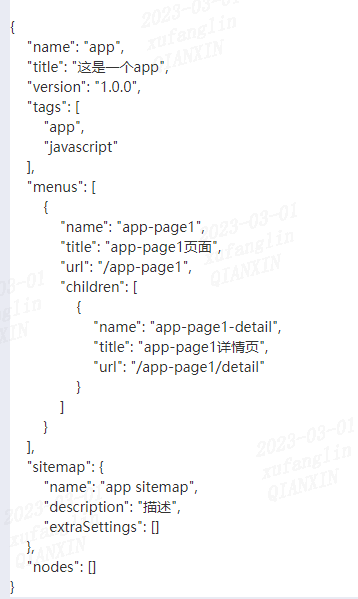

## 1. 如何在页面显示格式化后的json对象？
在日常开发过程中，我们有时候需要在前端页面展示一个对象类型的数据（比如某个配置文件），这个对象可能嵌套了多层。   
在对UI要求不是很严格的情况下，我们可以使用`JSON.stringify()`结合`<pre>`标签来对原始数据进行格式化，并设置缩进。   
比如，我们需要将这样一个对象展示在界面的弹窗中：  
```json
// data.json
{
  "name": "app",
  "title": "这是一个app",
  "version": "1.0.0",
  "tags": ["app", "javascript"],
  "menus": [
    {
      "name": "app-page1",
      "title": "app-page1页面",
      "url": "/app-page1",
      "children": [
        {
          "name": "app-page1-detail",
          "title": "app-page1详情页",
          "url": "/app-page1/detail"
        }
      ]
    }
  ],
  "sitemap": {
    "name": "app sitemap",
    "description": "描述",
    "extraSettings": []
  },
  "nodes": []
}
```  
如何处理？  
```vue
<pre>{{ data }}</pre>

<script>
import jsonData from './data.js';

export default {
  data() {
    return {
      data: JSON.stringify(jsonData, null, 4);
    }
  }
}
</script>
```  
最终展示效果：  

