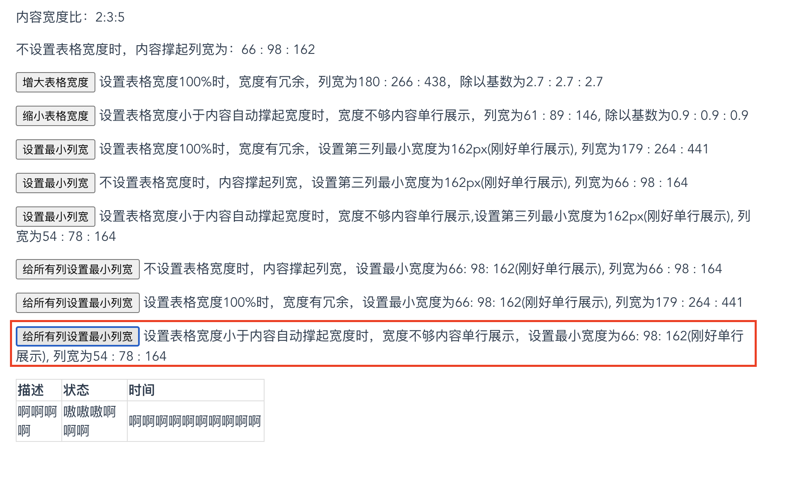

> 走出舒适圈，打败懒惰的自己。

## 1. 探索表格列宽自适应算法

### 前置信息

最近在研究 table 元素的列宽算法，背景是产品提了一个列宽优化的需求，期望全局表格列宽能够合理地展示，具体要求如下：

- 1、尽可能将所有内容单行展示完整
- 2、对于部分字段内容较长时，可以超长省略处理

表格类型： 涵盖所有基础表格（表格+分页器，默认展示 20 条/页），暂不考虑复杂型表格（如：单元格合并，表头分组，树形表格等）。

表格说明：

- 允许对表格列字段进行删减、调序。其中，表格列字段数最少 1，未设上限
- 默认展示列数取决于业务产品定义（通常为 6-8 列，不含 selection 和 operation 列）
- 表格允许出现横向滚动条，当表格宽度小于所有列设置的最小列宽之和时

已知表格中的字段展示会包含如下几种类型：

- 可预知最大宽度的字段，全局统一的显示规则：如日期、IP
- 有限的可枚举类字段，由各业务表定义： 如运行状态（在线、离线、错误、启动中）
- 单行展示的不可预知的文本类型字段，内容来源于用户输入或第三方系统导入，全局默认单行展示，超长省略：如描述信息（字符长度可能达 100+）、资产名称
- 2 行展示的不可预知的文本类型字段，内容来源于用户输入或第三方系统导入，业务产品要求 2 行展示，超长省略：如描述信息（字符长度可能达 100+）
- 单元格内嵌组件：如多值类型（IP）、标签、icon、按钮、下拉框（适用操作列）

table 元素有自己的布局属性：table-layout.

### table-layout: auto

表格列宽会受内容影响。为了挖掘自适应的算法，尝试了不同场景下的列宽结果：

```vue
<template>
  <div id="app">
    <p>内容宽度比：2:3:5</p>
    <p>不设置表格宽度时，内容撑起列宽为：{{ tableRate1.join(' : ') }}</p>
    <p>
      <button @click="changeTableWidth">增大表格宽度</button>
      设置表格宽度100%时，宽度有冗余，列宽为{{
        tableRate2.join(' : ')
      }}，除以基数为{{ rate2.join(' : ') }}
    </p>
    <p>
      <button @click="addTableWidth">缩小表格宽度</button>
      设置表格宽度小于内容自动撑起宽度时，宽度不够内容单行展示，列宽为{{
        tableRate3.join(' : ')
      }}, 除以基数为{{ rate3.join(' : ') }}
    </p>
    <table :width="width">
      <tr>
        <th ref="th1">描述</th>
        <th ref="th2">状态</th>
        <th ref="th3">时间</th>
      </tr>
      <tr>
        <td>啊啊啊啊</td>
        <td>嗷嗷嗷啊啊啊</td>
        <td>啊啊啊啊啊啊啊啊啊啊</td>
      </tr>
    </table>
  </div>
</template>

<script>
export default {
  name: 'App',
  data() {
    return {
      tableRate1: [],
      tableRate2: [],
      tableRate3: [],
      rate2: [],
      rate3: [],
      width: 'unset',
    };
  },
  mounted() {
    this.tableRate1 = this.getRate();
  },
  methods: {
    getRate() {
      const th1Width = this.$refs.th1.clientWidth;
      const th2Width = this.$refs.th2.clientWidth;
      const th3Width = this.$refs.th3.clientWidth;
      return [th1Width, th2Width, th3Width];
    },
    changeTableWidth() {
      this.width = '100%';
      this.$nextTick(() => {
        this.tableRate2 = this.getRate();
        this.rate2 = this.tableRate2.map((item, index) =>
          (item / this.tableRate1[index]).toFixed(1)
        );
      });
    },
    addTableWidth() {
      this.width = '300';
      this.$nextTick(() => {
        this.tableRate3 = this.getRate();
        this.rate3 = this.tableRate3.map((item, index) =>
          (item / this.tableRate1[index]).toFixed(1)
        );
      });
    },
  },
};
</script>

<style scoped>
#app {
  font-family: 'Avenir', Helvetica, Arial, sans-serif;
  -webkit-font-smoothing: antialiased;
  -moz-osx-font-smoothing: grayscale;
  text-align: center;
  color: #2c3e50;
  margin: auto;
  width: 50%;
}

table {
  border-collapse: collapse;
  /* width: 100%; */
  text-align: left;
}

th,
td {
  border: 1px solid #ddd;
}
</style>
```

分析：

- 1、在容器宽度充足的情况下，不设置 table 宽度，则最终宽度是内容单行展示撑起的宽度（参考 tableRate1），此时表格宽度刚好允许内容不换行。  
  

- 2、表格列字符数的比值(示例为 2:3:5)，与实际内容撑起的列宽（tableRate1）并不具备严格等比关系（误差较大），不能以字符数推导列宽分配算法。
- 3、内容撑起的列宽(tableRate1)，与存在冗余宽度(tableRate2)、宽度不够单行展示(tableRate3)的分配比例几乎是一致的。  
    
  

得出如下结论：<font color="#008dff">不设置列边距时，列宽不是均分的，实际列宽的分配，是以内容撑起列宽为基数进行等比放大/缩小</font>

鉴于表格允许出现横向滚动条，因此尝试给列宽设置 minWidth 试试：

```vue
<template>
  <div id="app">
    <div style="text-align: left;">
      <p>内容宽度比：2:3:5</p>
      <p>不设置表格宽度时，内容撑起列宽为：{{ tableRate1.join(' : ') }}</p>
      <p>
        <button @click="changeTableWidth">增大表格宽度</button>
        设置表格宽度100%时，宽度有冗余，列宽为{{
          tableRate2.join(' : ')
        }}，除以基数为{{ rate2.join(' : ') }}
      </p>
      <p>
        <button @click="addTableWidth">缩小表格宽度</button>
        设置表格宽度小于内容自动撑起宽度时，宽度不够内容单行展示，列宽为{{
          tableRate3.join(' : ')
        }}, 除以基数为{{ rate3.join(' : ') }}
      </p>
      <p>
        <button @click="setMinWidth1">设置最小列宽</button>
        设置表格宽度100%时，宽度有冗余，设置第三列最小宽度为163px(刚好单行展示),
        列宽为{{ tableRate4.join(' : ') }}
      </p>
      <p>
        <button @click="setMinWidth2">设置最小列宽</button>
        不设置表格宽度时，内容撑起列宽，设置第三列最小宽度为163px(刚好单行展示),
        列宽为{{ tableRate5.join(' : ') }}
      </p>
      <p>
        <button @click="setMinWidth3">设置最小列宽</button>
        设置表格宽度小于内容自动撑起宽度时，宽度不够内容单行展示,设置第三列最小宽度为163px(刚好单行展示),
        列宽为{{ tableRate6.join(' : ') }}
      </p>
    </div>

    <table :width="width">
      <tr>
        <th ref="th1">描述</th>
        <th ref="th2">状态</th>
        <th ref="th3" :style="{ minWidth: minWidth }">时间</th>
      </tr>
      <tr>
        <td>啊啊啊啊</td>
        <td>嗷嗷嗷啊啊啊</td>
        <td :style="{ minWidth: minWidth }">啊啊啊啊啊啊啊啊啊啊</td>
      </tr>
    </table>
  </div>
</template>

<script>
export default {
  name: 'App',
  data() {
    return {
      tableRate1: [],
      tableRate2: [],
      tableRate3: [],
      rate2: [],
      rate3: [],
      width: 'unset',
      minWidth: 'unset',
      tableRate4: [],
      tableRate5: [],
      tableRate6: [],
    };
  },
  mounted() {
    this.tableRate1 = this.getRate();
  },
  methods: {
    getRate() {
      const th1Width = this.$refs.th1.clientWidth;
      const th2Width = this.$refs.th2.clientWidth;
      const th3Width = this.$refs.th3.clientWidth;
      return [th1Width, th2Width, th3Width];
    },
    changeTableWidth() {
      this.width = '100%';
      this.$nextTick(() => {
        this.tableRate2 = this.getRate();
        this.rate2 = this.tableRate2.map((item, index) =>
          (item / this.tableRate1[index]).toFixed(1)
        );
      });
    },
    addTableWidth() {
      this.width = '300';
      this.$nextTick(() => {
        this.tableRate3 = this.getRate();
        this.rate3 = this.tableRate3.map((item, index) =>
          (item / this.tableRate1[index]).toFixed(1)
        );
      });
    },
    setMinWidth1() {
      this.width = '100%';
      this.minWidth = '163px';
      this.$nextTick(() => {
        this.tableRate4 = this.getRate();
      });
    },
    setMinWidth2() {
      this.width = 'unset';
      this.minWidth = '163px';
      this.$nextTick(() => {
        this.tableRate5 = this.getRate();
      });
    },
    setMinWidth3() {
      this.width = '300';
      this.minWidth = '163px';
      this.$nextTick(() => {
        this.tableRate6 = this.getRate();
      });
    },
  },
};
</script>

<style scoped>
#app {
  font-family: 'Avenir', Helvetica, Arial, sans-serif;
  -webkit-font-smoothing: antialiased;
  -moz-osx-font-smoothing: grayscale;
  text-align: center;
  color: #2c3e50;
  margin: auto;
  width: 50%;
}

table {
  border-collapse: collapse;
  /* width: 100%; */
  text-align: left;
}

th,
td {
  border: 1px solid #ddd;
}
</style>
```

分析：

- 1、观察 tableRate5 vs tableRate4 和 tableRate5 vs tableRate6 可以看出，设置 minWidth 会影响列宽基数，进而影响实际列宽分配
- 2、观察 tableRate4, tableRate5, tableRate6 的结果可以看出，设置最小宽度后，不论表格宽度是否足够内容单行展示，该列的实际宽度始终不低于设置的 minWidth  
    
    
  

得出如下结论：<font color="#008dff">设置 minWidth 会影响列宽分配，并且实际列宽始终不低于设置的 minWidth</font>

在上述结论下，表格展示会存在以下问题：

- 1、表格宽度不够时，如果不同列的内容长度差距过大，会出现：长列占用过多宽度，短列换行。
- 2、可以给每列都设置 minWidth 来解决上述部分问题，但当所有列的 minWidth 之和大于表格宽度时还是会出现上述问题.

代码如下：

```vue
<template>
  <div id="app">
    <div style="text-align: left;">
      <p>内容宽度比：2:3:5</p>
      <p>不设置表格宽度时，内容撑起列宽为：{{ tableRate1.join(' : ') }}</p>
      <p>
        <button @click="changeTableWidth">增大表格宽度</button>
        设置表格宽度100%时，宽度有冗余，列宽为{{
          tableRate2.join(' : ')
        }}，除以基数为{{ rate2.join(' : ') }}
      </p>
      <p>
        <button @click="addTableWidth">缩小表格宽度</button>
        设置表格宽度小于内容自动撑起宽度时，宽度不够内容单行展示，列宽为{{
          tableRate3.join(' : ')
        }}, 除以基数为{{ rate3.join(' : ') }}
      </p>
      <p>
        <button @click="setMinWidth1">设置最小列宽</button>
        设置表格宽度100%时，宽度有冗余，设置第三列最小宽度为162px(刚好单行展示),
        列宽为{{ tableRate4.join(' : ') }}
      </p>
      <p>
        <button @click="setMinWidth2">设置最小列宽</button>
        不设置表格宽度时，内容撑起列宽，设置第三列最小宽度为162px(刚好单行展示),
        列宽为{{ tableRate5.join(' : ') }}
      </p>
      <p>
        <button @click="setMinWidth3">设置最小列宽</button>
        设置表格宽度小于内容自动撑起宽度时，宽度不够内容单行展示,设置第三列最小宽度为162px(刚好单行展示),
        列宽为{{ tableRate6.join(' : ') }}
      </p>
      <p>
        <button @click="setAllMinWidth1">给所有列设置最小列宽</button>
        不设置表格宽度时，内容撑起列宽，设置最小宽度为66: 98: 162(刚好单行展示),
        列宽为{{ tableRate7.join(' : ') }}
      </p>
      <p>
        <button @click="setAllMinWidth2">给所有列设置最小列宽</button>
        设置表格宽度100%时，宽度有冗余，设置最小宽度为66: 98: 162(刚好单行展示),
        列宽为{{ tableRate8.join(' : ') }}
      </p>
      <p>
        <button @click="setAllMinWidth3">给所有列设置最小列宽</button>
        设置表格宽度小于内容自动撑起宽度时，宽度不够内容单行展示，设置最小宽度为66:
        98: 162(刚好单行展示), 列宽为{{ tableRate9.join(' : ') }}
      </p>
    </div>

    <table :width="width">
      <tr>
        <th ref="th1">描述</th>
        <th ref="th2">状态</th>
        <th ref="th3" :style="{ minWidth: minWidth3 }">时间</th>
      </tr>
      <tr>
        <td>啊啊啊啊</td>
        <td>嗷嗷嗷啊啊啊</td>
        <td :style="{ minWidth: minWidth3 }">啊啊啊啊啊啊啊啊啊啊</td>
      </tr>
    </table>
  </div>
</template>

<script>
export default {
  name: 'App',
  data() {
    return {
      tableRate1: [],
      tableRate2: [],
      tableRate3: [],
      rate2: [],
      rate3: [],
      width: 'unset',
      tableRate4: [],
      tableRate5: [],
      tableRate6: [],
      minWidth1: 'unset',
      minWidth2: 'unset',
      minWidth3: 'unset',
      tableRate7: [],
      tableRate8: [],
      tableRate9: [],
    };
  },
  mounted() {
    this.tableRate1 = this.getRate();
  },
  methods: {
    getRate() {
      const th1Width = this.$refs.th1.clientWidth;
      const th2Width = this.$refs.th2.clientWidth;
      const th3Width = this.$refs.th3.clientWidth;
      return [th1Width, th2Width, th3Width];
    },
    changeTableWidth() {
      this.width = '100%';
      this.$nextTick(() => {
        this.tableRate2 = this.getRate();
        this.rate2 = this.tableRate2.map((item, index) =>
          (item / this.tableRate1[index]).toFixed(1)
        );
      });
    },
    addTableWidth() {
      this.width = '300';
      this.$nextTick(() => {
        this.tableRate3 = this.getRate();
        this.rate3 = this.tableRate3.map((item, index) =>
          (item / this.tableRate1[index]).toFixed(1)
        );
      });
    },
    setMinWidth1() {
      this.width = '100%';
      this.minWidth3 = '162px';
      this.$nextTick(() => {
        this.tableRate4 = this.getRate();
      });
    },
    setMinWidth2() {
      this.width = 'unset';
      this.minWidth3 = '162px';
      this.$nextTick(() => {
        this.tableRate5 = this.getRate();
      });
    },
    setMinWidth3() {
      this.width = '300';
      this.minWidth3 = '162px';
      this.$nextTick(() => {
        this.tableRate6 = this.getRate();
      });
    },
    setAllMinWidth1() {
      this.width = 'unset';
      this.minWidth1 = '66px';
      this.minWidth2 = '98px';
      this.minWidth3 = '162px';
      this.$nextTick(() => {
        this.tableRate7 = this.getRate();
      });
    },
    setAllMinWidth2() {
      this.width = '100%';
      this.minWidth1 = '66px';
      this.minWidth2 = '98px';
      this.minWidth3 = '162px';
      this.$nextTick(() => {
        this.tableRate8 = this.getRate();
      });
    },
    setAllMinWidth3() {
      this.width = '300';
      this.minWidth1 = '66px';
      this.minWidth2 = '98px';
      this.minWidth3 = '162px';
      this.$nextTick(() => {
        this.tableRate9 = this.getRate();
      });
    },
  },
};
</script>

<style scoped>
#app {
  font-family: 'Avenir', Helvetica, Arial, sans-serif;
  -webkit-font-smoothing: antialiased;
  -moz-osx-font-smoothing: grayscale;
  text-align: center;
  color: #2c3e50;
  margin: auto;
  width: 50%;
}

table {
  border-collapse: collapse;
  /* width: 100%; */
  text-align: left;
}

th,
td {
  border: 1px solid #ddd;
}
</style>
```

具体表现如下：  
  
  


那么，要怎么解决所有列 minWidth 之和大于表格宽度的问题呢？
