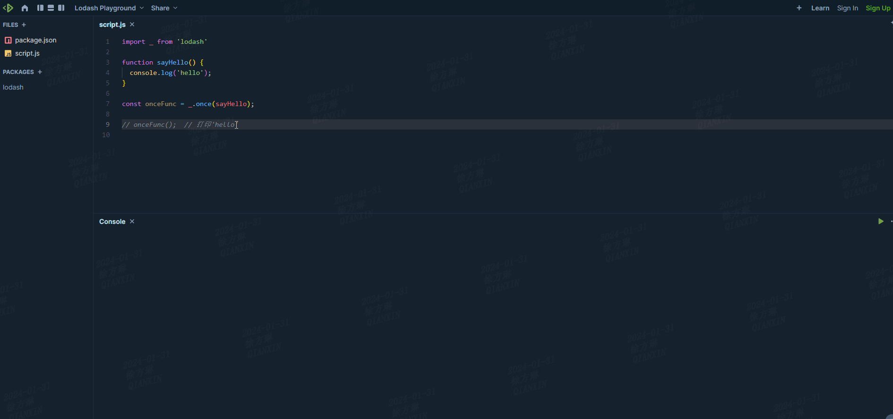
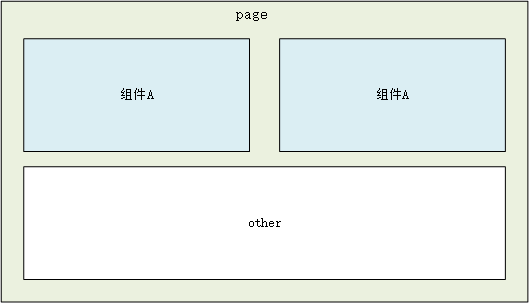
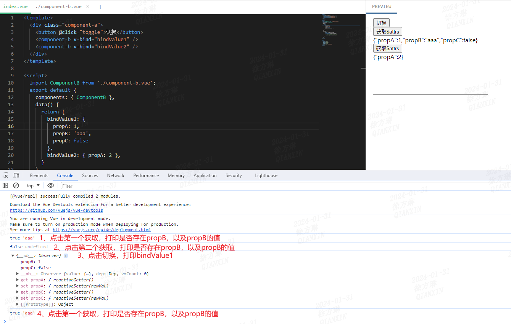

> 存档去年，喜迎新年。

## 1. 研发说：这个定时任务是幂等的  

### 幂等的概念   
幂等（Idempotence）是一个数学概念，在计算机科学中广泛应用于描述操作或函数的行为。在编程和软件设计中，一个操作或函数是幂等的，意味着重复执行这个操作或函数多次的效果等同于只执行一次。也就是说，无论执行多少次，结果都是相同的。

### 幂等在编程中的应用  
在编程中，幂等性通常与操作的副作用相关。如果一个函数没有副作用（即不会对系统状态产生任何永久性的改变），那么它通常是幂等的。    

```js
// 幂等
add(2, 4);  // 第一次调用，结果为6
add(2, 4);  // 第二次调用，结果依然为6
```  

在分布式系统、数据库操作、网络请求等领域，幂等性是一个重要的概念，它有助于确保系统的一致性和正确性。例如，当一个网络请求由于网络问题被重复发送时，如果这个请求是幂等的，那么服务器可以安全地忽略重复的请求，而不必担心产生不一致的状态。

### 对立面：非幂等
非幂等意味着重复执行一个操作或函数会导致不同的结果。在编程和软件设计中，一个操作或函数是非幂等的，意味着如果每次执行它都会产生不同的结果，或者至少有可能产生不同的结果。 

### 非幂等在编程中的应用
- 数据库操作：某些数据库操作，如插入、更新或删除记录，通常是非幂等的，因为重复执行这些操作可能会导致记录被多次插入、更新或删除。  
- 网络请求：许多类型的网络请求（如HTTP请求）默认是非幂等的。例如，对同一个网址执行两次GET请求通常会返回相同的结果，但执行两次POST请求可能会导致数据被重复处理。  
- 文件操作：对一个文件执行写操作（如append、write等）可能是非幂等的，因为重复写入可能会导致数据被重复添加到文件中。  
- 函数副作用：任何产生副作用的函数，例如修改全局变量、I/O操作或改变自身参数的函数，通常都是非幂等的。  

```js
// 非幂等
// increment函数作用：累加器，初始值为0
increment(5);  // 第一次调用，结果为5
increment(5);  // 第二次调用，结果为10
```

### 小结
在设计系统或函数时，如果可能，应该尽量使其具有幂等性，因为这样可以提高系统的可靠性、安全性和可维护性。  
对于非幂等的操作，通常需要额外的机制来防止副作用或不一致性的产生，例如通过使用事务、版本控制或唯一性验证等手段。

## 2. 请听好，定时任务终止后务必重置timer！
最近看到了一段这样的代码：    

```js
let timer = null;
let ind = 0;
function startLoop() {
  if(timer) {
    console.log(`timer未清空 -> ${timer}`);
    return;
  }
  timer = setInterval(loopProgress, 1000);
}

function loopProgress() {
  console.log(`${timer}, execute ${ind++}`);
}

function cancelLoop() {
  timer && clearInterval(timer);
  console.log(timer);
}
```

请在浏览器控制台输入上述代码，首先执行`startLoop`，待打印几次后再执行`cancelLoop`，你会发现神奇的现象（不是每次都出现但出现概率极高噢）： 
- 定时任务终止，但timer未被设置成null？？？   

   

- 再次执行`startLoop`，未开启定时任务？？？  

  

查看了MDN文档，发现使用`clearInterval`或`clearTimeout`只会取消定时器，不会重置timer，导致再次尝试启用定时器时，由于timer判断falsy导致启用失败。

优化后代码：  

```js{17}
let timer = null;
let ind = 0;
function startLoop() {
  if(timer) {
    console.log(`timer未清空 -> ${timer}`);
    return;
  }
  timer = setInterval(loopProgress, 1000);
}

function loopProgress() {
  console.log(`${timer}, execute ${ind++}`);
}

function cancelLoop() {
  timer && clearInterval(timer);
  timer = null;
  console.log(timer);
}
```

### 小结  
通过`clearInterval(timerId)` 或`clearTimeout(timerId)`可以清除定时器，但是`timerId`并不会被置空，不能以`Boolean（timerId）`判断定时器已关闭。

## 3. 【lodash踩坑系列】多实例组件使用once仅触发一次噢
### 前置信息
**`lodash`**：一个应用非常普遍的js库，提供了丰富的工具函数帮助开发人员处理数组、对象、字符串等数据类型，可以简化代码复杂度，减少代码量和潜在bug。  
**`once(func)`**：创建一个只能调用 func 一次的函数。 重复调用返回第一次调用的结果。 func 调用时， this 绑定到创建的函数，并传入对应参数。  
 - 参数: func（Function），指定的触发函数。   
 - 返回：（function），一个新的受限函数。

使用举例：  

```js
const once = require('lodash/once');

function sayHello() {
  console.log('hello');
}

const onceFunc = once(sayHello);

onceFunc();  // 第一次执行onceFunc()，打印'hello'
onceFunc();  // 第二次执行onceFunc()，不会执行sayHello()，也不会打印'hello'

```  

  

### 问题描述
vue项目某页面使用了一个公共组件A，用户可以自定义添加多个卡片在界面进行展示，卡片内是组件A。用户通过鼠标拖拽卡片右下角来调整宽高，卡片内组件A宽高期望能自适应调整（参考仪表板业务场景）。页面布局如下：  

  

问题说明：
当页面引用多个组件A时，调整卡片高度后，组件A的高度不会自适应。

### 排查路径
1. 查看控制台有无组件相关的报错或警告 => 无   
2. 尝试调整数据量，对每个卡片进行拖拽，确认是否所有组件A都异常 => 发现仅一个是正常的，其余都异常！   
3. 删除所有组件A仅保留一个，再调整卡片高度，确认是否异常 => 否    
4. 通过vue devtools查看组件A接收的props属性是否有区别 => 无    
5. 继续查看组件A内部与高度相关的属性是否有差异 => 有   
6. 查看组件A源码，找到高度计算相关逻辑，debugger    
7. 发现组件A内部在初始化时使用`once`添加了一个resize监听器，用于监听父元素高度变化，从而实现高度自适应填充与布局更新   
8. 在`once`执行前debugger，发现只有第一个完成初始化的组件A会执行`once`内的监听函数，其后所有组件A均没有成功添加监听   

相关逻辑如下：

```js{15,26}
import { once } from 'lodash';
import { addResizeListener } from './utils';  // 监听器实现工具方法，不是重点。

export default {
  data() {
    return {
      height: null
    }
  }
},
mounted() {
  this.setHeight();
},
methods: {
  addParentNodeResizeListener: once(function() {
    const parentNode = this.$el.parentNode;
    if(!parentNode) return;
    addResizeListener(parentNode, this.setHeight);
  }),
  setHeight() {
    this.$nextTick(() => {
      const parentNode = this.$el.parentNode;
      if(!parentNode) return;
      
      this.height = parentNode.clientHeight;
      this.addParentNodeResizeListener(); 
    })
  },
}
```  

代码执行说明：  
- 第一个注册的组件A（后续称A1），在mounted中第一次执行`setHeight` -> `addParentNodeResizeListener` -> `addResizeListener`，成功添加监听器。   
- 其后注册的组件A（后续称A2），由于`addParentNodeResizeListener`已经执行过一次，不会再执行，故在mounted执行的路径为`setHeight`，不会添加监听器。   
- 若之后用户手动拖拽A1卡片，会再次执行`setHeight`，但由于此前`addParentNodeResizeListener`已经执行过一次，故仅会更新`height`属性，从而实现高度自适应。  
- 接着用户手动拖拽A2卡片，由于没有执行添加监听器函数，故不会执行`setHeight`，进而导致高度不会自适应。  

### 解决方案  
从上述排查分析可知，异常原因是所有组件A的实例公用了`addParentNodeResizeListener`。因此，只要每个组件A在注册后都能执行一次`addParentNodeResizeListener`，就可以分别添加各自的监听器，从而实现高度自适应。  

修改后的代码：  

```js{12,18}
import { once } from 'lodash';
import { addResizeListener } from './utils';  // 监听器实现工具方法，不是重点。

export default {
  data() {
    return {
      height: null
    }
  }
},
created() {
  this.addParentNodeResizeListener = once(this._addParentNodeResizeListener);
},
mounted() {
  this.setHeight();
},
methods: {
  _addParentNodeResizeListener() {
    const parentNode = this.$el.parentNode;
    if(!parentNode) return;
    addResizeListener(parentNode, this.setHeight);
  },
  setHeight() {
    this.$nextTick(() => {
      const parentNode = this.$el.parentNode;
      if(!parentNode) return;
      
      this.height = parentNode.clientHeight;
      this.addParentNodeResizeListener(); 
    })
  },
}
```   

关注第12行代码，确保每个组件注册时都会声明一个`once`函数`addParentNodeResizeListener`，这个函数中的`once`绑定的是当前实例的`_addParentNodeResizeListener`方法，因此每个组件实例的`addParentNodeResizeListener`都是独一无二的，从而都可成功添加resize监听。  

另一个思路： 根因是`once`函数被复用了，那么只要将其执行的上下文分别绑定到各个组件A实例即可实现监听。  

代码如下：  

```js{1,15}
import { once, bind } from 'lodash';
import { addResizeListener } from './utils';  // 监听器实现工具方法，不是重点。

export default {
  data() {
    return {
      height: null
    }
  }
},
mounted() {
  this.setHeight();
},
methods: {
  addParentNodeResizeListener: bind(once(function() {
    const parentNode = this.$el.parentNode;
    if(!parentNode) return;
    addResizeListener(parentNode, this.setHeight);
  }), this),
  setHeight() {
    this.$nextTick(() => {
      const parentNode = this.$el.parentNode;
      if(!parentNode) return;
      
      this.height = parentNode.clientHeight;
      this.addParentNodeResizeListener(); 
    })
  },
}
```

### 小结  
once用法需谨慎，否则排查两行泪~~

## 4. 【vue踩坑系列】$attrs属性被删除时，子组件依然能获取到属性  

### 结论先行
Vue在更新`$attrs`时，会保留之前传递的所有属性，即使这些属性被删除了。

Vue官方文档：  
> `$attrs`包含了父作用域中不作为props被识别（且获取）的`attribute`绑定（不含`class`和`style`）。当组件未声明任何`props`时，这里会包含所有父作用域的绑定，并且可以通过`v-bind="$attrs"`传入内部组件。  

### 背景信息
vue项目，父组件A中引用了子组件B，其中B接收三个props分别为propA、propB、propC。代码示例如下：  

**A.vue**

```vue
<template>
  <div class="component-a">
    <button @click="toggle">切换</button>
    <component-b v-bind="bindValue1" />
    <component-b v-bind="bindValue2" />
  </div>
</template>

<script>
  import ComponentB from './component-b.vue';
  export default {
    components: { ComponentB },
    data() {
      return {
        bindValue1: {
          propA: 1,
          propB: 'aaa',
          propC: false
        },
        bindValue2: { propA: 2 },
      }
    },
    methods: {
      toggle() {
        if(this.bindValue1.propB) {
          delete this.bindValue1.propB;
          console.log(this.bindValue1);
        }
      }
    }
  }
</script>

<style>
  .component-a {
    width: 300px;
    height: 200px;
    margin: 10px;
    border: 1px solid gray;
  }
</style>
  
```

**B.vue**  

```vue
<template>
  <div class="component-b">
    <button @click="getAttrs">获取$attrs</button>
    <div>{{ value }}</div>
  </div>
</template>

<script>
  export default {
    data() {
      return {
        value: {}
      }
    },
    methods: {
      getAttrs() {
        console.log(Object.prototype.hasOwnProperty.call(this.$attrs, 'propB'), this.$attrs.propB);
        this.value = JSON.stringify(this.$attrs)
      }
    }
  }
</script>
```

### 问题描述
父组件A在点击按钮时会使用delete方法删除`bindValue1`的`propB`属性，子组件B点击获取时打印发现`propB`还是旧值。   



### 排查路径
1. 尝试在组件A中打印`bindValue1`，发现点击切换按钮后`bindValue1`中已经没有`propB`属性  
2. 尝试在组件A中修改切换按钮后的逻辑，将delete操作换成赋值操作，发现子组件B可以正常更新`propB`  
3. 结论：delete操作导致`bindValue1`的属性丢失了响应性。   

### 解决方案  
使用不影响响应式的方式更新属性值。

## 5. window.open之你不知道的那些事  
### 背景  
系统有两个页面A/B可互相跳转。其中A页面中有个图片可以通过点击，利用自定义实现的`jump`方法新开一个tab页跳到B页面。B页面可以通过按钮点击跳到A。  

### 问题
操作步骤：  
1. 进入A页面，点击图片跳到B页面（`jump(urlB)`）   
2. 在上一步打开的B页面点击按钮，跳到A页面（`<a>`标签）   
3. 在上一步打开的A页面，点击图片跳到B页面（`jump(urlB)`）  

期望结果：  
1. 新开tab页打开B页面  
2. 当前页打开A页面   
3. 新开tab页打开B页面

实际结果：  
1. 新开tab页打开B页面  
2. 当前页打开A页面  
3. 当前页打开B页面  

### window.open
`window.open(url, target, windowFeatures)`:  
- `url`：一个字符串，表示要加载的资源的 URL 或路径。如果指定空字符串（""）或省略此参数，则会在目标浏览上下文中打开一个空白页。  
- `target`：一个不含空格的字符串，用于指定加载资源的浏览上下文的名称。如果该名称无法识别现有的上下文，则会创建一个新的上下文，并赋予指定的名称。还可以使用特殊的 `target`关键字：`_self`、`_blank`、`_parent`和 `_top`。  
- `windowFeatures`：一个字符串，包含以逗号分隔的窗口特性列表。非本节重点，不解释~   

### 问题原因——窗口复用
如果当前窗口已经存在`target`，则在此窗口执行`window.open(url)`的时候，不会再新开tab页加载新页面，而是在当前窗口中加载。如果要在每次调用`window.open()`的时候打开一个新窗口，就需要将参数`target`设置为`_blank`。  

此处实现窗口复用的原理如下：  

```js
function jump(url, target = url) {
  window.open(url, target || '_blank');
}
```

引用上述问题，具体解释如下： 
1. 进入A页面，点击图片跳到B页面（`jump(urlB)`）
> 由于未指定`target`，因此会新开窗口跳到B（`window.open(urlB, urlB)`），此时B窗口存在`target` = 'urlB'  
2. 在上一步打开的B页面点击按钮，跳到A页面（`<a>`标签）  
> 此时B窗口存在`target` = 'urlB' 
3. 在上一步打开的A页面，点击图片跳到B页面（`jump(urlB)`）  
> 由于当前窗口的`target` = 'urlB'，且跳转的目标url也是'urlB'，因此不再新开窗口，直接在当前窗口加载新的B页面。


