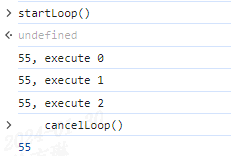
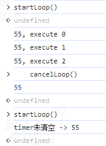

> 存档去年，喜迎新年。

## 1. 研发说：这个定时任务是幂等的  

### 幂等的概念   
幂等（Idempotence）是一个数学概念，在计算机科学中广泛应用于描述操作或函数的行为。在编程和软件设计中，一个操作或函数是幂等的，意味着重复执行这个操作或函数多次的效果等同于只执行一次。也就是说，无论执行多少次，结果都是相同的。

### 幂等在编程中的应用  
在编程中，幂等性通常与操作的副作用相关。如果一个函数没有副作用（即不会对系统状态产生任何永久性的改变），那么它通常是幂等的。    

```js
// 幂等
add(2, 4);  // 第一次调用，结果为6
add(2, 4);  // 第二次调用，结果依然为6
```  

在分布式系统、数据库操作、网络请求等领域，幂等性是一个重要的概念，它有助于确保系统的一致性和正确性。例如，当一个网络请求由于网络问题被重复发送时，如果这个请求是幂等的，那么服务器可以安全地忽略重复的请求，而不必担心产生不一致的状态。

### 对立面：非幂等
非幂等意味着重复执行一个操作或函数会导致不同的结果。在编程和软件设计中，一个操作或函数是非幂等的，意味着如果每次执行它都会产生不同的结果，或者至少有可能产生不同的结果。 

### 非幂等在编程中的应用
- 数据库操作：某些数据库操作，如插入、更新或删除记录，通常是非幂等的，因为重复执行这些操作可能会导致记录被多次插入、更新或删除。  
- 网络请求：许多类型的网络请求（如HTTP请求）默认是非幂等的。例如，对同一个网址执行两次GET请求通常会返回相同的结果，但执行两次POST请求可能会导致数据被重复处理。  
- 文件操作：对一个文件执行写操作（如append、write等）可能是非幂等的，因为重复写入可能会导致数据被重复添加到文件中。  
- 函数副作用：任何产生副作用的函数，例如修改全局变量、I/O操作或改变自身参数的函数，通常都是非幂等的。  

```js
// 非幂等
// increment函数作用：累加器，初始值为0
increment(5);  // 第一次调用，结果为5
increment(5);  // 第二次调用，结果为10
```

### 小结
在设计系统或函数时，如果可能，应该尽量使其具有幂等性，因为这样可以提高系统的可靠性、安全性和可维护性。  
对于非幂等的操作，通常需要额外的机制来防止副作用或不一致性的产生，例如通过使用事务、版本控制或唯一性验证等手段。

## 2. 请听好，定时任务终止后务必重置timer！
最近看到了一段这样的代码：    

```js
let timer = null;
let ind = 0;
function startLoop() {
  if(timer) {
    console.log(`timer未清空 -> ${timer}`);
    return;
  }
  timer = setInterval(loopProgress, 1000);
}

function loopProgress() {
  console.log(`${timer}, execute ${ind++}`);
}

function cancelLoop() {
  timer && clearInterval(timer);
  console.log(timer);
}
```

请在浏览器控制台输入上述代码，首先执行`startLoop`，待打印几次后再执行`cancelLoop`，你会发现神奇的现象（不是每次都出现但出现概率极高噢）： 
- 定时任务终止，但timer未被设置成null？？？   

   

- 再次执行`startLoop`，未开启定时任务？？？  

  

查看了MDN文档，发现使用`clearInterval`或`clearTimeout`只会取消定时器，不会重置timer，导致再次尝试启用定时器时，由于timer判断falsy导致启用失败。

优化后代码：  

```js{17}
let timer = null;
let ind = 0;
function startLoop() {
  if(timer) {
    console.log(`timer未清空 -> ${timer}`);
    return;
  }
  timer = setInterval(loopProgress, 1000);
}

function loopProgress() {
  console.log(`${timer}, execute ${ind++}`);
}

function cancelLoop() {
  timer && clearInterval(timer);
  timer = null;
  console.log(timer);
}
```

## 3. 【lodash踩坑系列】多实例组件使用once仅触发一次噢

## 4. 【vue踩坑系列】$attrs属性被删除时，子组件依然能获取到属性，且值为undefined