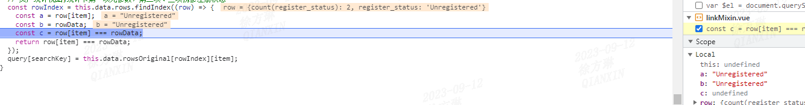
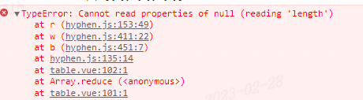
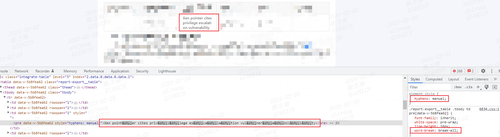
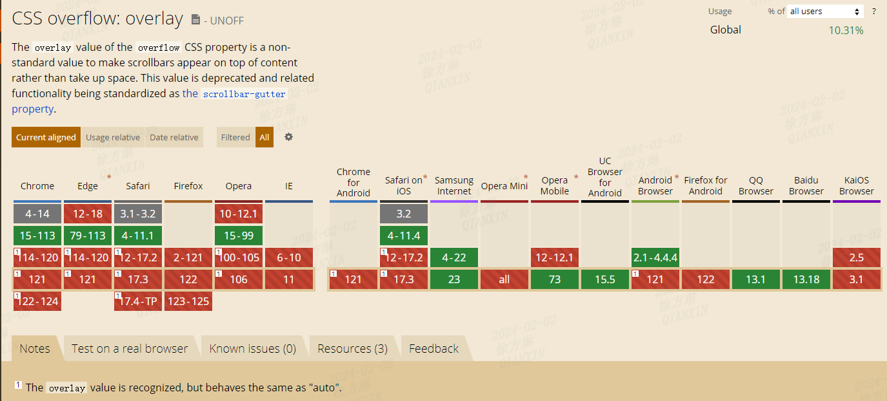
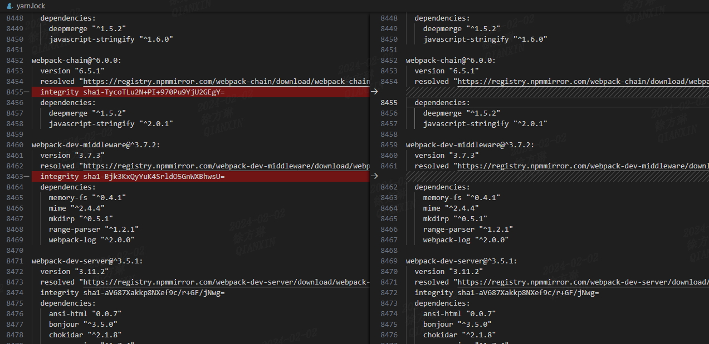

> 回家倒计时第6天。

## 1. 【踩坑记录】 i8n之hyphenateSync使用问题  
### 单词换行方案说明 
当项目需要做国际化版本时，不可避免的需要处理一些单词内文本换行问题。已经有如下方案（叠加）：   
1. 给各级元素添加换行样式：  

```css
{
  word-break: normal;
  overflow-wrap: anywhere;
}
```

2. 需要兼容1366*768以及1920*1080不同的分辨率时，给文案展示的空间设置得足够合适，确保不会换行，或者合理换行。   
3. 使用 [hyphen](https://github.com/ytiurin/hyphen)库来处理空间不足导致被迫单词内换行的情况。用法如下：

```js
import { hyphenateSync } from 'hyphen/en';

function transformName (val) {
  return hyphenateSync(val);
}
```
### hyphen简介
[hyphen](https://github.com/ytiurin/hyphen)是依据一组断词模式来对单词进行分割添加连字符。它所依据的断词模式来源于[hyph-utf8](https://www.ctan.org/pkg/hyph-utf8), `hyph-utf8`是一个广泛使用的用于TeX中断词处理的包，提供了多种语言的连字规则，可用于实现自动断字等功能。

### hyphen坑点记录  
1. 使用`hyphenateSync`处理以后的字符串不能用于字符串匹配，因为添加了隐形字符，匹配总会失败（**debugger都看不出来哦**）。   
如下图所示，在浏览器debugger时甚至都无法判断二者为啥`===`为false！但是在浏览器控制台打印后才发现，经由`hyphenateSync`处理后的字符串中间有隐形连字符`&shy;`

  

2. 原理同1，由于隐形连字符的原因，如果有文案复制->粘贴的需求，需要单独处理复制的逻辑，确保其复制的文案是未经过`hyphenateSync`处理！  

```js
// 去重复制文本中的隐藏连字符 ­
document.addEventListener('copy', (event) => {
  const selectionText = document.getSelection().toString() || '';
  const text = selectionText.replace(/\u00AD/g, '');
  event.clipboardData.setData('text/plain', text);
  event.preventDefault();
});
```

3. `hyphenateSync`不能传递`null`值，函数会报错   

  

4. 经过`hyphenateSync`处理的文案所在标签不能使用word-break:break-all，否则hyphen属性会失效。  



## 2. [sleep函数实践]当异步结束时机不可控时，如何让Promise一直处于pending？
### 实现方案：  

```js
function waitForPending() {
  return new Promise((resolve, reject) => {
    const checkPending = () => {
      // 在异步执行的过程中，不断检查是否需要改变Promise的状态
      if (/* 需要继续保持pending状态的条件 */) {
        setTimeout(checkPending, 1000);  // 每隔一段时间轮询一次
      } else {
        resolve(/* 最终的结果值 */);  // 根据条件决定resolve或reject
      }
    };

    checkPending();
  });
}
```  
## 3. 【chrome】114版本对overflow: overlay不再支持  
### overflow属性值解析
`overflow`是`overflow-x`和`overflow-y`的简写，用于设置元素溢出时的行为。   
常用取值如下：  

| value | 说明 |   
| ---- | ---- |   
| `visible` | 内容不能被裁减并且可能渲染到边距盒（padding）的外部 |  
| `hidden` | 如果需要，内容将被裁减以适应边距（padding）盒。不提供滚动条，也不支持允许用户滚动（例如通过拖拽或者使用滚轮）。 |  
| `scroll` | 无论是否实际裁剪了任何内容，浏览器总是显示滚动条 |  
| `auto` | 如果内容适应边距（padding）盒，它看起来与 visible 相同，但是仍然建立了一个新的块级格式化上下文。如果内容溢出，则浏览器提供滚动条。|  
| `overlay` | <font color="red">chrome 114及以后不再支持</font> 行为与 auto 相同，但是滚动条绘制在内容之上，而不是占据空间 |   

### 不支持overlay意味着什么？
`overlay`属性值在不同浏览器上的兼容情况不同，并且使用同一款相同版本的浏览器，<font color="red">在mac和windows上的具体表现也是不同的。</font>  

  

### 为什么要提overlay？
`overlay`属性下，滚动条不会占用内容宽度。对于一些页面边距要求比较精致的场景来说，左右边距视觉效果一致无疑是必要的，有些甚至会覆盖默认滚动条宽度。在废除`overlay`之前，我们仅需设置下这个属性即可轻松满足要求。    
另外，mac用户对于`overlay`被废弃是无法感知的，因为`mac`用户的浏览器默认就是不占据空间的！  
想象一下：设计师使用高配mac，研发mac/windows一半一半，测试全windows是种什么场景？  
答案来了：设计师提供的高保真中，滚动条是mac的样式（颜色、宽度、是否占据内容等等），我相信任何看过mac+chrome滚动条样式后的前端研发都会更青睐这种效果。。

因此，废弃`overlay`以后，windows用户泪奔了，目前提供的既有属性都无法达到设计师的要求，只能通过两种方式来实现：  
1. 方案一：各页面自行处理水平间距问题 or 添加一个全局类名共个页面按需使用，弊端显而易见：无法识别页面是否有滚动条。然而有无滚动条对设置页面边距影响是极大的。    
2. 方案二：自定义全局滚动条来实现同`overlay`一致的交互效果，当然也有一个极大的弊端： 一些常用的基础组件库（如`element-ui`）部分组件会通过创建离线DOM模拟滚动条以获取滚动条宽度，此时由于自定义滚动条的原因，极大可能获取到的滚动条宽度为0或者浏览器默认滚动条宽度！  

## 4、yarn.lock中的integrity
### 发现问题  
在clone一个git项目后，执行`yarn`命令安装依赖，发现`yarn.lock`文件存在npm包版本不变但新增了`integrity`的情况，这个`integrity`是什么？有何用？  

   

### 解惑
执行`yarn`后会计算`integrity`并与lock文件中的`integrity`进行对比，验证已安装的软件包是否被改动过，其算法一般是哈希值算法`sha-1`或`或`sha-256`，是基于包的内容计算得出的。  
如果两个哈希值匹配，说明包在下载过程中没有被篡改；如果不匹配，Yarn会拒绝安装该包，并报错。 

### 扩展
有时会发现有些npm包有`integrity`，而另一些npm包没有，是为什么呢？  
可能的原因：  
1. 全局安装的yarn工具版本存在的bug。  
2. 该npm包是本地存储的（如`npm link`或本地安装）。因为本地文件不经过网络，无需校验完整性。  
3. 网络问题。如果在生成`yarn.lock`文件时遇到网络问题，可能导致某些包的下载和哈希计算失败，从而导致缺失`integrity`字段。

## 5、使用IntersectionObserver实现懒加载

### IntersectionObserver定义  
MDN定义：  
> 交叉观察器 API（Intersection Observer API）提供了一种异步检测目标元素与祖先元素或顶级文档的视口相交情况变化的方法。  

可能用到相交检测的场景：  
- 页面滚动时懒加载图片或其他内容  
- 无限滚动：在滚动过程中加载和显示更多的内容，避免用户翻页  

### 实践应用
场景：仪表板界面有多个卡片，初始化时仅加载可视区内的卡片，当鼠标滚动时，随着卡片的状态从不可见 -> 可见，需要加载卡片内容。  

`parent.vue`（仪表板页面，内部是多个卡片）  

```vue
<template>
  <div class="parent">
    <ChildComponent v-for="item in data" :key="item.id" :item="item" />
  </div>
</template>

<script>
import ChildComponent from 'child.vue';

export default {
  components: { ChildComponent },
  data() {
    return {
      data: [
        { id: 1, title: 'card-1' },
        { id: 2, title: 'card-2' },
        { id: 3, title: 'card-3' },
        { id: 4, title: 'card-4' },
        { id: 5, title: 'card-5' },
        { id: 6, title: 'card-6' },
        { id: 7, title: 'card-7' },
        { id: 8, title: 'card-8' },
        { id: 9, title: 'card-9' },
        { id: 10, title: 'card-10' },
        { id: 11, title: 'card-11' },
        { id: 12, title: 'card-12' },
        { id: 13, title: 'card-13' },
        { id: 14, title: 'card-14' },
      ]
    }
  }
}
</script>
```

`child.vue`(卡片组件)

```vue
<template>
  <div class="child" v-loading="loading">{{ data }}</div>
</template>

<script>
export default {
  props: {
    item: {
      type: Object,
      default: ()=> ({})
    }
  },
  data() {
    return {
      loading: true,
      data: null
    }
  },
  mounted() {
    this.intersectionObserver = new InterSectionObserver((changes) => {
      // fix: 监听一个目标元素，短时间内交叉状态频繁发生变化时，会按照时间顺序生成多个changes
      if(changes[changes.length - 1].isIntersecting) {
        this.queryData();
        this.instersectionObserver.disconnect();
      }
    }, { threshold: 0.1 });
    this.intersectionObserver.observe(this.$el);
  },
  beforeDestroy() {
    this.intersectionObserver?.disconnect();
  },
  methods: {
    queryData() {
      this.loading = true;
      setTimeout(() => {
        this.data = this.item.title;
        this.loading = false;
      }, 2000)
    }
  }
}
</script>
```
