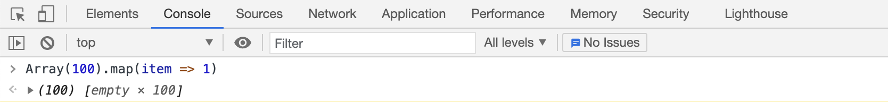

> 生活就是这样，会慢慢磨平你的棱角，或使你成为一颗璞玉，前提是你耐得住打磨，忍得了寂寞。

## 1. Vue3 Composition API: ref vs reactive
Composition API，即组合式API，是vue3提出的一个新概念，能做到一个独立的逻辑关注点相关的代码在同一个地方进行集中管理。

**ref：** 通过ref函数使 **<font color="#0000dd">值类型</font>** 的变量变成响应式。
```vue
<template>
  <!-- 模板中使用ref变量(当ref变量在模板中使用时，会自动解套，无需在模板中额外书写.value) -->
  <div>{{counter}}</div>
</template>

<script>
  // 引入ref函数
  import { ref } from 'vue';

  export default {
    setup() {
      // 声明ref变量
      const counter = ref(0);
      console.log(counter); // { value: 0 }
      console.log(counter.value); // 0

      // 更新ref变量
      counter.value++;
      console.log(counter.value); // 1

      return {
        counter
      }
    }
  }
</script>
```

**reactive：** 通过reactive函数使 **<font color="#0000dd">对象类型</font>** 的变量变成响应式。等同于vue2.x中的Vue.observable()
```vue
<template>
  <div>{{ state.count }}</div>
</template>

<script>
  // 引入reactive函数
  import { reactive, toRefs } from 'vue';
  export default {
    setup() {
      const state = reactive({
        count: 0
      });

      // 更新reactive变量
      state.count++; // 1

      // 解构state后得到的属性值修改不会引起state的更新，解构后的属性会丢失其响应性。
      const { count } = state;
      count++; // 2
      console.log(state.count); // 1

      // 将reactive变量转换成一组ref,解构后的属性会保留与源对象之间的响应式
      const { count } = toRefs(state);
      // 通过ref变量更新的方式（.value）更新取值
      count.value++; // 2
      console.log(state.count); // 2

      return {
        // toRefs将响应式对象的每个property都变成了响应式的ref变量
        toRefs(state); 
      }
    }
  }
</script>
```

**比较：** 

- 共同点：都用于创建响应式数据。
- 区别：
  - ref用于创建值类型的响应式；reactive用于创建对象类型的响应式。
  - ref的更新方式通过修改xxx.value进行；reactive的更新需要通过toRefs方法转换从而使每个属性都具备响应式。

## 2. 页面导入样式比较：link vs @import
在html文档中，css有四种引入方式：

1. 内联样式（行内样式）：在html标签的style属性中添加样式
```html
<div style="color: red">这是一段红色的文字</div>
```
2. 嵌入样式：在style标签中添加样式
```html
<head>
  <style>
    .aaa {
      color: red;
    }
  </style>
</head>
<body>
  <div class="aaa">这是一段红色的文字</div>
</body>
```
3. 链接样式：在head标签中通过link添加样式
```css
 /* aaa.css文件 */
.aaa {
  color: red;
}
```
```html
<head>
  <link ref="stylesheet" type="text/css" href="./aaa.css">
</head>
<body>
  <div class="aaa">这是一段红色的文字</div>
</body>
```
4. 导入样式：在style标签中使用CSS规则引入外部样式文件，或者在.css 样式文件中引入外部样式文件
```html
<head>
  <style>
    @import url('./aaa.css');
  </style>
</head>
<body>
  <div class="aaa">这是一段红色的文字</div>
</body>
```
PS: css文件中也可以引入外部样式文件
```css
@import url('./bbb.css');

.aaa {
  color: red;
}
```
外部引入样式的方式有两种，即link标签和@import引入。

**link vs @import**：

- @import是css提供的，只能加载css；link除了加载css外，还可以定义RSS等其他事务。
- **兼容性**：@import是CSS2.1提出的，低版本浏览器（IE5以下）不支持；link是XHTML标签，无兼容问题。
- **加载顺序**：@import引入的样式需等页面加载完成后再加载（所以可能出现页面一开始没有css样式，在网速慢的情况下可能出现页面闪烁一下后样式正常的现象）；link引入的样式在页面载入的同时加载；
- **DOM操作**：link支持通过JS控制DOM来改变样式（通过DOM操作插入link标签，从而引入样式）；@import不支持（因为无法获取DOM）

## 3. Array(100).map(x=>1)结果是多少？
在真正执行这段语句之前我以为的是输出结果为100各元素为1的数组，然而事实是输出了长度为100的空数组。



来扫盲吧~

关键词：Array构造器、Array.prototype.map()。

### Array构造器
Array构造器会根据指定的元素创建一个数组；当仅有一个元素且类型为数字时，会创建一个指定长度的数组。**<font color="#0000dd">言外之意就是该数组此时不包含任何实际元素，更不能认为它是一个包含了指定个数的undefined的元素。</font>**

### Array.prototype.map()
map方法会给原数组中的每个元素按顺序调用一次callback函数，callback函数执行后返回的值组合形成一个新数组。**<font color="#0000dd">callback函数只会在有值的索引上被调用；没有被赋过值或者使用delete删除的索引不会被调用。</font>**

### 结论
由以上两点基本可以找到输出为一个长度为100的数组的原因了，使用Array(100)构造函数生成的数组并没有对其中的数组元素进行赋值；map方法不会被未赋值的数组元素调用。因此Array(100).map(item => 1)中的callback实际上一次都没有被调用过。来验证下吧：
```js
var a = undefined, b = null;  // 虽然值为falsy，但实际被赋过值的变量
var c = Array(3); // 创建长度为3的数组，数组元素未被赋值
c.push(a, b); // 现在数组的前三个元素未被赋值，后俩元素被赋值了
var d = c.map(item => 1);
console.log(d);

// 为了更好看到map被调用的情况，看看另一个map,在map中写下打印语句
var e = c.map((item, index) => {
  console.log(index);
  return 1;
});
console.log(e);
```

