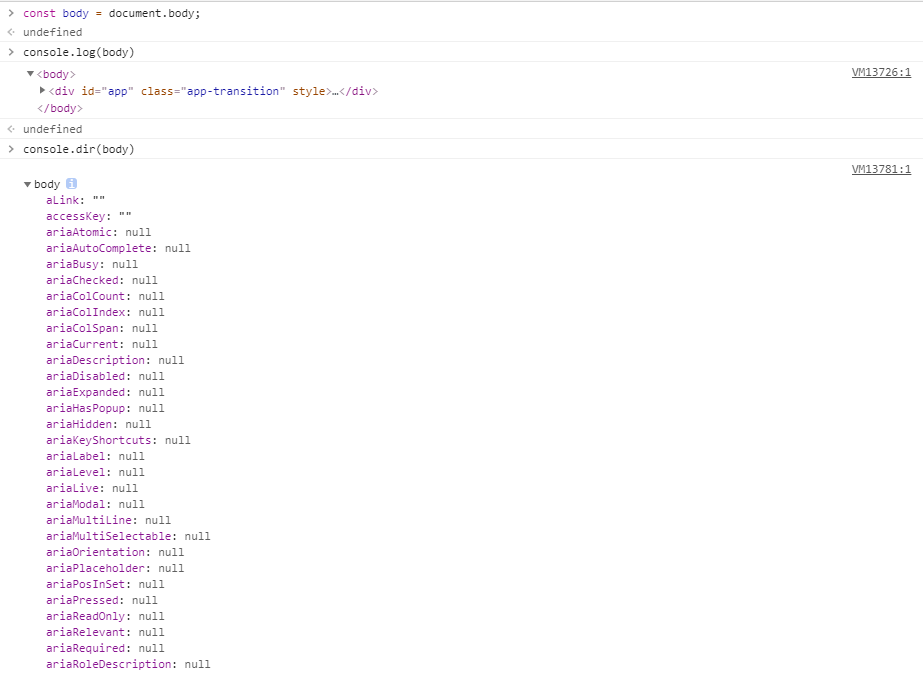
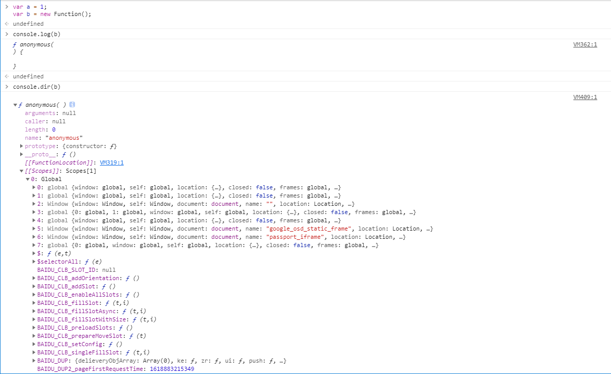

> 热爱生活，往心之所向那里去。

## 1. console.dir()
在控制台显示指定JavaScript对象的属性，并通过类似文件树样式的交互列表显示。




## 2. ES6中的TDZ（暂时性死区）
- TDZ(Temporal Dead Zone, 暂时性死区)是ES6（ES2015）中对作用域新的专用语义。

- ES6明确规定，如果区块中存在let和const命令，这个区块对这些命令声明的变量，就会形成封闭作用域。<font color="#ff0000">凡是在声明之前就使用这些变量，就会报错。</font>

```js
// 在代码块内，使用let/const命令声明变量之前，该变量都是不可用的。

// console语句无法获取a的值，因为if语句内是一个块级作用域，从该作用域顶部开始到使用let声明a之前，a都不可用。
let a = 1;
if(true) {
  console.log(a);  // Uncaught ReferenceError: Cannot access 'a' before initialization
  let a = 2;   
}

// 此时可以获取a的值，a在上级块作用域中
let a = 1;
if(true) {
  console.log(a);  // 1 
}

// 使用let声明的a作用域与在if块内使用var声明的a作用域一致。let/const不允许在相同作用域内重复声明同一个变量。
let a = 1;
if(true) {
  console.log(a);  // Uncaught SyntaxError: Identifier 'a' has already been declared
  var a = 1;
}

// 使用var声明的a在if作用域内也生效。let/const不允许在相同作用域内重复声明同一个变量。
var a = 1;
if(true) {
  console.log(a); // Uncaught SyntaxError: Identifier 'a' has already been declared
  let a = 1;
}
```
## 3. HTTP/1.1的队头阻塞问题
 1. **<font color="#0000dd">什么是队头阻塞（Head-of-Line blocking, HOL blocking）</font>**  
 队头阻塞是一个专有名词，这个问题产生的根本原因是使用了**队列**这种数据结构，在计算机网络得到范畴中是一种性能受限的现象。  
 队列这种数据结构遵循FIFO（first-in-first-out，先进先出）原则，就好比超市排队付款的时候，第一个人手机支付有问题或没带现金，会导致整个队伍阻塞很久。  
 因此，我们可以这样理解队头阻塞：在队头（Head）发生的问题会阻塞（block）整个队伍（line）。
 
 2. HTTP中的队头阻塞问题
 - 队头阻塞在计算机网络的范畴中表现为一种性能受限的现象。原因是某一列的第一个数据包（or队头）受阻导致整列数据包受阻。（https://zhuanlan.zhihu.com/p/330300133）
