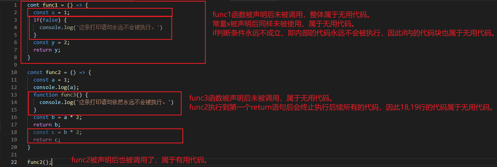
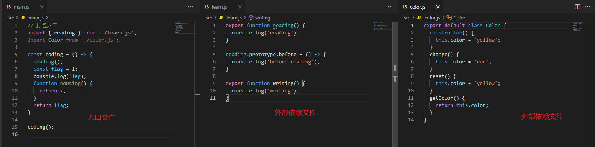
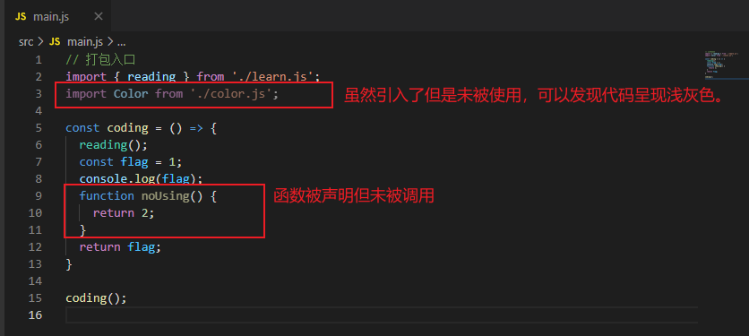
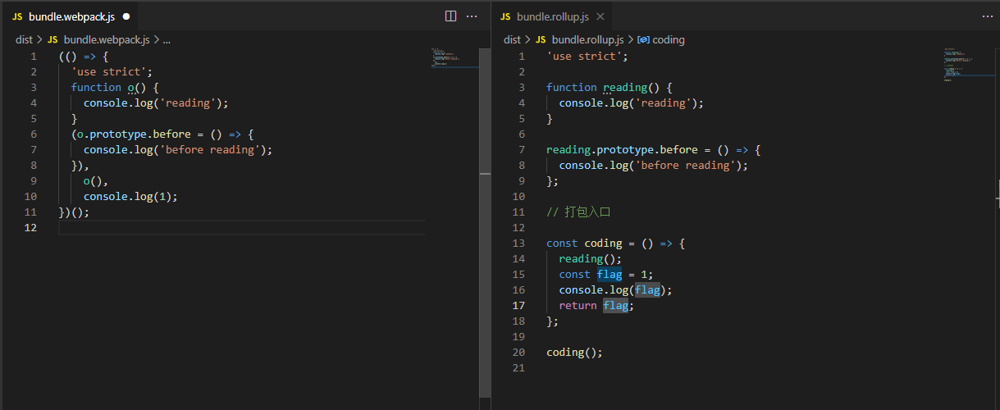
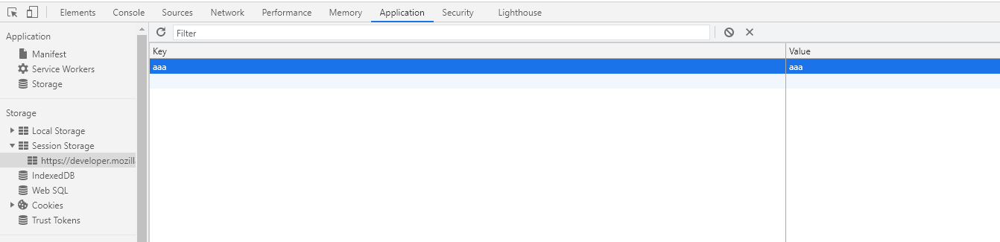
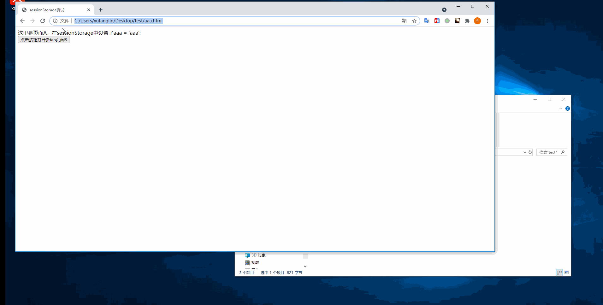
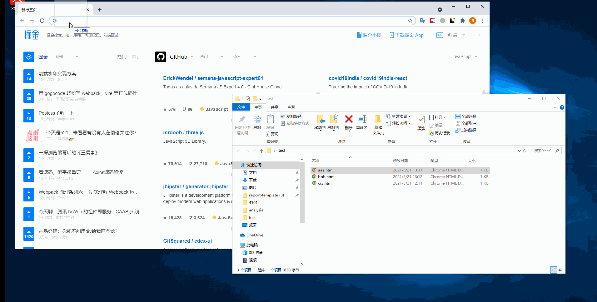
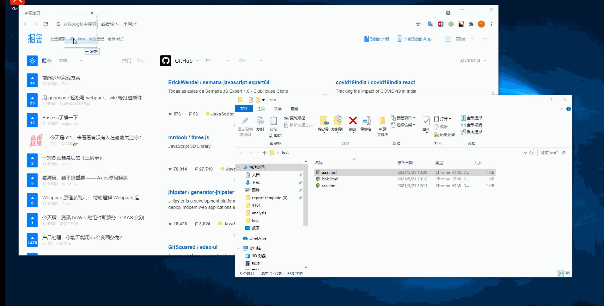
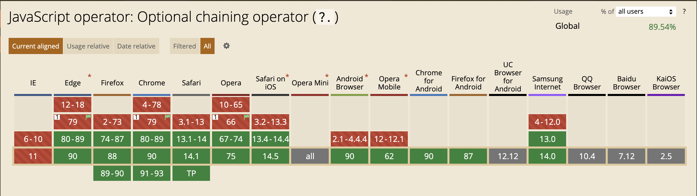
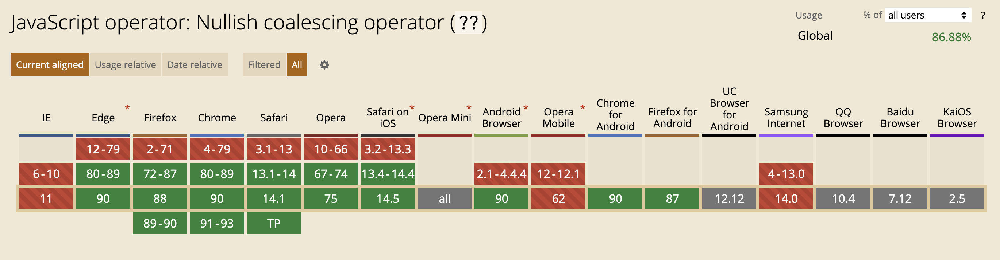

> 保持进步是一种态度，不因小而不为，不因难而不攻。

## 1. tree shaking
> tree shaking是一个通常用于描述移除JavaScript上下文中的未引用代码（dead-code）行为的术语。它依赖于ES2015中的import和export语句，用来检测代码模块是否被导入、导出，且被JavaScript文件使用。

在JavaScript应用程序中，我们使用模块打包（webpack或rollup）将多个JavaScript文件打包成单个文件时会自动删除未被引用的代码，这样可以使最终文件具有简洁的结构和最小体积。

**<font color="#0000dd">tree shaking</font>** 本质是消除无用的js代码。一个形象描述：你可以将应用程序想象成一棵树，其中绿色表示实际使用的source code（源码）和library（库），是有生机的叶子。灰色表示未被引用的代码，是枯萎的叶子。因此，为了干掉枯叶，需要摇动这棵树使它们掉下。  

未引用代码（dead-code）是指该代码永远不会被执行的代码，如下图中框起来的部分代码：
  

要理解并使用tree shaking，你需要：
- 使用ES2015模块语法（即import和export）
- 在项目package.json文件中，添加一个"sideEffects"入口
- 引入一个能够删除dead-code的压缩工具（minifier）（如： UglifyJSPlugin）

**webpack与rollup打包小实践**
代码仓库地址：[webpack与rollup打包小实践](https://github.com/flXu12/tree-shaking)  

1. 首先来看看源码的三个文件。其中main.js是打包的入口文件，分别引入了两个外部js资源learn.js和color.js。
  
2. 观察发现上述的main.js中会存在一些无用的代码，包括无用的外部依赖。

3. 我们希望上图中标注的无用代码可以在打包的时候摒弃掉，只保留有用的代码。分别使用webpack和rollup打包后的结果：   
> 注：由于webpack生产环境打包后代码被压缩成一行，这里为了可读性将构建后的代码进行了格式化（换行处理） 


4. 首先来分析下rollup：通过构建产物可以看到，rollup基本维持了源码的原本形式，只是将引入的外部代码块以源码的形式嵌入了打包后的文件中。并且我们期望的摒弃第2步的无用代码的想法也达成了。
5. 再来分析webpack：源码被webpack编译过后只能从结构上看到我们的期望也是达成了的，其中函数声明与调用采用闭包的方式呈现，虽然看不到return语句，但实际执行与rollup构建结果一致。
6. 对比rollup和webpack打包的结果，可以发现从可读性来说，rollup构建后的产物可读性更高。

> webpack对代码分割和资源导入具备“天然的支持”。在项目开发时使用webpack构建，在库开发时使用rollup构建。  

## 2. tree shaking之sideEffects
> 基于上节tree shaking的一个补充扩展，因在实践中也踩过这样的坑，在这里记录下~   

还原踩坑背景：  
当前开发的项目A（下文称A）使用webpack打包，在入口的mian.js文件中通过import引入了一个npm包（下文称npm-B）的样式文件（import 'npm-B/npm-B.css'），在开发环境下页面展示正常，打包部署到生产环境后，经排查发现npm-B中的组件样式丢失了，而这些样式都在npm-B.css文件中。  
```js
// A main.js
import "npm-B/npm-B.css";
```  
排查：定位样式异常的DOM元素，找到该元素对应的类名，在构建后的css产物中搜索发现没找到该类名对应的样式，在npm-B.css文件中找到了。由此可以判定，生产环境下的npm-B.css样式文件未被构建。  
定位：基于关键字“import css webpack 样式丢失”搜索相关问题，发现基本都是tree shaking相关的一些问题，进而排查到sideEffects对外部引入文件打包的影响。发现npm-B的package.json中sieEffects属性置为false，从而导致样式文件npm-B.css丢失。    
```json
// npm-B package.json
{
  "sideEffects": false
}
``` 
相关链接：[webpack tree shaking 踩坑](https://blog.csdn.net/qq_34356563/article/details/85000295)

tree shaking依赖于ES2015模块系统中的静态结构特性，如import和export。webpack4扩展了dead-code的检测能力，通过package.json的"sideEffects"属性作为标记，指定该模块在使用import引入时的tree shaking特性。 

**将文件标注为无副作用**：将package.json中的"sideEffects"属性设置为false，表明包中的所有代码不包含副作用，告知webpack在打包的时候可以安全地删除未使用的export。

> **什么是副作用**:在导入时会执行特殊行为的代码，而不仅仅暴露一个或多个export。如polyfill，它会影响全局作用域，但不提供export。

> 任何import引入的文件都会受到tree shaking的影响，也就是说，如果你在项目中使用了诸如css-loader并导入了外部的css文件，就需要将其添加到sideEffects列表中，避免在webpack构建时样式文件丢失，导致生产环境下样式失效。  

基于上述说明，npm-B.css样式丢失的问题可以通过以下几种方式之一来解决：  
1. 修改npm-B的package.json文件中sideEffects属性值为: 
```json
// npm-B的package.json
{
  "sideEffects": ["**/*.css"]
}
```  
2. 修改A引入npm-B.css的方式为非import引入：
```js
require('npm-B/npm-B.css');
```  
或
```css
/* A的style.css */
/* 从node_modules中引入的外部样式文件，需要加上前缀~ */
@import '~npm-B/npm-B.css';
```
```js
// A的main.js
import './style.css';
```

## 3. DSL
> DSL通过在表达能力上做的妥协换取在某一领域内的高效。  
DSL(Domain Specific Language), 定义是：为特定领域设计的专用语言。如SQL、JSON、正则表达式等都是DSL。  
与DSL对应的另一种预研是GPL(General Purpose Language)，即通用编程语言。如C、Java、JavaScript等。  
DSL分类：  
  1. 内部DSL： 前端比较熟悉的就是jQuery库等，我们知道jQuery的实现是基于JavaScript语言，但是在使用时又自成一种新的语法风格。  
  ```js
  $('#app').find('button').html('hahahha');
  ```  
  2. 外部DSL：是一种独立的编程语言或者规范语言，一般具备特定的语法。前端常用的如HTML、CSS、JSX等都是外部DSL。
  ```html
  <div>
    <h1>我是一级标题</h1>
  </div>
  ```  
  3. 语言工作台(Language Workbench)：是一种专用的IDE，可以将DSL可视化，并且支持定义和构建一个DSL。如前端常用的vscode、可视化搭建工具等。

## 4. 使用cookie, sessionStorage, localStorage鉴权
这里主要是针对在实践中踩过坑的方面进行阐述，毕竟这三个关键字google一下，随便一篇文章都能比我这里讲得详细并且通俗易懂~  
还原踩坑现场：  
一般项目都需要用户鉴权，通常的实现方案是：配置一个登录页，前端通过向服务端发送用户名、密码、验证码等方式获取一个有效token，并且在后续所有的接口请求中携带该token进行API请求。服务端需要做的是验证该token的有效性，并返回该用户对应的数据响应。  

那么问题来了：  
已知当前系统的认证方式是：login后取得的token存储在localstorage，在请求拦截中给请求头赋值token（从localstorage中取得），由于还存在一些公共组件内的API需要在query上添加token参数，因此这里的token也是从localstorage中拿到的。  
```js
// token的存取
Object.defineProperty(this, 'token', {
  get() {
    return window.localStorage['token'];
  },
  set(value) {
    window.localStorage['token'] = value;
  },
  enumerable: true,
  configurable: true,
})

// 请求拦截
axios.interceptors.request.use(
  // 在发送请求前做些什么，如参数序列化、添加统一token等
  function(config) {
    const params = {
      token: this.token
    }
    // 统一在参数中添加token
    if(config.method === 'get') {
      config.params = config.params || {};
      Object.assign(config.params, params);
    } else {
      config.data = config.data || {};
      Object.assign(config.data, params);
    }
    return config;
  },
  // 对请求错误的处理
  function(error) {
    return Promise.reject(error);
  }
)
``` 
现在，用户反馈了一个需求，希望登录系统后，关闭浏览器窗口再重新打开窗口，并输入系统的url，此时重新走一次登录页面。原因是：防止不同人使用同一台计算机时，前者未退出而是关闭窗口后，后者可以通过输入url篡改该系统数据。  
对于这种场景，其实根源就是需要监听浏览器窗口关闭事件，在窗口关闭的时候清空存储在localtorage中的token即可。  
```js
window.onbeforeunload = function() {
  this.token = null;
}
```  
**<font color="#ff0000">注意啦，上述操作是有问题的！</font>**就这么监听下窗口的关闭事件，然后清除token就真的能达到目的吗？显然不可能，并且还会误伤。  
首先，我们来看看window.onbeforeunload的定义：当窗口即将被卸载（关闭）时，会触发该事件，此时页面文档依然可见，且该事件的默认动作可以被取消。也就是说，这个事件给了你在窗口关闭前能做一些事情的时机，但是用户可以选在取消呀！这样就会导致当你清除token以后，用户选择取消关闭时，或者刷新页面时，发现token失效了，退回到登录页，一脸懵逼。。。非常影响用户体验。  
这个时候，我们再来看看会话级别的sessionStorage能否实现我们的需求呢？sessionStorage中存储的数据会在页面会话结束时被清除。  
   
需要注意的是：  
- 页面会话在浏览器打开期间一直保持，并且重新加载或恢复页面仍会保持原来的页面会话。（通俗点讲：我在sessionStorage中存了一个aaa的数据，然后刷新页面，或者关闭该tab页后，再通过历史记录重新打开，这个aaa的数据仍会在sessionStorage中）
- 通过手动输入的相同url打开的tab页面，会创建个字的sessionStorage。（通俗点讲：手动输入的url不会与其同名tab页共享sessionStorage，比如我开了https://aaa.com，设置的sessionStorage的aaa值，然后新开一个页面，手动输入https://aaa.com并回车，发现这个页面的sessionStorage中没有aaa）
- 关闭浏览器窗口/tab，会清除对应的sessionStorage
- 在新标签或窗口打开一个页面时，会复制顶级浏览器会话的上下文作为新会话的上下文。（通俗点讲：页面A设置了sessionStorage的aaa，然后从页面A点击某个按钮或链接，新开了一个新的窗口B或者新的tab页B，此时B的sessionStorage中也会有aaa）  

Okay，既然sessionStorage的特性就是关闭窗口即清除token，那么这样是不是就能满足用户的需求呢？我们来试试：
```html
<!-- 这个是第一个html页面，名为aaa，点击按钮会打开bbb -->
<!DOCTYPE html>
<html lang="en">
<head>
  <meta charset="UTF-8">
  <meta http-equiv="X-UA-Compatible" content="IE=edge">
  <meta name="viewport" content="width=device-width, initial-scale=1.0">
  <title>sessionStorage测试</title>
</head>
<body>
  <div>
    这里是页面A，在sessionStorage中设置了aaa = 'aaa';
  </div>
  <div>
    <button onclick="handleClick()">点击按钮打开新tab页面B</button>
  </div>
</body>
<script>
  window.onload = function() {
    window.sessionStorage.setItem('aaa', 'aaa');
  }
  function handleClick() {
    window.open('./bbb.html');
  }
</script>
</html>
```

```html
<!-- 这是第二个html页面bbb，点击按钮打开页面ccc -->
<!DOCTYPE html>
<html lang="en">
<head>
  <meta charset="UTF-8">
  <meta http-equiv="X-UA-Compatible" content="IE=edge">
  <meta name="viewport" content="width=device-width, initial-scale=1.0">
  <title>sessionStorage测试</title>
</head>
<body>
  <div>
    这里是页面B，在sessionStorage中设置了bbb = 'bbb';
  </div>
  <button onclick="handleClick()">点击跳到页面C</button>
</body>
<script>
  window.onload = function() {
    window.sessionStorage.setItem('bbb', 'bbb');
  }
  function handleClick() {
    window.open('./ccc.html')
  }
</script>
</html>
```

```html
<!-- 这是页面ccc -->
<!DOCTYPE html>
<html lang="en">
<head>
  <meta charset="UTF-8">
  <meta http-equiv="X-UA-Compatible" content="IE=edge">
  <meta name="viewport" content="width=device-width, initial-scale=1.0">
  <title>sessionStorage测试</title>
</head>
<body>
  <div>
    这里是页面C
  </div>
</body>
</html>
```

首先我们预测一下打开aaa > bbb > ccc的时候sessionStorage的变化吧，按照sessionStorage的特性来看，在新标签或窗口打开一个页面时，会复制顶级浏览器会话的上下文作为新会话的上下文。预测结果如下：
| 页面 | sessionStorage |
| ----- | ----- | 
| aaa.html | { aaa: 'aaa' } |
| bbb.html | { aaa: 'aaa', bbb: 'bbb' } |
| ccc.html | { aaa: 'aaa' } |

来看看效果：  
   

实际结果是：  
| 页面 | sessionStorage |
| ----- | ----- | 
| aaa.html | { aaa: 'aaa' } |
| bbb.html | { aaa: 'aaa', bbb: 'bbb' } |
| ccc.html | { aaa: 'aaa', bbb: 'bbb' } |  
也就是说，**从当前页面点击按钮打开的新页面会复制父页面的sessionStorage** ，而不是所谓的根节点对应的"祖先页面"。  

也许我们可以尝试下以其他方式来打开新页面呢，比如a标签试试看，这里只需要修改aaa.html页面如下：  
```html
<!-- 这个是第一个html页面，名为aaa，点击链接会打开bbb -->
<!DOCTYPE html>
<html lang="en">
<head>
  <meta charset="UTF-8">
  <meta http-equiv="X-UA-Compatible" content="IE=edge">
  <meta name="viewport" content="width=device-width, initial-scale=1.0">
  <title>sessionStorage测试</title>
</head>
<body>
  <div>
    这里是页面A，在sessionStorage中设置了aaa = 'aaa';
  </div>
  <div>
    <a href="./bbb.html" target="_blank">点击链接跳到页面B</a>
  </div>
</body>
<script>
  window.onload = function() {
    window.sessionStorage.setItem('aaa', 'aaa');
  }
  function handleClick() {
    window.open('./bbb.html');
  }
</script>
</html>
```  

再来测一波~  
  
嗯？跟想象的不太一样呀。实际结果是通过a标签打开的新页面，不会复制父页面的sessionStorage呢：  
| 页面 | sessionStorage |
| ----- | ----- | 
| aaa.html | { aaa: 'aaa' } |
| bbb.html | { bbb: 'bbb' } |
| ccc.html | { bbb: 'bbb' } |   

查找相关信息发现是因为：**Chrome更新89版本后，a标签target="_blank"跳转丢失sessionStorage**，提供了以下解决方案：  
1. 给a标签加一个属性：rel="opener"
2. 将a标签换成window.open
3. 更换其他存储方式如cookie或localStorage  

前面已经尝试过window.open是可行的，现在我们来测测给a标签加上rel="opener"属性试试：  
  
棒，可行~

现在看起来sessionStorage貌似可以满足用户的需求呢，但是我们最终并没有采用这个方案，而是将token存储在cookie中。  
**<font color="#0000dd">为什么不用sessionStorage来存储token？</font>**：来看看这篇文章 =>     [sessionStorage的数据能否在多标签页共享，取决于标签页如何打开](https://github.com/lmk123/blog/issues/66)

## 5. ES2020新特性
**1. 可选链操作符(Optional chaining operator): ?.**  
可以让我们在查询具有多个层级的对象时，不再进行冗余的各种前置校验。**<font color="#0000dd">使用可选链后，一旦前置中存在null或undefined，就会短路计算并返回undefined。</font>**  
```js
let nestedProp;
let nestedMethod;
const obj = {
  a: {
    b: {
      c: 'hello',
      d: function() {
        return this.c
      }
    }
  }
}
// before
// 在访问obj.a.b.c之前，需要先确认前置的值布尔转换后不是false
nestedProp = obj && obj.a && obj.a.b && obj.a.b.c; 
nestedMethod = obj && obj.a && obj.a.b && obj.a.b.d && obj.a.b.d()
// after
// 使用可选链后，一旦前置中存在null或undefined，就会短路计算并返回undefined
nestedProp = obj?.a?.b?.c;
nestedMethod = obj?.a?.b?.d?.();
```  
  
**2. 空值合并操作符（Nullish coalescing operator）: ??**  
当查询某个属性时，如果没有该属性就会设置一个默认的值，针对属性值为''，0等falsy类的值的时候，逻辑运算符会将其转化为false，因此容易误伤。**<font color="#0000dd">空值合并操作符仅对查询到的属性为null或undefined时，才做默认值处理</font>**  
```js
let prop;
// before
// 这种判断方法会导致当obj.a为0或''时，被重新赋值"暂无数据"
prop = obj.a || '暂无数据'; 
// 不会误伤的处理
prop = (obj.a !== undefined && obj.a !== null) ? obj.a : '暂无数据';

// after
prop = obj.a ?? '暂无数据'
```  

**3. Promise.allSettled**  
Promise.allSettled的出现是为了解决Promise.all的一个痛点：使用Promise.all来同时请求三个接口，一旦其中一个promise出现异常，就会导致整个Promise.all终止并返回一个reject的promise对象。也就是说，只要发生一个reject，就会导致三个请求的数据都无法返回。也就是说，Promise.all的结果取决于其中任意一个reject。  
**Promise.allSettled与Promise.all的区别是：当Promise全部处理完成以后，可以拿到每一个promise的状态，无论是否成功。**  
```js
const promise1 = Promise.resolve('test1');
const promise2 = Promise.reject('test2');
const promise3 = Promise.resolve('test3');

// 存在reject时，Promise.allSettled结果
const result1 = await Promise.allSettled([promise1, promise2]);
console.log(result1); 
/*
[
  { status: 'fulfilled', value: 'test1' },
  { status: 'rejected', reason: 'test2' }
]
*/

// 存在reject时，Promise.all结果
const result2 = await Promise.all([promise1, promise2]);
// Uncaught test2
console.log(result2); // Uncaught ReferenceError: result3 is not defined

// 全部fulfilled时，Promise.all结果
const result3 = await Promise.all([promise1, promise3]);
console.log(result3); 
/*
 ['test1', test3']
*/

// 全部fulfilled时，Promise.allSettled结果
const result4 = await Promise.allSettled([promise1, promise3]);
console.log(result4); 
```  
可以看到，`Promise.all`和`Promise.allSettled`返回的结果也是有差异的，`Promise.all`仅返回promise执行的结果，而`Promise.allSettled`会同时返回promise执行的状态以及结果。
**4. String.prototype.matchAll**  
`matchAll`返回一个包含所有匹配正则表达式的结果及分组捕获组的迭代器，返回结果可以用for...of取出。  
```js
const regexp = /t(e)(st(\d?))/g;
const str = 'test1test2';
const array = [...str.matchAll(regexp)];
console.log(array)
/*
[
  ['test1', 'e', 'st1', '1', index: 0, input: 'testtest2', groups: undefined],
  ['test2', 'e', 'st2', '2', index: 5, input: 'test1test2', groups: undefined]
]
*/
```
**5. Dynamic import**  
**6. BigInt**  
**7. globalThis**  
相关链接：[TC39提案github地址](https://github.com/tc39/proposals/blob/master/finished-proposals.md)