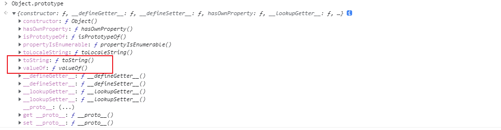
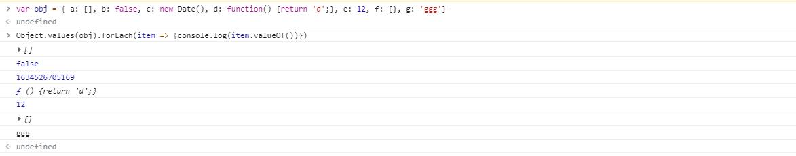
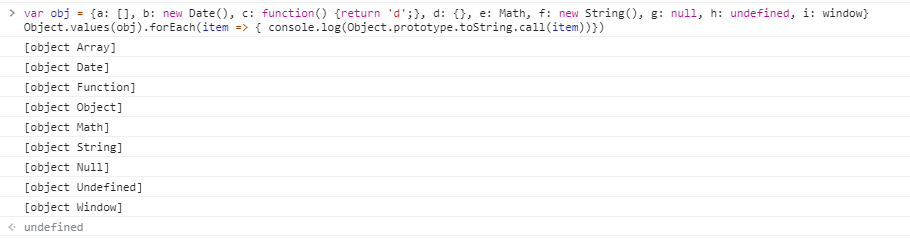
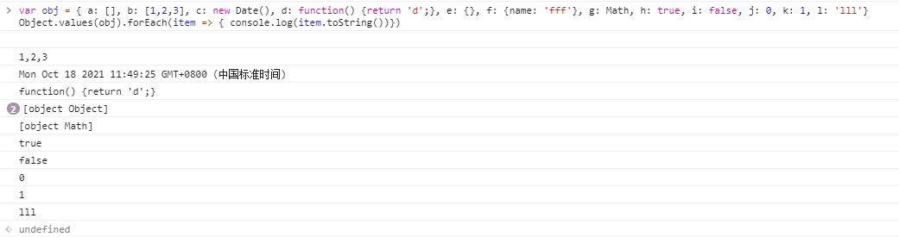

> 总有一天你会知道，任何想要但觉得遥远的东西，努力的话是能碰得着的。

## 1. [] == ![]为true？
在chrome控制台输入：  
```js
[] == ![]  // 返回true
```
上述表达式会输出true，为什么`[] == ![]`？  
> 相等运算符(==) 检查其两个操作数是否相等，并返回Boolean结果。与严格相等运算符(===)不同，它会尝试强制类型转换并且比较不同类型的操作数。  

==运算符会对操作数进行**隐式的强制类型转换**，转换规则如下：  
- 如果两个操作数都是对象，则仅当两个操作数都引用同一个对象时才返回true；
- 如果一个操作数是null,另一个操作数是undefined，则返回true;
- 如果两个操作数是不同类型的，就会尝试在比较值钱将他们转换为相同类型：  
  - 当数字与字符串进行比较时，会尝试将字符串转换成数字；
  - 若操作数之一是Boolean，则将布尔操作数转换为1或0
  - 若操作数之一是对象，另一个是数字或字符串，会尝试将对象转换为原始值（valueOf()和toString()）
- 若操作数具有相同的类型：
  - String: 仅当两个操作数具有相同顺序的相同字符时才返回true
  - Number：仅当两个操作数具有相同的值时才返回true。**+0与-0相等。若任一操作数为NaN，则返回false**
  - Boolean: 仅当操作数为两个true或者两个false时才返回true。

根据上述转换规则，我们这样来一一化解[] == ![]：  
1. `!`取非运算符优先级高于`==`,等号右边的![]进行取非后得到布尔值false，实际进行对比的操作数： `[] == false`；
2. 两个操作数类型不同，操作数数之一是Boolean, 将布尔值false转换成数字0，实际进行对比的操作数： `[] == 0`；
3. 两个操作数类型不同，操作数之一是对象，另一个是数字，则将对象`[]`转换成原始值为`''`，实际进行对比的操作数： `'' == 0`；
4. 两个操作数类型不同，当数字与字符串进行比较时，将字符串`''`换成数字0，实际进行对比的操作数： `0 == 0`；
5. 连个操作数类型相同，且都为Number类型，且数值相等，返回true。

**总结：** `==`是糟粕，其中的隐式类型转换会出现各种你想象不到的结果，所以在使用时，用全等运算符(===)吧。

## 2. valueOf()和toString()？
有点好奇`1`中转换时第3步将对象[]转换成原始值''的实现，原始值是怎么转换得来的呢？  
`valueOf()`和`toString()`是对象的两个方法，在控制台中输入`Object.prototype`会得到如下结果：  
    

### 2.1 Object.prototype.valueOf()  
**`valueOf()`方法返回指定对象的原始值。**   
JavaScript的许多内置对象都重写了`valueOf()`，以实现更适合自身的功能需要。如果对象没有原始值，则`valueOf()`返回对象本身。   
**不同类型对象的valueOf()方法返回值**:
| 对象 | 返回值 |  
| ---- | ---- |  
| Array | 返回数组本身 |  
| Boolean | 布尔值 |  
| Date | 从1970年1月1日午夜开始计时的毫秒数UTC |  
| Function | 函数本身 |  
| Number | 数字 |  
| Object | 默认值是对象本身 |  
| String | 字符串 | 
| Math，Error | Math和Error对象没有valueOf()方法 |   

在控制台输入如下代码进行验证:  
```js
var obj = { a: [], b: false, c: new Date(), d: function() {return 'd';}, e: 12, f: {}, g: 'ggg'}
Object.values(obj).forEach(item => {console.log(item.valueOf())})
```  
输出结果如下图：  


### 2.2 Object.prototype.toString()  
**`toString()`方法返回一个表示该对象的字符串。**  
每个对象都有一个`toString()`方法，若该方法在自定义对象中未被覆盖，`toString()`返回`[object type]`，其中`type`是对象的类型。  

**使用`Object.prototype.toString()`检测对象类型**:  
 > toString()调用null返回[object Null], undefined返回[object Undefined]。  
```js
var obj = {a: [], b: new Date(), c: function() {return 'd';}, d: {}, e: Math, f: new String(), g: null, h: undefined, i: window}
Object.values(obj).forEach(item => { console.log(Object.prototype.toString.call(item))})
```  
输出结果如下图：  


**调用`toString()`方法返回对象字符串**：  
toString()转换规则：  
| 对象 | 返回值 |  
| ---- | ---- |  
| Array | 以逗号分隔的字符串 |  
| Boolean | 布尔值对应的字符串 |  
| Date | 可读的时间字符串 |   
| Function | 函数源码字符串 |  
| Number | 数字字符串 |  
| Object | [object type]，其中type为对象类型 |   
| String | 字符串 |  
| Math | '[object Math]' |  

```js
var obj = { a: [], b: [1,2,3], c: new Date(), d: function() {return 'd';}, e: {}, f: {name: 'fff'}, g: Math, h: true, i: false, j: 0, k: 1, l: 'lll'}
Object.values(obj).forEach(item => { console.log(item.toString())})
```  
输出结果如下图：  
  

**<font color="#0000dd">重要：从上可以看出，对于对象，不论是检测类型还是返回对象字符串，最终结果都是[object Object]</font>**

### 2.3 valueOf() VS toString()  
**相同点**  
- 自动调用
- 可以被重写
**不同点**
- 默认返回值不同
- 自动调用时，对于不同类型调用顺序不同：
  - 在进行对象转换时，优先调用`toString()`
  - 在对象转字符串类型时，优先调用`toString()`
  - 在对象转数字时，优先调用`valueOf()`
  - 在使用运算操作符时，`valueOf()`优先级高于`toString()`
