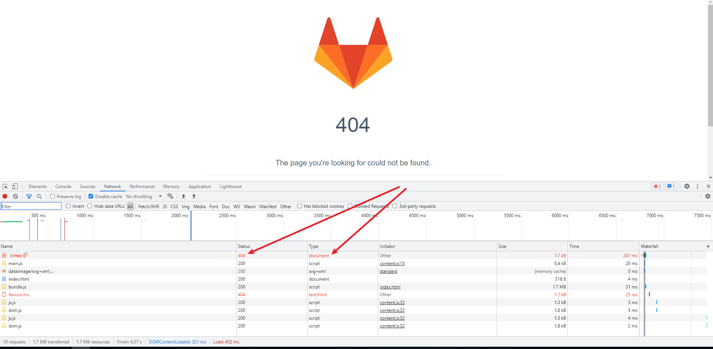
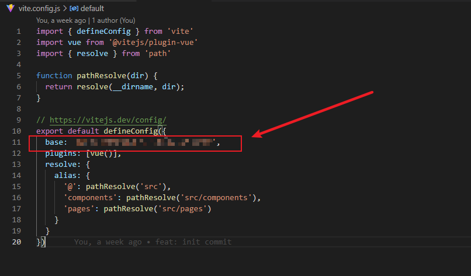
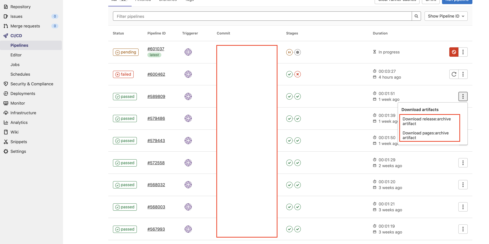
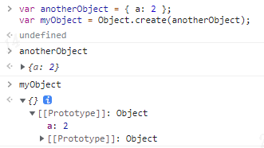

## 1. vue router history刷新404
最近在gitlab上创建了一个用于管理各种需规和设计资源的项目（技术背景：Vue3 + vue-router4 + ant Design Vue2），并使用gitlab pages进行了部署，但是在使用过程中发现了一个问题：通过router.push跳转不同路由页面是OK的；但对路由页面进行刷新时，页面404了。  
  
从network请求来看，浏览器试图向服务器请求一个index文件，但服务器不存在此资源，就返回了默认的404页面。  
那么就联想到如下问题：   
- 是所有页面刷新都会404吗？   
- 为什么通过路由跳转页面OK，但浏览器刷新页面就404呢？  

**所有页面刷新都会404吗？**  
首先我们来对页面进行一个分类：第一种是路由页面，第二种是静态资源页面。这两种页面分别有如下特点：  
路由页面： 由于是单页应用，只有一个入口，从构建制品来看，所有页面资源均在一个html文件中，通过路由进行动态加载，因此在切换路由时，**不会向服务器发起任何请求**。  
静态资源页面： 有自己的html文件，通过浏览器url访问时，**会向服务器发起请求**，用于获取该页面对应的html,js,css等资源。  

根据这两种页面的特点，可以得出如下结论：  
通过router动态切换路由(push, replace等)时，**不会向服务器发起请求**，页面正常展示；    
访问静态资源页面时，**会向服务器发起请求**， 服务器上存在该资源，所以无论刷新与否，都能正常展示。

**为什么通过路由跳转页面OK，但浏览器刷新页面就404呢？**  
通过动态路由来切换页面，其实就是通过js操作dom，从而让用户看到不同的页面效果，但实际在控制台network上可以看到，浏览器并没有向服务器发起任何资源请求。原因是上述页面所需的html，js，css等资源在第一次访问首页时就已经被加载过。  
在切换路由时，用户以为是打开了一个新的html页面，但实际还是使用的 html；同样的，虽然浏览器的url发生了变化，但其实是使用了浏览器的[History.pushState()](https://developer.mozilla.org/zh-CN/docs/Web/API/History/pushState)，可以实现不刷新页面的同时更改URL。  
再来说页面404可能就比较好理解了，我们刷新页面时，会向服务器发起请求，请求的内容就是根据当前浏览器的url去请求服务器对应路径上的资源，但由于我们的入口文件只有一个并且该路径与请求的url不匹配，服务器匹配不上正确的html，就会甩一个404页面出来。  

**怎么解决页面刷新404？**  
修改nginx配置，当请求的资源不存在时，将原本默认的404请求指向入口文件，也就是项目配置的baseurl对应的资源。  


## 2. gitlab Storage为什么如此之大？
  

还是上一个项目，经过多次提交与测试发现，每次commit后gitlab Storage就涨得厉害，平均100MB/次，这样算下来要不了多久我的仓库所占存储就会超过GB了，但实际clone本项目只需要几十MB，现在来分析这个项目的存储结构：  
1. 使用了`git lfs`进行大文件存储：因为本项目目的是为了在线预览+下载高保真和原型，所以会存储很多压缩资源，主要是为了节省git存储空间，同时满足每个文件不超过5MB的约束。参考文档： [Git Large File Storage (LFS) ](https://git-biz.qianxin-inc.cn/help/topics/git/lfs/index)  
2. 除了项目本身必须的一些存储（files, .git），目前并未使用多分支开发，也没有添加tag管理，因此必须的存储空间已无裁剪余地。  
3. 使用了`gitlab pages`来部署静态资源：每次master分支的提交都会触发ci/cd，ci/cd成功都会保留两个制品文件。  

  
> 公司电脑添加了水印，请不要在意截图中的红色方块~
下载了上图红框标注的artifacts，来看看大小：  


现在storage大的原因基本找到了，就是ci/cd的制品一直保留着在，导致每次执行ci/cd都会增加一部分存储占用。清除ci/cd历史的artifacts:   
```yml
# .gitlab-ci.yml
artifacts:
  expire_in: 1 day  # 一天后过期
```

## 3. 思考如下代码
```js
// 本案例来自《你不知道的JavaScript（上）》
var anotherObject = { a: 2 };
var myObject = Object.create(anotherObject);

anotherObject.a;  // 2
myObject.a;  // 2

anotherObject.hasOwnProperty("a");  // true
myObject.hasOwnProperty("a");  // false ?

myObject.a++;

anotherObject.a;  // 2
myObject.a;  // 3

myObject.hasOwnProperty("a")  // true  ?????
```
> `Object.create()`方法创建一个新对象，使用现有的对象来提供新创建的对象的__proto__。

通过`Object.create()`来创建的对象`myObject`本身是没有属性a的, 实际上a属性存在于[[Protptype]]原型链中：  
  

对象属性访问首先会查找当前对象本身的属性，当属性不存在且[[Prototype]]非空时，会继续向上查找，因此`myObject.a`可以获取a属性值；  

**重点来了**，当属性不直接存在于对象中，而是位于原型链上层时，执行`obj.a = b`这样的赋值操作会出现三种情况：  
1. 如果在[[Prototype]]链上层存在名为a的属性且未被标记为只读（writable: false），就会直接在obj中添加一个名为a的新属性  
2. 如果在[[Prototype]]链上层存在a且被标记为只读（writable: false），则无法修改已有属性或在obj上创建新的属性
3. 如果[[Prototype]]链上层存在a且是一个`setter`，则一定会调用这个`setter`。a不会被添加到obj,也不会重新定义这个`setter`  

关键操作来了，`myObject.a++`实际相当于`myObject.a = myObject.a + 1`，命中了上述第一种情况，从而有了后边的`myObject.hasOwnProperty('a')`返回true。
