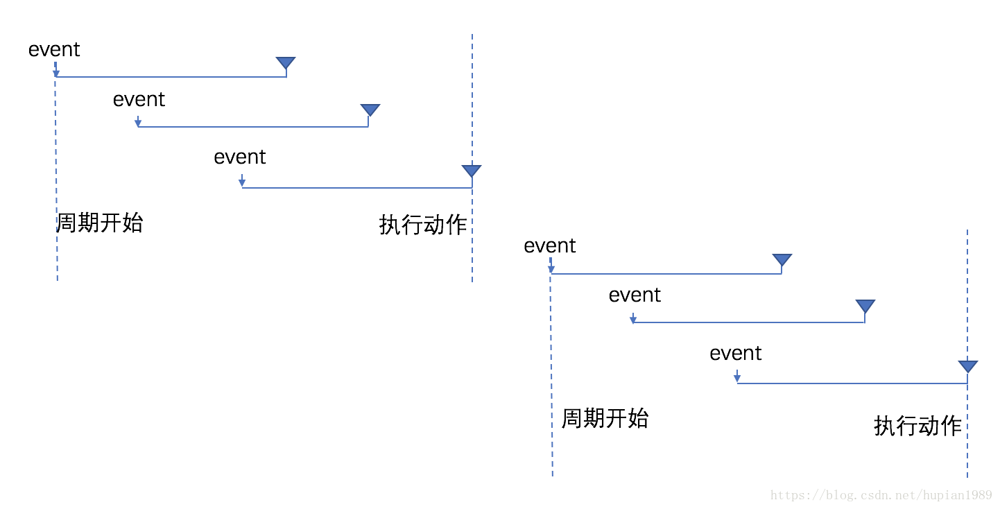
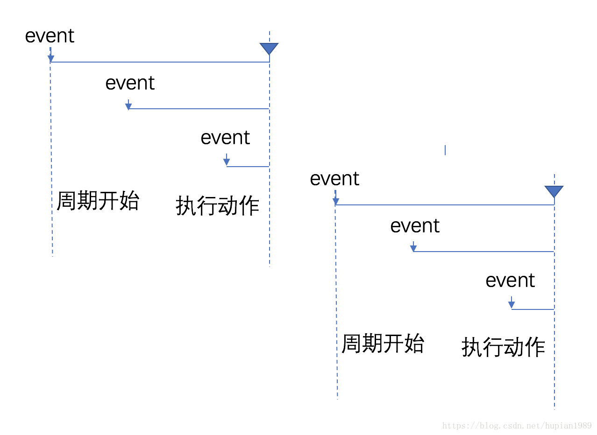

> 虎年快乐，开工大吉。

## 1. vuex mutations中不支持return
今天在优化项目代码的时候发现一个同步方法写到了vuex actions里，就顺手改到mutations中了，然后发现项目运行数据异常，排查发现是代码中有这样一条赋值操作：  
```js
// aaa.js
const value = this.$store.commit('my-commit', payload);
console.log(value);
```  
在`mutations-->my-commit`中，return了一个确定不可能是`undefined`的值:  
```js
// mutations.js
['my-commit'](state, payload) {
  // xxx
  return 123;
}
```  
然后我们在控制台看到`aaa.js`打印输出的是`undefined`，竟然不是123。在vuex的issues中找到了同样有疑问的小伙伴：[Return values from mutation commits](https://github.com/vuejs/vuex/issues/1437)    
> Reply: So I think we can close this issue. Sorry for making it open for so long, but as I described, this is technically really hard to do with Vuex 3. We should consider this and take in to the design of next Vuex iteration for sure.  

根据issue的回复情况，官方答复是说在mutations中实现return在vuex3（匹配vue2）是一个技术难点，并考虑在vuex4中支持return。  
However, 经过测试，我发现在vuex@4.0.2中也并没有支持commit中return，也许之后能支持也说不定。

## 2. 防抖 VS 节流  
**场景**： 针对事件被高频触发场景（如resize, scroll, 实时检查input输入动作等），若事件的回调函数为异步或过于复杂，就会出现响应跟不上触发的现象，导致页面卡顿。    
**核心**： 用于防止高频js代码的执行。  
**<font color="#8800ff">防抖（debounce）</font>**  
当事件被触发时，设定一个周期延迟执行动作，若期间又被再次触发，则重新设定周期，直到周期结束，再执行动作。**【<font color="#ff0000">周期内最后一次操作有效</font>】**  


**<font color="#8800ff">节流（throttling）</font>**   
固定周期内，只执行第一次动作，若在周期内有新事件被触发，不再执行；周期结束后，又有新事件触发，则开始新的周期。**【<font color="#ff0000">周期内第一次操作有效</font>】**  
  

**代码实现**  
```js
function debounce(fn, delay) {
  let timer = null;
  return () => {
    clearTimeout(timer);
    timer = setTimeout(() => {
      fn.apply(this, arguments);
    }, delay)
  }
}

function throttle(fn, delay) {
  let activeTime = 0;
  return () => {
    const current = Date.now();
    if(current - activeTime > delay) {
      fn.apply(this, arguments);
    }
    activeTime = Date.now();
  }
}
```  

**测试**  
```html
<!DOCTYPE html>
<html lang="en">

<head>
  <meta charset="UTF-8">
  <meta http-equiv="X-UA-Compatible" content="IE=edge">
  <meta name="viewport" content="width=device-width, initial-scale=1.0">
  <title>防抖 vs 节流</title>
  <style>
    #container {
      width: 100%;
      height: 200px;
      line-height: 200px;
      text-align: center;
      color: #fff;
      background: #000;
      font-size: 30px;
    }
  </style>
</head>

<body>
  <div id="container"></div>
  <script>
    let count = 1;
    const container = document.getElementById('container');

    function getUserAction () {
      container.innerHTML = count++;
    }

    container.onmousemove = getUserAction; // 不使用防抖，节流
    container.onmousemove = debounce(getUserAction, 1000); // 防抖
    container.onmousemove = throttle(getUserAction, 1000); // 节流

  </script>
</body>
</html>
```
**无节流，防抖**  
  

**防抖**  
  

**节流**  


参考如下资料：  
- [什么是节流和防抖](https://muyiy.cn/question/js/3.html)  
- [JavaScript专题之跟着underscore学防抖](https://github.com/mqyqingfeng/Blog/issues/22#)  
- [JavaScript专题之跟着 underscore 学节流](https://github.com/mqyqingfeng/Blog/issues/26#)  

## 3. Web Worker
Web Worker是HTML5新特性。  
JavaScript是单线程的，这样就容易出现一个问题，只要前面的任务没有执行完，后面的任务就只能等待。  
Web Worker为JavaScript创造了多线程环境，允许主线程创建Worker线程，在主线程运行的同时，Worker线程在后台运行，两者互不干扰。  
### 3.1 使用
1. 主线程调用`Worker()`构造函数，创建一个Worker线程。  
```js
// 第一个参数是一个脚本文件路径，改文件就是Worker线程执行的任务，因为Worker不能读取本地文件，因此该脚本文件必须来源于网络
// 第二个参数是配置对象，可选，用于指定Worker的名称，如name: 'xxx'，区分多个Worker线程
const worker = new Worker('worker.js');
```  
2. 主线程调用`worker.postMessage()`向Worker发消息。  
主线程：  
```js
// worker.postMessage()方法的参数即为主线程传给Worker的数据，可以是任何数据类型。
worker.postMessage('hello world');
worker.postMessage({ method: 'echo', args: ['Work']})
```  
Worker线程内部需要一个监听函数，用于监听message事件(addEventListener or onmessage)：  
```js
// worker.js

// self表示子线程自身，击子线程的全局对象
self.addEventListener('message', function(e) {
  self.postMessage('you said: ' + e.data);
}, false);

// 也可以用self.onmessage指定监听
```  
3. 主线程通过`worker.onmessage`指定监听函数，接收子线程发回来的消息。  
```js
worker.onmessage = function(event) {
  // 可以从event.data中获取Worker发来的数据
  console.log('recieved message: ' + event.data);
  doSomething();
}

function doSomething() {
  // 执行任务
  worker.postMessage('work done');
}
```  
4. Worker内部如果需要加载其它脚本，可以使用`importScripts()`方法。  
```js
// 加载单个脚本
importScripts('script1.js');

// 加载多个脚本
importScripts('script1.js', 'script2.js');
```  
5. 错误处理  
主线程可以监听Worker是否发生错误，Worker线程内部也是可以监听 `error`事件的。  
```js
worker.onerror(function(error) {
  // xxx
})

// 或者
worker.addEventListener('error', function(error) {
  // xx
})
```  
6. 关闭Worker线程  
当Worker完成任务以后，可以在主线程将其关闭:   
```js
worker.terminate();
```  
也可以在Worker线程内部关闭自身：  
```js
self.close();
```  
### 3.2 Web Worker使用注意事项
1. **同源限制**：分配给Worker线程运行的脚本文件，必须与主线程的脚本文件同源。  
2. **DOM限制**：Worker线程所在的全局对象与主线程不一样，无法读取主线程所在网页的DOM对象，也不能使用`document`、`window `、`parent`等对象，但可以使用`navigator`和`location`对象。   
3. **通信联系**：Worker线程和主线程不在同一个上下文环境，不能直接通信，需要使用`postMessage()`。   
4. **脚本限制**：Worker线程不能执行`alert()`和`confirm()`方法，但可以使用XMLHttpRequest对象发出AJAX请求。  
5. **文件限制**：Worker线程无法读取本地文件，它所加载的脚本必须来自网络。  

> 本节参考阮一峰老师的[Web Worker使用教程](https://www.ruanyifeng.com/blog/2018/07/web-worker.html)  

## 4. WebSocket
WebSocket是HTML5的新特性之一。  
WebSocket协议为web应用程序客户端与服务端之间提供了一种全双工通信机制，弥补了HTTP通信的一个缺陷————通信只能由客户端发起。    
  
### 4.1 WebSocket特点  
1. 建立在 TCP 协议之上，服务器端的实现比较容易。  
2. 与 HTTP 协议有着良好的兼容性。默认端口也是80和443，并且握手阶段采用 HTTP 协议，因此握手时不容易屏蔽，能通过各种 HTTP 代理服务器。  
3. 数据格式比较轻量，性能开销小，通信高效。  
4. 可以发送文本，也可以发送二进制数据。  
5. 没有同源限制，客户端可以与任意服务器通信。  
6. 协议标识符是`ws`（如果加密，则为`wss`），服务器网址就是 URL：  
```bash
ws://example.com:80/some/path
```   
  
### 4.2 客户端API  
1. 使用构造函数`WebSocket()`与服务器建立连接  
```js
const ws = new WebSocket('ws://location:8080');
```  
2. 实例`ws`属性  
属性：

| 属性 | 描述 | 类型 | 取值 |  
|---- | ---- | ---- | ---- |  
| readyState | 实例对象的当前状态 | Number | 0：CONNECTING，表示正在连接；1：OPEN，表示连接成功，可以通信了；2：CLOSING，表示连接正在关闭；3：CLOSED，表示连接已经关闭或打开连接失败 |  
| onopen | 用于指定连接成功后的回调函数 | Function | event对象 |    
| onclose | 用于指定连接关闭后的回调函数 | Function | event对象 |  
| onmessage | 用于指定收到服务器数据后的回调函数 | Function | event对象 |  
| binaryType | 显示指定收到的二进制数据类型 | String | 'blob', 'arraybuffer'等 |  
| bufferedAmount | 表示还有多少字节的二进制数据没有发送出去，用于判断发送是否结束 | Number | - |  
| onerror | 用于指定报错时的回调函数 | Function | - | 

方法：  

| 方法 | 描述 |  
| ---- | ---- |  
| send() | 用于向服务器发送数据 |

> 本节参考阮一峰老师的[WebSocket教程](https://www.ruanyifeng.com/blog/2017/05/websocket.html)