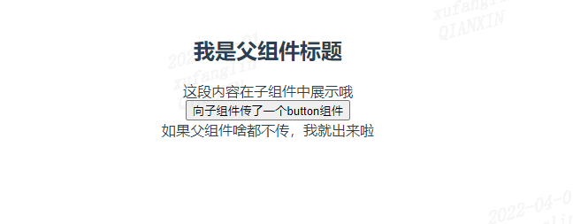
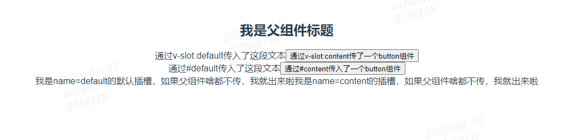
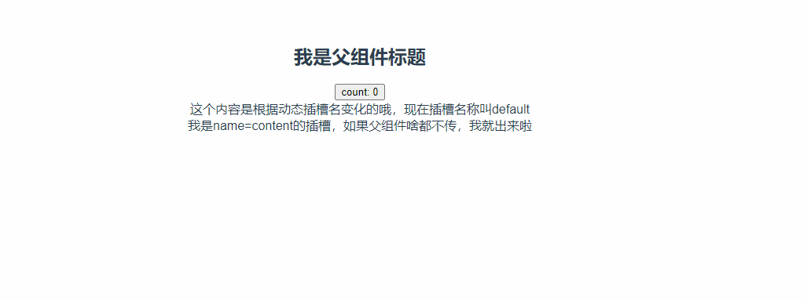

> 昨天追完了《人世间》，2022第一部喜欢的剧^^

## 1. 客户端渲染(CSR)、服务端渲染(SSR)
页面渲染流程：  
1. 浏览器通过请求得到一个HTML文本  
2. 渲染进程解析HTML文本，构建DOM树  
3. 解析HTML的同时，如果遇到内联样式或者样式脚本，就并行下载并构建CSSOM树；如果遇到JS脚本，就会下载并执行脚本  
4. DOM树和CSSOM树构建完成后，渲染进程将两者合并为渲染树  
5. 渲染进程对渲染树进行布局，生成布局树  
6. 渲染进程对布局树进行绘制，生成绘制记录  
7. 渲染进程对布局树进行分层，分别栅格化每一层，并得到合成帧  
8. 渲染进程将合成帧信息发送给GPU进程显示到页面中。  
页面的渲染其实就是浏览器将HTML文本转化为页面帧的过程。  
### 1.1 客户端渲染
客户端渲染（client side render）,即在执行JS脚本的时候，HTML页面就已经开始解析并且构建DOM树，此时JS的作用是动态的改变DOM树的结构，从而影响最终生成的页面帧（即我们看到的页面）。
### 1.2 服务端渲染
服务端渲染（server side render），即浏览器在请求页面url时，服务端会将处理以后的HTML文本组装好并返回给浏览器，此时的HTML文本不需要再执行JS脚本。

> 本节内容参考[SSR原理](https://github.com/yacan8/blog/issues/30)

## 2. 前后端分离
顾名思义，就是将一个应用的前端代码和后端代码分开写，前后端研发提前约定好接口（前后端通过接口通信），然后并行开发，最后集成。

## 3. 发布-订阅模式
### 3.1 概念
在软件架构中，发布-订阅是一种消息范式，消息的发送者（<font color="#008dff">发布者</font>）不会将消息**直接**发送给特定的接收者（<font color="#008dff">订阅者</font>），而是发送给调度中心，由调度中心统一调度；同样的，订阅者也并不关心发布者的存在，只需要通过调度中心注册并获取到发布者发布的消息。   
在发布-订阅模式中，发布者和订阅者是完全解耦的。  
  

**例子**：比如我们经常看的微信公众号，当很喜欢某个公众号发布的内容时，就会点击关注，然后公众号每次有内容发布时，都会收到微信消息提示，告知有新的内容更新了。  
在这个例子里边，用户作为订阅者，可以订阅多个不同的公众号；而公众号作为发布者，将事件发布到调度中心，然后由调度中心发送消息告知用户。

### 3.2 简易版发布-订阅实现
发布-订阅需要以下要素：  
- 创建一个类
- on方法：订阅  
- emit方法：发布  
- off方法：取消订阅  
- once方法： 仅订阅一次  

```js
class EventEmitter {
  constructor() {
    this._events = {}; // 调度中心
  }

  // 订阅
  on(eventName, callback) {
    // 同一个事件可以注册多个回调，因此用数组存储
    const callbacks = this._events[eventName] || []; 
    callbacks.push(callback);
    this._events[eventName] = callbacks;
  }

  // 发布
  emit(eventName, ...args) {
    const callbacks = this._events[eventName] || [];
    callbacks.forEach(cb => cb(...args));
  }

  // 取消订阅
  off(eventName, callback) {
    const callbacks = this._events[eventName] || [];
    const newCallbacks = callbacks.filter(cb => cb !== callback && cb.initialCallback != callback);
    this._events[eventName] = newCallbacks;
  }

  // 仅订阅一次
  once(eventName, callback) {
    const one = (...args) => {
      callback(...args);
      this.off(eventName, one)
    }
    one.initialCallback = callback;
    this.on(eventName, one);
  }
}
```  

使用：  
```js
const eventEmitter = new EventEmitter();

const callback1 = function() { console.log('callback1'); }
const callback2 = function() { console.log('callback2'); } 
const onceCallback = function() { console.log('once callback'); }

eventEmitter.on('eventName1', callback1);
eventEmitter.on('eventName1', callback2);
eventEmitter.off('eventName1', callback2);

eventEmitter.once('eventName2', onceCallback);

eventEmitter.emit('eventName1');
eventEmitter.emit('eventName2');

// 结果
//  'callback1'
//  'once callback'
```

## 4. 插槽：$slots, slot, $scopedSlots, slot-scope, v-slot [WIP]
### 4.1 插槽是什么  
Vue实现了一套内容分发API，将`<slot>`元素作为承载分发内容的出口。简单来说就是子组件内部留了一个或多个插槽位置，可以在使用该组件时传入模板代码或组件。   
插槽可以让用户拓展组件，让组件变得更加灵活。  
### 4.2 插槽分类  
- 默认插槽  
- 具名插槽  
- 作用域插槽  

**默认插槽**  
父组件在使用时，直接将想要传入的内容写在子组件标签`<child>`内。  
子组件用`<slot>`标签来确定渲染的位置，标签中可以放一些默认内容，当父组件使用时没有往子组件传入内容，子组件的`<slot>`标签内容就会显示在页面。

父组件：  
```vue
<template>
  <div>
    <h2>我是父组件标题</h2>
    <child>这段内容在子组件中展示哦</child>
    <child><button>向子组件传了一个button组件</button></child>
    <child />
  </div>
</template>
<script>
  import Child from './child.vue';
  export default {
    components: { Child }
  }
</script>
```

子组件：  
```vue
<template>
  <div>
    <slot>如果父组件啥都不传，我就出来啦</slot>
  </div>
</template>
<script>
  export default {
    name: 'Child'
  }
</script>
```  

效果图：  


**具名插槽**
父组件在使用子组件`<child>`时，将想要放入的内容包裹在`<template>`标签内，并在`<template>`标签上添加`v-slot:xxx`，其中`xxx`是插槽名称，对应子组件`<child>`的`<slot>`标签上的`name`属性。`v-slot:`指令也可以简化为`#`。    
子组件`<child>`用`<slot>`标签来确定渲染的位置，`<slot>`标签上加一个`name`属性，表示插槽名称，当不传`name`属性时，等同于`name="default"`。标签中可以放一些默认内容，当父组件使用时没有往子组件传入内容，子组件的`<slot>`标签中内容就会显示在页面。   

父组件：   
```vue
<template>
  <div id="app">
    <h2>我是父组件标题</h2>
    <child>
      <template v-slot:default>通过v-slot:default传入了这段文本</template>
      <template v-slot:content><button>通过v-slot:content传了一个button组件</button></template>
    </child>
    <child>
      <template #default>通过#default传入了这段文本</template>
      <template #content><button>通过#content传入了一个button组件</button></template>
    </child>
    <child />
  </div>
</template>

<script>
import Child from './child.vue';

export default {
  name: 'App',
  components: {
    Child
  }
}
</script>
```

子组件：  
```vue
<template>
  <div>
    <slot>我是name=default的默认插槽，如果父组件啥都不传，我就出来啦</slot>
    <slot name="content">我是name=content的插槽，如果父组件啥都不传，我就出来啦</slot>
  </div>
</template>
<script>
  export default {
    name: 'Child'
  }
</script>
```

效果图：  
  

<font color="#008dff">动态插槽名</font>  
顾名思义，父组件向子组件传不同的name即渲染子组件不同的插槽内容。  

父组件：  
```vue
<template>
  <div id="app">
    <h2>我是父组件标题</h2>
    <button @click="add">count: {{count}}</button>
    <child>
      <template v-slot:[dynamicSlotName]>这个内容是根据动态插槽名变化的哦，现在插槽名称叫{{ dynamicSlotName }}</template>
    </child>
  </div>
</template>

<script>
import Child from './child.vue';

export default {
  name: 'App',
  components: {
    Child
  },
  data() {
    return {
      count: 0
    }
  },
  computed: {
    dynamicSlotName() {
      return this.count%2 === 0 ? 'default' : 'content';
    }
  },
  methods: {
    add() {
      this.count++;
    }
  }
}
</script>
```

子组件：  
```vue
<template>
  <div>
    <slot>我是name=default的默认插槽，如果父组件啥都不传，我就出来啦</slot><br>
    <slot name="content">我是name=content的插槽，如果父组件啥都不传，我就出来啦</slot>
  </div>
</template>
<script>
  export default {
    name: 'Child'
  }
</script>
```

效果图：  
  

**作用域插槽**  
父组件通过`v-slot:xxx="childProps"`或`#xxx="childProps"`来向子组件`<child>`插入内容的同时，可以从`childProps`中获取子组件传出来的一些数据。  
子组件`<child>`将想要对外传出的数据放到`<slot>`标签上，父组件即可拿到。   

父组件：  
```vue
<template>
  <div id="app">
    <h2>我是父组件标题</h2>
    <child v-slot:default="slotData">{{ slotData.slotProps.a + slotData.slotProps.b}}</child>
  </div>
</template>

<script>
import Child from './child.vue';

export default {
  name: 'App',
  components: {
    Child
  },
}
</script>
```

子组件：  
```vue
<template>
  <div>
    <slot :slotProps="name">我是name=content的插槽，如果父组件啥都不传，我就出来啦</slot>
  </div>
</template>
<script>
  export default {
    name: 'Child',
    data() {
      return {
        name: { a: 111, b: '哈哈哈' }
      }
    }
  }
</script>
```

效果图： 
 

**小结**  
- `v-slot`属性只能在`<template>`标签上使用，特例是当**只有**默认插槽时，可以直接在子组件`<child>`标签上使用。   
- 默认插槽名为`default`，可以将`v-slot:default`省略为`v-slot`。  
- 将`v-slot:`缩写为`#`时插槽名必写，默认插槽需写`#default`。  
- 默认插槽时，可以通过解构获取作用于插槽内的变量，`v-slot="{a}"`，或重命名`v-slot="{a: newName}"`，或自定义属性默认值`v-slot="{a: 111111 }"`。


