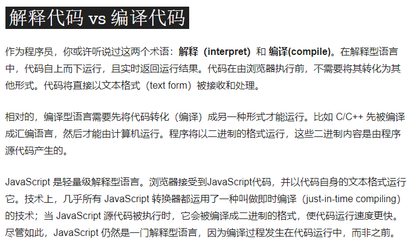

> 聚水成河，汇河成海。

# 2021年2月小记

## 编译和运行的区别

### 编译型语言
代码是由CPU执行的，而CPU无法直接执行类似if...else这样的高级语言，只能执行二进制指令，因此需要将高级语言转化为CPU能识别的汇编语言/机器指令才能执行。

- 编译：包含编译和链接两个过程。前者把源文件转换成机器可以识别的二进制语言，后者将生成的二进制文件组装成一个可执行文件。
- 运行：将编译生成的可执行文件在系统中运行的过程。

### 解释型语言
**JavaScript是轻量级解释型语言。** 在执行之前不需要将代码转化为其他形式，而是直接以文本格式（text form）被接收和处理。其编译过程发生在代码运行中，而非之前。

MDN——什么是JavaScript：

# 2021年3月小记

