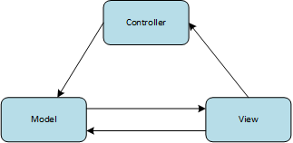
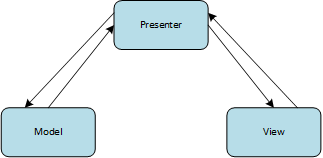
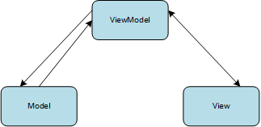

---
title: vue双向绑定
date: 2021-06-01
categories:
 - 前端
tags:
 - vue
sidebar: auto
---  

## 1. MVC、MVP、MVVM
说到双向绑定，就不得不提一嘴几种常见的前端架构模式：  
- **MVC(Model-View-Controller)**  
【功能划分】：
  - Model, 模型，主要存储数据；
  - View, 视图，表示用户界面；
  - Controller，控制器，负责业务逻辑。
【数据关系】：
  - View接收用户的交互请求 -> View将请求转交给Controller -> Controller操作Model更新数据 -> Model更新数据后通知View更新视图。  
    
【特点】：  
  - MVC的数据流是单向的，但View可以直接访问Model;
  - 用户交互请求既可以发送给View，也可以发送给Controller；
  - 由于View可以直接访问Model，那么View中必定存在一些业务逻辑，导致View和Model之间存在耦合，不利于维护。  
【使用场景】：  
  - 适用于一个Model同时对应多个不同的View场景，因为Model不依赖View，但View依赖Model.  
- **MVP(Model-View-Presenter)**  
【功能划分】：  
  - 在MVC基础上将Controller改为Presenter，其功能依然是控制器。
【数据关系】：  
  - View接收用户的交互请求 -> View将请求转交给Presenter -> Presenter操作Model更新数据 -> Model更新数据后通知Presenter数据已更新 -> Presenter更新View数据  
    
【特点】：  
  - View和Model之间不存在直接联系，都是通过Presenter来传递的。
【使用场景】：  
  - 适用于当项目中存在一个数据对应多个视图显示，且逻辑经常发生变化的场景。   
- **MVVM(Model-View-ViewModel)**   
【功能划分】：  
  - 在MVP基础上将Presenter改为ViewModel
【数据关系】：  
  - View接收用户交互请求 -> View将请求转发给ViewModel -> ViewModel操作Model更新数据 -> Model更新数据后通知ViewModel数据更新 -> ViewModel更新View数据  
     
【特点】：  
  - MVVM的数据流是双向的，View改变会反应在ViewModel中，反之亦然。  
【使用场景】：  
  - 可同时兼容MVC和MVP的使用场景。  

## 2. vue与MVVM
vue的设计收到了MVVM模型的启发，也正因如此，在源码以及官方文档的demo中，我们经常会看到用vm(ViewModel的缩写)这个变量名来表示Vue实例。  
```vue
<template>
  <div id="app">
    {{ slogen }}
  </div>
</template>
<!--template标签内容即为view层-->
<script>
  const data = {
    slogen: 'hello world'
  }
  // 以上为model层
  let vm = new Vue({
    el: "#app",
    data,
    methods: {
      init() {
        this.slogen += '阿白';
      }
    }
  });
  // 以上为ViewModel层
</script>
```  
## 3. Object.defineProperty()
vue是通过数据劫持的方式来实现数据的绑定，vue2实现响应式的核心是利用了ES5的Object.defineProperty；vue3的响应式是用Proxy实现的。  
Object.defineProperty()方法会直接在一个对象上定义一个新属性，或者修改一个对象的现有属性，并返回此对象。语法如下：  
```js
/**
  * @param {Object} obj 要定义属性的对象
  * @param {String} prop 要定义或修改的属性的名称
  * @param {Object} descriptor 要定义或修改的属性描述符
  * @return {Object} 被传递给函数的对象
*/
Object.defineProperty(obj, prop, descriptor); 
```  
可以为对象(obj)的某一属性(prop)设置描述符，在实现双向绑定时，我们比较关注的描述符（descriptor）是get和set, 如下：  
| 属性 | 说明 | 类型 | 可选值 | 默认值 |  
| ---- | ---- | ---- | ---- | ---- |  
| get | prop的getter函数，如果没有getter，则为undefined。当访问prop时，会调用次函数。不接受任何参数，返回值作为prop的value。 | Function | -- | undefined |  
| set | prop的setter函数，如果没有setter，则为undefined。当prop值被修改时，会调用次函数。接收一个参数。 | Function | -- | undefined |   

## 4. vue双向绑定
利用Object.defineProperty，我们可以给一个对象属性配置set和get方法，使其变成一个响应式对象。
