> 常问是什么、为什么、怎么做，并且在理解概念后动手写一写，会比停留在问一问来掌握得更扎实~

## 1.前端发展简史
### 1.1 石器时代——这是一个没有模块化的时代
1995年正式发布了HTML 2，通常与CSS、JavaScript一起用于网页设计。在这个时期，我们编写的网页极其简洁，JavaScript仅作为一种脚本语言，用于处理表单验证和动画实现等效果，页面的交互通常几行代码就可完成。我们可以通过link标签和script标签，在html文件中引入独立的样式以及js文件，组装成我们想要的页面。  
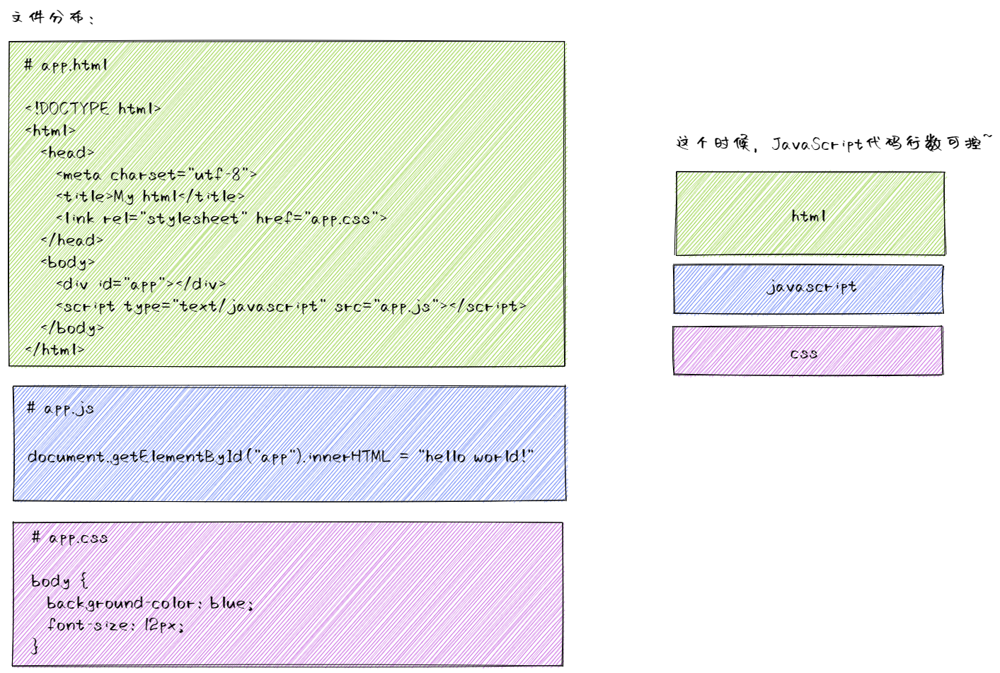  

### 1.2 信息时代————模块化管理
一直持续了有十多年才慢慢出现了各种框架与库，但好在社区一直很活跃，所以对于初学者都比较友好。  
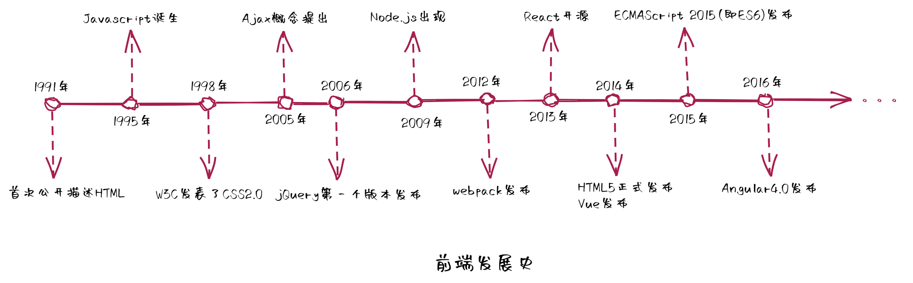  

然而，也正是由于框架与库的相关生态不断扩大、业务复杂度不断攀升，就出现了如下问题：  
- 业务间耦合度高；
- 代码复用性低；
- 依赖模糊；
- 开发、测试、维护效率低。  

想象一下，如果有一天你接手了一个这样的代码：页面所有的交互都在一个js中维护，在表单提交时莫名其妙重置了页面搜索条件；同样的时间格式化方法重复声明与调用；直接引入了一个库，而不是库的某个具体方法；修改了一个表单的bug，发现影响了整个页面的功能。不能说像，这就是灾难！
为了解决上述问题，社区提供了前端模块化解决方案。

## 2.前端模块化概念
### 2.1 什么是模块化
**模块（modules）**  
webpack给出的模块定义：  
> 在模块化编程中，开发者将程序分解为功能离散的chunk，并称之为模块。每个模块都拥有小于完整程序的体积，使得验证、调试及测试变得轻而易举。精心编写的模块提供了可靠的抽象和封装界限，使得应用程序中每个模块都具备条理清晰的设计和明确的目的。  

综上，模块应该是简单、独立、可靠、明确的功能块。

### 2.2 模块化的优点  
- 业务解耦，同时避免命名冲突;
- 高复用性;
- 按需加载;
- 开发、测试、维护效率高

## 3. 前端模块化简史
### 3.1 全局函数
将不同功能逻辑抽离并封装成不同的函数，通过script标签引入这些函数所在文件，供全局使用。  
缺点：  
- 容易出现命名冲突，污染全局  
- 需要管理依赖引入的顺序  
- 随着业务复杂度的提升，后续维护成本也会逐步提高  
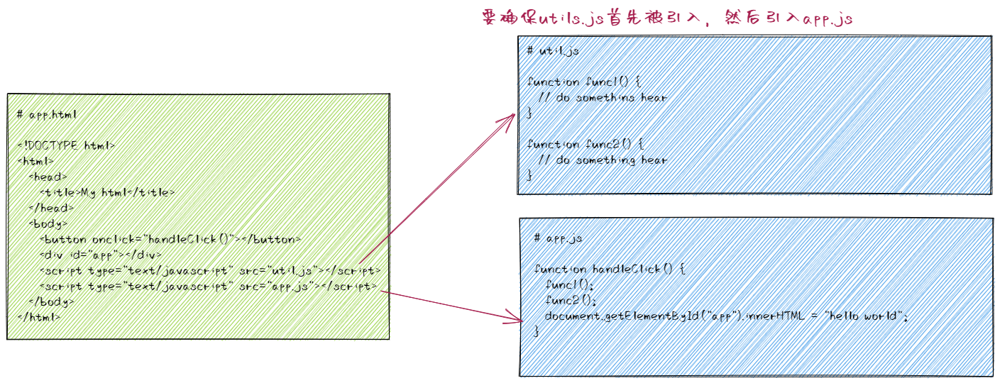  

### 3.2 对象命名空间
将各种私有变量与方法放到一个对象中作为属性进行管理，可以解决全局函数造成的全局污染问题。  
缺点：  
- 数据不再安全，因为对象作为一种引用类型的数据，其属性可以被外部修改  
```js
var module = {
  name: 'xiaobai',
  age: 18,
  getName: function() {
    return this.name;
  }
}

module.name = 'a bai'; // 数据被修改
module.getName(); // 'a bai'   属性被修改后会导致方法中对属性的读写操作受影响
```  
### 3.3 IIFE（匿名函数自调用）
立即执行函数，函数创建后立即调用，调用后即被释放。由于是匿名函数，因此不用烦恼函数命名的问题。最重要的是它有独立的作用域，可以在内部创建私有变量，不会污染全局。  
缺点：  
- 需要维护依赖引入的顺序，尤其是当IIFE需要将另一个模块作为参数传入时，要保证该模块先于IIFE被引入  
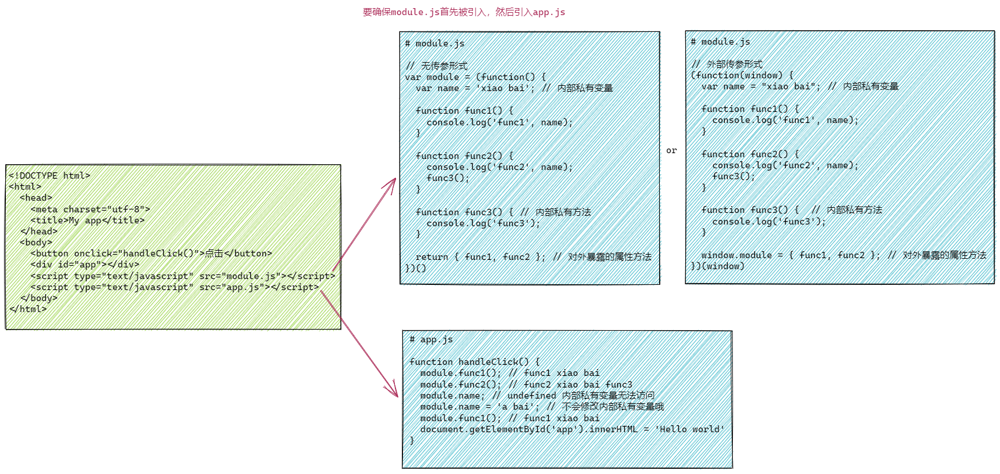  

### 3.4 CommonJS
实现代表: Node.js  
CommonJS，简称CJS。在ES6出现以前，JavaScript本身并不支持模块化，但JavaScript社区提出了一些模块化解决方案，其中CommonJS作为一个模块化标准，后续在Node.js中用于模块的导入导出，适用于JavaScript的服务端编程。  
CommonJS的主流实现有node.js，webpack，babel等。  

CommonJS规定：  
- 一个模块就是一个文件（有自己的作用域，文件中定义的变量、函数、类都是私有的，对其他文件不可见）
- 每个模块内有两个变量可以使用：require和module
- 通过require加载模块
- 通过module.exports或exports导出模块（Node.js在实现CommonJS规范时，为每个模块提供了一个私有变量exports，指向module.exports）

CommonJS特点：  
- CommonJS模块输出的值是浅拷贝。
- CommonJS模块输出的值会被缓存。模块可以被多次加载，但只会在第一次加载时运行一次，然后结果被缓存起来，以后再次加载时直接读取缓存结果。
- 运行时加载。因此可以写在需要使用的位置而不是一开始就引入，但这也意味着CommonJS模块只能在运行时才能确定模块的依赖关系。
- 模块加载的顺序按照其在代码中出现的顺序执行。
- 模块的代码执行作用于在模块内，不会污染全局作用域。
- 模块加载是同步的。也就是说只能等模块加载完成，会阻塞后续的操作。（为什么是同步的？ 因为Node.js的模块文件一般都在本地磁盘，传输速率快且稳定，不需要考虑异步加载的方式。）

CommonJS模块使用示例：  
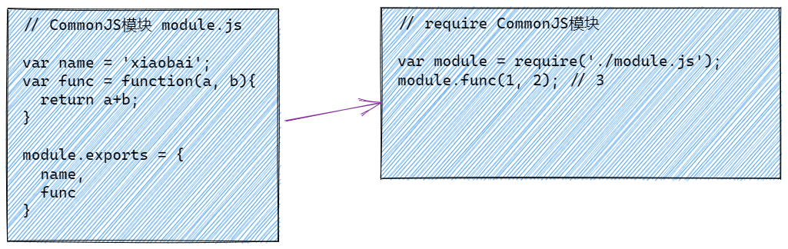  

### 3.5 AMD（Asynchronous Module Definition, 异步模块定义）
实现代表：Require.js  
AMD是除了CommonJS以外另一种通行的JavaScript模块规范。如果当前是浏览器环境，需要从服务端加载模块，那么CommonJS规范就不适用了，必须采用异步模式来引入模块，因此浏览器一般采用AMD规范。

AMD来源：  
AMD原本是CommonJS规范中分化的某个分支，但由于各种原因没有被CommonJS社区认同。后来于2011年从CommonJS社区独立出去并成立了AMD社区，并逐步演化成require.js的附属品。

AMD规范：  
- 定义函数define：define(id?, dependencies?, factory)
- 定义特殊关键字：require， exports，module
- 一个模块就是一个文件。
- 模块名即为文件名。即在module.js中定义了一个模块，那么在引入的时候，该模块名就叫module。

AMD特点：  
- 模块加载是异步的。即模块的加载不会影响后续操作的执行，适用于浏览器环境加载服务端模块场景。
- 运行时加载。
- 使用AMD模块时，需要先在浏览器注入脚本加载器，如require.js。（具体见下图示例）
	
AMD模块使用示例：  
**注意模块引入的方式，data-main属性指定被require.js加载的模块文件，后续不需要重复引入module.js了。**  
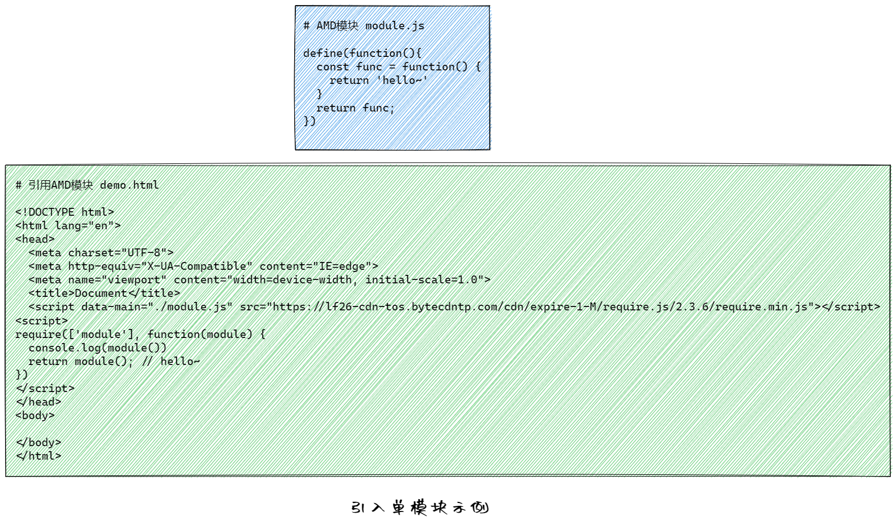  

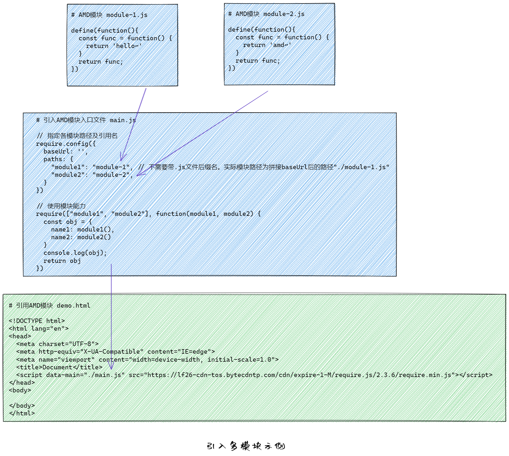  

### 3.6 CMD（Common Module Definition）
实现代表：sea.js  
CMD推崇“as lazy as possible”（即，延迟执行），相反的是，AMD推崇依赖前置，提前执行。  
在sea.js中，所有JavaScript模块都遵循CMD模块定义规范。  

CMD规范：  
- 一个模块就是一个文件
- 定义define作为一个全局函数，用于定义模块

CMD特点：  
- 模块加载是异步的。即模块的加载不会影响后续操作的执行，适用于浏览器环境加载服务端模块场景。
- 运行时加载。
- CMD推崇依赖就近，延迟执行；AMD推崇依赖前置，提前执行。

CMD模块使用示例：  
**注意：自seajs2.0版本开始，删除了对data-config/ data-main的支持，需要通过seajs.use启动加载模块，所以不能使用AMD的data-main属性（具体见相关链接）**  
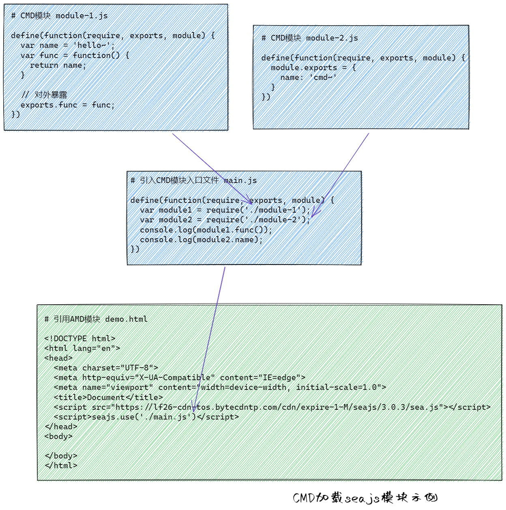  

### 3.7 ES6 Module
ES6模块，简称ESM。与CommonJS、AMD、CMD这种源于社区的模块化规范不同，ES6模块化标准是定义在JavaScript语言标准层面上的，不仅实现了模块化，还可以取代CommonJS以及AMD规范，成为浏览器和服务器通用的模块解决方案。  

ES6模块特点：  
- ES6模块自动采用严格模式，也即是说ES6模块的语法要遵循严格模式的规则，比如变量必须先声明再使用，顶层this指向undefined而不是全局等。
- 设计思想是尽量的静态化，编译时加载。即在编译时即确定模块的依赖关系以及输入输出（CommonJS、AMD、CMD都是运行时加载）。
- ES6模块不是对象，通过定义export命令用于指定输出，再通过import命令引入。
- ES6模块输出的是值的引用。若模块内部存在变化，会导致import引入的值跟着变化。
- ES6模块支持整体加载，使用*指定一个对象，模块的所有输出值都加载在这个对象上面。 形如：import * as modue from 'xxx.js'
- ES6模块支持export default，当用户不了解模块具体有哪些输出时，可以使用export default为模块提供默认输出。但一个模块只能有一个export default
- ES6模块间可以继承。使用export *用于输出模块的非default属性与方法。

ES6模块使用示例：  
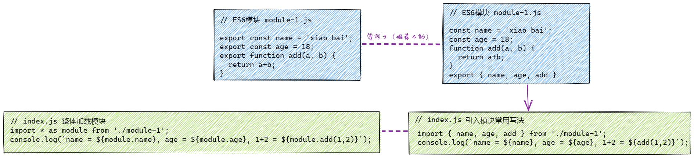  

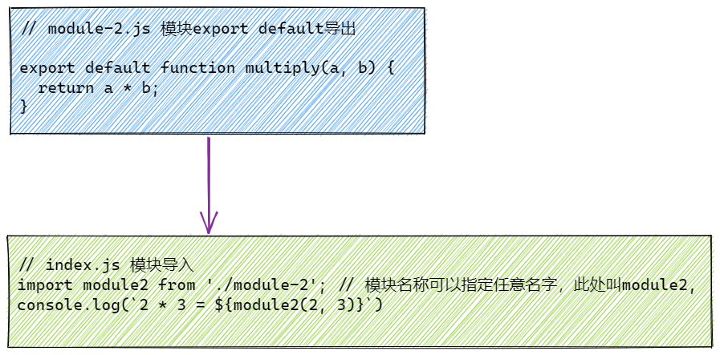

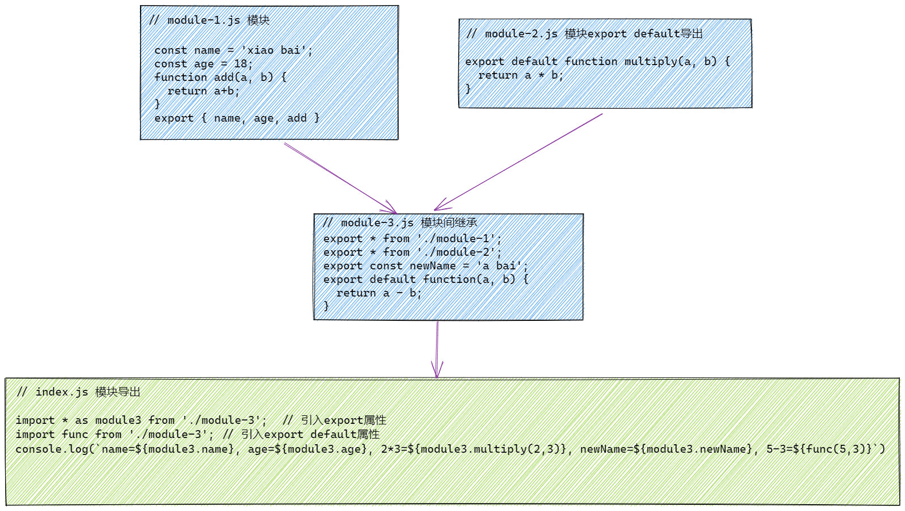  

## 4. 总结
| 模块化规范 | 使用平台 | 加载方式 | 加载时机 | 模块输出值 | 代表实现 | 特色 |   
| ---- | ---- | ---- | ---- | ---- | ---- | ---- |  
| ES6 Module | 浏览器&服务端 | 规范未定义具体实现，取决于loader api | 编译时 | 值的引用，动态更新 | - | 简单 |   
| CommonJS | 服务端 | 同步 | 运行时 | 值的拷贝，会被缓存 | Node.js | 同步加载模块 |  
| AMD | 浏览器 | 异步 | 运行时 | 值的拷贝 | require.js | 依赖前置，提前执行 |  
| CMD  | 浏览器 | 异步 | 运行时 | 值的拷贝 | sea.js | 依赖就近，延迟执行 |  

## 5. 相关链接
- [AMD模块定义规范](https://github.com/amdjs/amdjs-api/wiki/AMD-(%E4%B8%AD%E6%96%87%E7%89%88))
- [CMD模块定义规范](https://github.com/seajs/seajs/issues/242)  
- [Sea.js功能删减讨论](https://github.com/seajs/seajs/issues/713)  
- [彻底掌握前端模块化](https://mp.weixin.qq.com/s?__biz=Mzg5MDAzNzkwNA==&mid=2247484285&idx=1&sn=bc37c00b5c58ff42355b1b01ad9b9c0d&chksm=cfe3f082f8947994b5475d365c4460ac0d4b36d6eec68b5dd7c15fc3a0ef1b88f33b776f3f05&scene=178&cur_album_id=1567316742547226629#rd)
- [前端模块化7日谈](https://github.com/Huxpro/js-module-7day)
