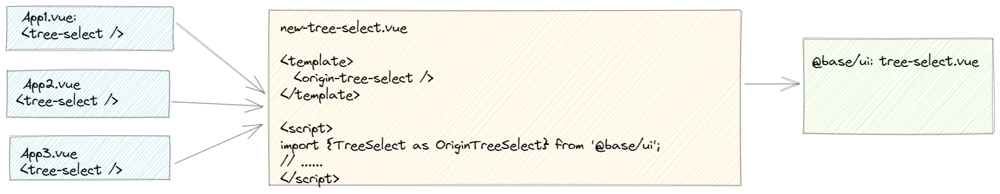
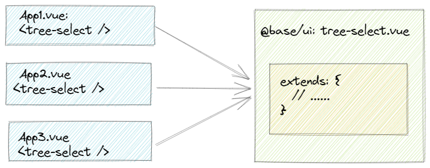

---
title: 【踩坑】组件二次封装指北
date: 2021-05-16
categories:
 - 前端
tags:
 - JavaScript
sidebar: auto
---  

> 这是一篇拖了很久的文章，原本打算写在【day-day-up系列】里的，想了想还是详细点，单独开个page吧~

## 1. 背景说明
事情的起因是这样的：  
  xx产品：我想要咱们系统里边所有的下拉框都支持拖拽！  
  我：这个需求是为了解决啥问题？  
  xx产品：销售跟我反馈的，因为他在xx系统看到过这样的实现，当下拉框数据量很大时，可能横、纵向会存在滚动条，但我希望能多看到一些数据，不想看到滚动条  
  我：滚动条就是为了更好地展示大数据呀，不然下拉框变得很大不是影响视觉效果么？  
  xx产品：你说得对，所以我觉得可以让用户自己拖拽，想看多少看多少  
  我：咱可以把下拉框的默认宽高稍微调整下不就好了， 干嘛要这么复杂？  
  xx产品：咱们系统里的数据比较复杂，写死宽高肯定无法满足所有场景的，我就想让它支持拖拽！而且现在已经有实现好的系统了，你照着做不就好了嘛  
  我：。。。  
  xx产品：而且对于下拉树，如果是多选然后又想一次性看到整棵子树的勾选情况，你说的那种方案也不行嘛  
  我：哪几种下拉框需要支持？  
  xx产品：select和treeSelect  

由于组件库是参考了`element UI`自研的，我们在项目中都是使用组件库提供的`select`和`tree-select`组件。然后，我找到了组件库开发团队，并向他们提出了我的诉求：  
  我：以上就是这个需求的背景，请问你们这边能支持吗？  
  组件库研发：这个需要评审一下才行，评审通过才能做，咱们先表决下个人意见吧！  
  组件库UED：我反对，因为这个只在你们这个产品提了需求，咱们组件库是服务整个公司所有产线的，需要考虑通用性，我个人认为这个需求所述方案并不通用  
  组件库研发：我反对，因为现在业界的组件库都没有这种能力，也许你可以跟产品再battle一下~  
  我：如果battle有用的话，我找你们干啥？产品表示这是个强需求，提到P0啦  
  组件库UED：那这样吧，我建议是你先自己实现一版，我这边持续收集其他产线的情况，后边如果在其他产线也有这种问题，咱们再考虑由组件库来支持  
  我：那组件库研发你这边，能给我一些开发建议么？select和tree-select组件是全局注册组件，期望以最低的修改成本实现resize的能力  
  组件库研发：可以重新注册select和tree-select组件，覆盖一下就好了  
  我：好的，我研究下  

就这样，中间反复拉着产品和组件库研发团队沟通数次无果，只能自己基于现有组件库二次封装`select`和`tree-select`，然后重新注册这俩组件使全局生效。  
最终实现效果：  


## 2. 如何实现拖拽？
关于拖拽的实现走了一些弯路，基础不扎实。  
一开始就朝着第三方库的方向走了，以为拖拽能力是需要被封装才能直接使用的，因此去调研了[vue-draggable-resizable](https://github.com/mauricius/vue-draggable-resizable)、[vue-moveable](https://github.com/daybrush/moveable/tree/master/packages/vue-moveable)、[jquery-ui](https://github.com/jquery/jquery-ui)这三个库。  
虽然都能实现我想要的拖拽功能，但或多或少都存在一些问题：包体积大、不支持Vue3、需要定制组件等等。  
后来才发现CSS是有一个现成的属性`resize`专门用于控制元素的可调整大小性：[CSS-resize](https://developer.mozilla.org/zh-CN/docs/Web/CSS/resize)。  
**最终实现：**    
在`select`和`tree-select`组件的`popover`元素上添加如下样式：  
```css
.select.popover,
.tree-select.popover {
  resize: both; // 垂直水平方向均可支持拖拽
  overflow: auto; // 滚动条自动
}
```

## 3. 为什么需要二次封装？
直接给下拉框元素添加`resize: both`是可以支持拖拽的，但是拖着拖着发现一个新的问题：  
  

原来是下拉内容区设置了最小高度，这个高度是通过tree-select组件的一个内置属性通过监听props计算得到的，需要侵入式修改组件内部的逻辑才能实现内容自适应的拖拽，因此需要二次封装。

## 4. 二次封装实现
提到二次封装，第一想法是注册一个`new-tree-select`，将其作为一个中间代理层，在代理层增加`resize`能力，然后将父组件的参数透传给tree-select，同时将tree-select对外暴露的属性以及事件抛出来。  
如果注册新的`tree-select`组件是二次封装的最佳实践，很显然就没有单独写这篇文章的必要了，请继续往下看。
### 4.1 实现一：注册新的tree-select
  

即，重新提供一个全局组件`tree-select`(后文称其为`new-tree-select`)包裹基础组件`tree-select`，`new-tree-select`组件作为中间层联通业务组件与`tree-select`之间的数据交互，同时自身添加`resize`逻辑，并入口文件中注册，命名`new-tree-select`组件名称为`tree-select`。  
入口文件：  
```js
import newTreeSelect from './new-tree-select.vue';
// 入口文件注册
Vue.component('tree-select', newTreeSelect);
```
#### 4.1.1 代理`attrs` & `event`
使用`vue`提供的`v-bind="$attrs"`、`v-on="$listener"`来处理`props`和事件的代理。具体实现(`new-tree-select.vue`)：  
```vue
<template>
  <origin-tree-select 
    ref="originTreeSelect" 
    v-bind="$attrs" 
    v-on="$listeners"
  />
</template>

<script>
  // 从基础库中引入二次封装的组件。
  // 需要注意的是不要使用原始组件名称，因为后续要在入口文件注册名为tree-select的组件覆盖，如果内部还是用原始名称TreeSelect，就会导致死循环抱错。
  import { TreeSelect as OriginTreeSelect } from '@base/ui'; 
</script>
```

#### 4.1.2 代理`method`或其它内置属性，以供父组件`vm.$refs.xxx`获取或调用
这一部分该怎么实现的问题，是整个二次封装过程中脑细胞死亡最多的一趴。因为我无法证明一个问题：当前的`tree-select`是父组件指定的一个`tree-select`,一个形象的比喻是：证明我是我爸的儿子。  
想象一下，当父组件使用`vm.$refs.xxx.yyy`去获取其某个子组件`tree-select`的内置属性时，在不修改父组件代码的情况下，我怎么才能从`origin-tree-select`中拿到属性`yyy`并将其指向父组件的`$refs.xxx.yyy`呢？我们需要这么做：  
 1. 获取父组件的所有`$refs`  
 2. 遍历父组件的`$refs`，拿到指向当前`new-tree-select`的唯一`$refs` 
 3. 将上一步得到的唯一`$refs`指向`origin-tree-select`  

上述步骤的难点在于第2步，如何获取到我想要的这个`new-tree-select`的`ref`呢？查询资料后发现有一个私有属性`_uid`(用于唯一标识一个组件实例)能帮到我。实现如下(`new-tree-select.vue`)：  
```vue
<template>
  <origin-tree-select 
    ref="originTreeSelect" 
    v-bind="$attrs" 
    v-on="$listeners"
  />
</template>

<script>
  // 从基础库中引入二次封装的组件。
  // 需要注意的是不要使用原始组件名称，因为后续要在入口文件注册名为tree-select的组件覆盖，如果内部还是用原始名称TreeSelect，就会导致死循环抱错。
  import { TreeSelect as OriginTreeSelect } from '@base/ui'; 
  export default {
    created() {
      this.$nextTick(() => {
        this.bindRef(this, this.$parent)
      })
    },
    methods: {
      bindRef(parentInstance, currentInstance) {
        // 获取父组件所有refs
        const parentRefs = Object.keys(parentInstance.$refs);
        if(!parentRefs.length) return;
        // 根据_uid拿到唯一的目标ref
        const matchRef = parentRefs.filter(ref => {
          parentInstance.$refs[ref]._uid === currentInstance._uid;
        });
        // 将origin-tree-select实例赋值给上一步得到的唯一ref
        parentInstance.$refs[matchRef] = currentInstance.$refs.originTreeSelect;
      }
    }
  }
</script>
``` 

#### 4.1.3 方案优化：使用Proxy以及Reflect
在代理`method`或其它内置属性时，还需要考虑一种场景：`origin-tree-select`的内置属性在代理层由于命名冲突问题重名了，或者代理层新增了一个属性，那么父组件在通过`$refs`想要拿到`tree-select`的属性`yyy`时，应该优先从`origin-tree-select`尝试拿到`yyy`,如果拿不到，就从代理层拿。同样地，赋值操作也是如此。  
最终实现(`new-tree-select.vue`)：   
```vue
<template>
  <origin-tree-select 
    ref="originTreeSelect" 
    v-bind="$attrs" 
    v-on="$listeners"
  />
</template>

<script>
  // 从基础库中引入二次封装的组件。
  // 需要注意的是不要使用原始组件名称，因为后续要在入口文件注册名为tree-select的组件覆盖，如果内部还是用原始名称TreeSelect，就会导致死循环抱错。
  import { TreeSelect as OriginTreeSelect } from '@base/ui'; 
  export default {
    created() {
      this.$nextTick(() => {
        this.bindRef(this, this.$parent, this.$refs.originTreeSelect)
      })
    },
    methods: {
      bindRef(parentInstance, currentInstance, originInstance) {
        // 获取父组件所有refs
        const parentRefs = Object.keys(parentInstance.$refs);
        if(!parentRefs.length) return;
        // 根据_uid拿到唯一的目标ref
        const matchRef = parentRefs.filter(ref => {
          parentInstance.$refs[ref]._uid === currentInstance._uid;
        });
        // 将origin-tree-select实例赋值给上一步得到的唯一ref
        parentInstance.$refs[matchRef] = new Proxy(orginInstance, {
          get(target, prop, receiver) {
            // 注意：使用hasOwnProperty是为了避免拿到falsy值导致没有获取到期望的属性。
            if(!target.hasOwnProperty(prop)) return Reflect.get(currentInstance, prop, receiver);
            return Reflect.get(target, prop, receiver);
          },
          set(target, prop, receiver) {
            if(!target.hasOwnProperty(prop)) return Reflect.set(currentInstance, prop, receiver);
            return Reflect.set(target, prop, receiver);
          }
        })
      }
    }
  }
</script>
```

### 4.2 实现二：使用Vue的extends选项增强tree-select
  

在此之前，我从未使用过`vue`的`extends`属性（[vue extends](https://cn.vuejs.org/v2/api/#extends)），了解后发现这个组件真的是能完美实现我想要的功能，彻底砍掉代理层。  
首先我们需要知道，中间层的存在意味着它是一个新的vue实例，导致父组件的`$refs`指向需要再往下一层才能真正获取到`orgin-tree-select`的方法或其他内置属性，也是因为中间层的存在，我们需要思考如何做内置属性的代理。  
那么，有没有办法去掉代理层，不修改父组件`$refs`指向呢？答案是有的，就是`extends`，这个选项类似`mixin`,能够在不新增vue实例的前提下，直接对原组件实例进行侵入式修改。  
有了`extends`方案，当然就不再需要.vue文件啦，我们只需写一个new-tree-select.js文件，然后注册即可：  
`new-tree-select.js`文件：  
```js
import { TreeSelect as OriginTreeSelect } from '@base/ui';

const treeSelectExtends = {
  extends: OriginTreeSelect,
  // resize扩展能力
  data() {},
  watch: {},
  computed: {},
  methods: {},
}
```  

入口文件：  
```js
import newTreeSelect from './new-tree-select.js';
// 入口文件注册
Vue.component('tree-select', newTreeSelect);
```
## 5. 最终实现
最终的实现是`实现二`，同时还做了一个`mixin`，因为需要支持`resize`功能的还有`select`，在测试后发现`select`也是需要二次封装的，并且关于`resize`部分的实现基本类似，因此提供了一个公用的`resize-mixin.js`，分别给`tree-select`以及`select`组件使用：
`resize-mixin.js`:    
``` js
// 将resize的公共逻辑（commin-resize）写在这里
export default {
  data() {},
  watch: {},
  computed: {},
  methods: {},
}
```

`new-select.js`:  
```js
import { Select as OriginSelect } from '@base/ui';
import resizeMixin from 'resize-mixin.js';

const SelectExtends = {
  extends: OriginSelect,
  mixins: [resizeMixin], // common-resize能力
  // 差异化resize扩展能力
  data() {},
  watch: {},
  computed: {},
  methods: {},
}
```

`new-tree-select.js`:  
```js
import { TreeSelect as OriginTreeSelect } from '@base/ui';
import resizeMixin from 'resize-mixin.js';

const treeSelectExtends = {
  extends: OriginTreeSelect,
  mixins: [resizeMixin], // common-resize能力
  // 差异化resize扩展能力
  data() {},
  watch: {},
  computed: {},
  methods: {},
}
``` 

入口文件重新注册：  
```js
import newTreeSelect from './new-tree-select.js';
import newSelect from './new-select.js';

// 入口文件注册
Vue.component('tree-select', newTreeSelect);
Vue.component('select', newSelect);
```

## 6. 总结
深入vue理解，挖掘未知领域，合理使用vue提供的能力。  
显然，对于一个公共组件（或基础组件库中某个组件）的二次封装，vue的extends选项派上了大用场。  
对于多个组件包含类似功能的场景，vue的mixin选项派上了大用场。  


