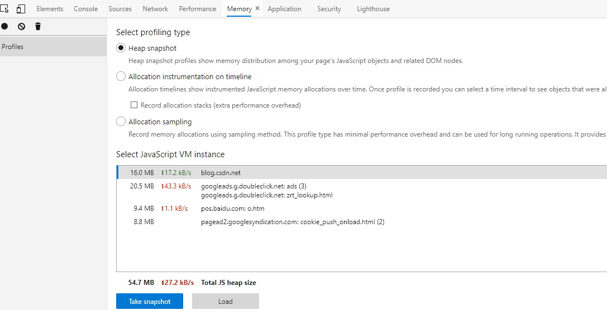

> 一定要做好两件事，努力和爱自己。不快乐就是因为你没有好好爱自己，还常常因为别人消耗着自己。

## 一、背景
- 项目：vue
- 领域：可视化
- 系统&浏览器：windows 10(64位), chrome 79.0.3945.79
- 功能：页面主体显示15个左右的图表，图表实现方式是echarts；为了实现排版显示美观，引入了第三方插件vue-grid-layout进行网格化布局；页面会定时刷新，刷新频率可选择1分钟不等（下文称此页面为仪表板页面）。
- 问题表现：在选择1分钟的刷新频率时，保持页面长时间挂载，持续约9小时后，页面出现崩溃现象。

## 二、排查
长时间挂载页面，并通过memory窗口观察内存变化，持续大约3小时，内存从130M涨到1100+M，并且页面在图表自动刷新以及对鼠标事件的响应出现明显卡顿，基本可以确认是内存泄漏了。

查找内存泄漏的原因：
- DOM引用
- 闭包
- echarts相关
- 定时器未销毁
- 等等。。。

这里没有列出全局变量的原因是，通常情况下，简单类型的全局变量并不是造成页面崩溃的主要原因，并且由于项目中声明变量基本都采用const和let的方式，未声明先使用的情况下控制台会提示，一旦出现全局变量导致的内存泄漏，也比较好排查（关注代码质量，eslint值得拥有）。

通过控制台performance窗口记录一段时间内存的变化趋势，可以发现在每次图表刷新时内存变化比较明显，考虑从自动刷新逻辑开始排查。

通过控制台memory窗口的快照功能大致定位内存泄漏的点也是一个比较好的办法，但惭愧的是，我研究了大半天memory的功能，还是不太会用。。。

## 三、解决
项目代码涉及公司隐私，这里就不贴图展示了。
### 1.v-if指令产生的内存泄漏
内存泄漏在vue应用中通常不是来自vue自身的，更多的发生于把其它库集成到应用中的时候。仪表板页面通过v-if指令在dom中移除或添加一个第三方组件（[vue-grid-layout](https://github.com/jbaysolutions/vue-grid-layout)），由于业务原因，组件内部嵌套了多层，并且存在dom的引用关系，每次图表刷新时会给v-if置为false，待图表数据返回后置为true，由于存在反复的添加和删除操作，而组件内部的引用并没有被一并清除，长此以往内存也在增长，积少成多，当同时有20个图表刷新时，内存的涨幅就十分明显了。

vue-grid-layout并没有提供销毁的方法，所以考虑图层覆盖的方式去进行loading与数据层展示的交互，不使用v-if切换。

### 2.echarts多次实例化导致的内存泄露
每次自动刷新时，都会先使用dispose去销毁echarts实例，然后init。但是echarts本身是存在内存泄漏的诟病的，也不推荐反复实例化echarts（内存泄漏的点在这），而是使用clear清除实例后通过setOption去更新实例。

仪表板存在的问题如下：
- 设置了事件监听器但是没有销毁
- 每次更新图表都通过销毁再实例化实现
- 没有在beforeDestroy中再次清除实例以及事件监听

解决：
- 设置first标识，只在初始化或者数据从无到有时进行init，其余情况通过setOption来更新echarts实例
- 每次销毁echarts实例前都清除一下事件监听
- 保障：在beforeDestroy中再次销毁echarts以及事件监听

