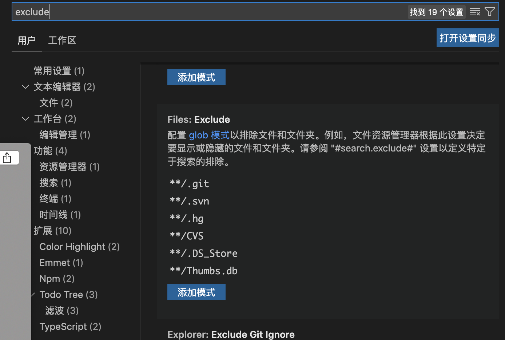
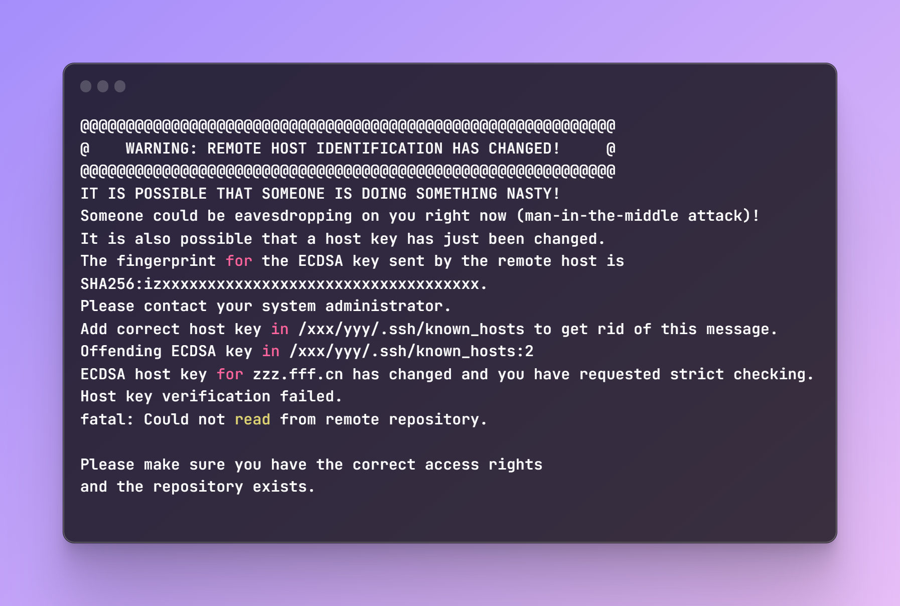

 ## 1. vscode自动编译ts
1. 编译配置文件： tsconfig.json 
```json
{
  "compilerOptions": {
    "target": "ES6",
    "outDir": "./output",   // 编译后输出的js文件输出路径
    "watch": true,
  },
  "include": ["./src"]  // 指定哪些目录下的ts文件会被自动编译
}
```   
2. 启动监视任务：vscode编辑器菜单【终端】-【运行任务】-【显示所有任务】-【tsc: 监视 - tsconfig.json】  
3. 停止监视：vscode编辑器菜单【终端】-【终止任务】-【tsc: 监视 - tsconfig.json】 

启动监视任务后，每次保存ts文件，都会自动编译啦～

 ## 2. vscode显示项目中的隐藏文件
 vscode默认配置如下文件是会被隐藏的:   
 ```
 **/.git
 **/.svn
 **/.hg
 **/CVS
 **/.DS_Store
 **/Thumbs.db
 ```  
 有时候想要看`.git/`下的文件，可以这么做：
 1. 【code】- 【首选项】-【设置】  
 2. 搜索exclude，删掉需要展示在目录中的模式即可  
  

 ## 3. 执行git操作时，报错【WARNING: REMOTE HOST IDENTIFICATION HAS CHANGED! fatal: Could not read from remote repository】  
在执行`git pull`或`git push`等操作，从远程拉取代码或将代码推送到远程仓库时，报错如下：   
    

 出现这个问题的原因是git远程仓库的域名/IP信息发生了变更，解决：    
 **法一：粗暴法**    
 找到报错信息中显示的`/xxx/yyy/.ssh/known_hosts`文件, 将其清空，或直接删掉这个文件。  

 **法二：**   
 还是找到`/xxx/yyy/.ssh/known_hosts`文件，根据错误信息提示的`zzz.fff.cn`发生了变更，则去掉这个域名对应的信息即可。


