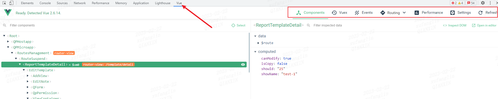

> ChatGPT给行业带来了什么？  

 ## 1. 【工具】桌面截图工具
 一款好用、轻量、简单的桌面截图工具： [snipaste](https://www.snipaste.com/)  
 适用于window、mac系统，个人觉得比mac自带截图工具好用。  

 ## 2. 【工具】桌面录屏工具  
 在研发过程中出现问题时，通常会将复现的步骤通过录视频的方式保留下来，然后发给对方。    
 你可以使用：[LICEcap](https://github.com/justinfrankel/licecap)  

 ## 3. 【工具】全能终端神器
 当我们需要访问服务器，通过终端执行命令时，可以使用： [mobalXterm](https://mobaxterm.mobatek.net/)  

 ## 4. 【工具】可视化终端工具
 当我们需要访问服务器，但是对终端命令不熟悉，需要做一些上传/下载文件的操作时，可以使用： [FileZilla](https://www.filezilla.cn/download)   
 这是一款快速可靠的、跨平台的FTP,FTPS和SFTP客户端。具有图形用户界面(GUI)和很多有用的特性。

 ## 5. 【工具】效率工具平台
 一款轻量、安全、简洁的效率工具平台，可以自由安装插件应用：[uTools](https://www.u.tools/)

 ## 6. 手动打开chrome控制台Vue devtools
 通常使用vue框架开发前端项目时，chrome浏览器都会安装vue.js devtools扩展插件，然后在开发环境下查看组件的状态或事件等信息：  
   

 但有时候这个插件不太听话，或者因为框架层做了一些限制导致插件不能正常加载，此时可以在chrome控制台输入如下信息，然后关闭-打开chrome控制台就可以看到插件被正常加载了：  
   
 ```js
window.__vue__.config.devtools = true;
__VUE_DEVTOOLS_GLOBAL_HOOK__.emit('init', window.__vue__);
```
