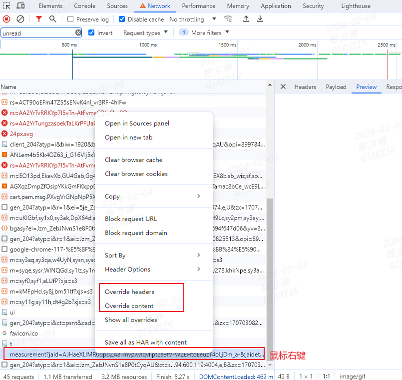
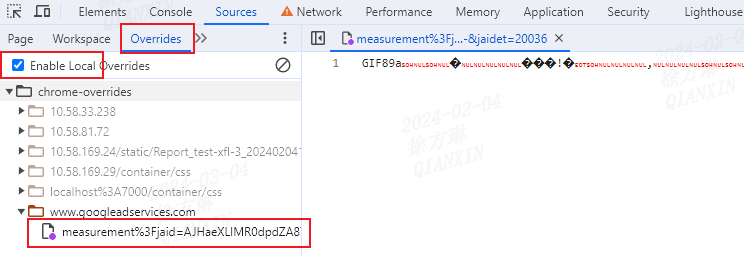

> 立春，常新，常总结。 

## 1. 使用patch-package给npm包打补丁
在日常工作中，我们必不可免地会使用到一些第三方库，当我们因为一些原因不得不修改第三方库的时候，可以尝试使用[`patch-package`](https://github.com/ds300/patch-package)，这个npm包允许开发者在不修改第三方库的情况下进行补丁(patch)。  
需要额外说明一点的是，尽管`patch-package`非常有用，但这可能导致后续的维护问题，尽可能通过与第三方库的维护者合作，以实现问题修复或特性支持。

## 2. 摆脱代理工具，使用chrome override功能mock数据
chrome 117版本推出了新特性：在`network`面板支持`overrides`选项。  
前端之前经常会通过各种代理工具来实现mock数据，现在chrome原生支持，体验相当之丝滑。  

  

  

## 3. 是哪个小傻瓜还在用npm link？
作为npm包的维护者，我们可能时长会将其引用至项目进行验证。在了解[`yalc`](https://github.com/wclr/yalc)之前，我都是使用`npm link`或`yarn link`通过创建软链进行调试。   
了解`yalc`并使用后，真香。  

`npm link`或`yarn link`的原理：  
- 在全局创建一个软链指向本地npm包的dist目录  
- 在项目组通过此软链将`node_modules/${npm}`指向到dist目录    
缺点很明显：  
- 全局软链如果不及时删除势必影响其他项目的npm依赖版本；  
- 每次npm包更新后需要先移除软链再重新创建软链；
- 除了对项目本身的node_modules有影响外，还会导致各种奇怪的问题，比如npm包更新或安装失败等等。  

`yalc`是项目级别的，不会污染全局，npm包更新后主动推送即可，无需重建软链，因此更加安全方便快捷。
